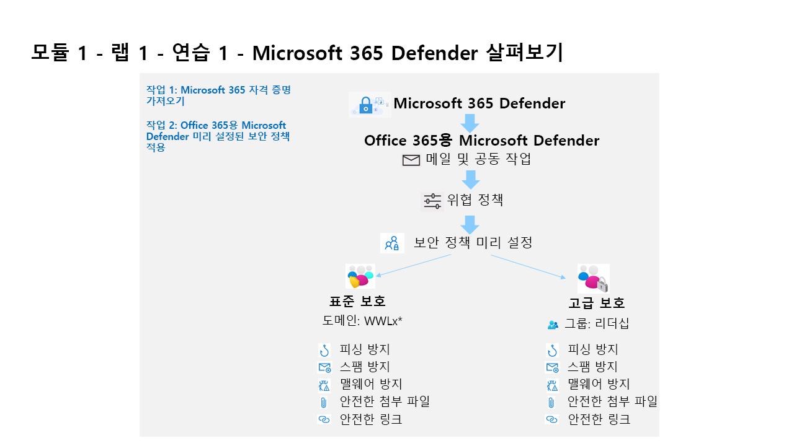

---
lab:
  title: 연습 1 - Microsoft Defender XDR 살펴보기
  module: Learning Path 1 - Mitigate threats using Microsoft Defender XDR
---

# 학습 경로 1 - 랩 1 - 연습 1 - Microsoft Defender XDR 살펴보기

## 랩 시나리오

여러분은 Microsoft Defender XDR을 구현하는 회사에서 근무하는 보안 운영 분석자입니다. 먼저 EOP(Exchange Online Protection) 및 Office 365용 Microsoft Defender에 사용되는 미리 설정된 보안 정책을 할당합니다.

>**참고:** **WWL 테넌트 - 사용 약관**강사 주도 교육 제공의 일부로 테넌트를 제공하는 경우, 강사 진행 교육에서 실습 랩을 지원하기 위해 테넌트를 사용할 수 있습니다. 테넌트를 실습 랩 외부에서 공유하거나 사용해서는 안 됩니다. 이 과정에서 사용되는 테넌트는 평가판 테넌트이며 클래스가 종료된 후 사용하거나 액세스할 수 없으며 확장판에서도 사용할 수 없습니다. 테넌트를 유료 구독으로 변환해서는 안 됩니다. 이 과정의 일부로 얻은 테넌트는 Microsoft Corporation의 재산으로 유지되며 언제든지 액세스 권한을 획득하고 다시 소유할 수 있는 권리를 보유합니다. 

### 작업 1: Microsoft 365 자격 증명 받기

랩을 시작하면 Microsoft 가상 랩 환경에서 액세스할 수 있는 평가판 테넌트가 제공됩니다. 이 테넌트에는 고유한 사용자 이름과 암호가 자동으로 할당됩니다. Microsoft 가상 랩 환경 내에서 Azure와 Microsoft 365에 로그인할 수 있도록 이 사용자 이름과 암호를 검색해야 합니다. 

이 과정은 학습 파트너가 여러 ALH(Authorized Lab Hosting) 공급자 중 하나를 사용하여 제공할 수 있기 때문에 귀하의 테넌트와 관련된 테넌트 ID 검색에 수반되는 실제 단계는 랩 호스팅 공급자에 따라 다를 수 있습니다. 따라서 강사가 귀하의 과정에서 이 정보를 검색하는 방법에 대한 필수 지침을 제공할 것입니다. 나중에 사용할 수 있도록 기록해 두어야 하는 정보는 다음과 같습니다.

- **테넌트 접미사 ID.** 이 ID는 랩 전체에서 Microsoft 365에 로그인하는 데 사용할 onmicrosoft.com 계정용입니다. 이 ID의 형식은 **{username}@ZZZZZZ.onmicrosoft.com**입니다. 여기서 ZZZZZZ는 랩 호스팅 공급자가 제공한 고유 테넌트 접미사 ID입니다. 나중에 사용할 수 있도록 이 ZZZZZZ 부분의 내용을 기록해 둡니다. 랩 단계를 진행할 때 Microsoft 365 포털에 로그인하라는 메시지가 표시되면 여기서 적어 둔 ZZZZZZ 값을 입력해야 합니다.
- **테넌트 암호.** 랩 호스팅 공급자가 제공한 관리자 계정의 암호입니다.

### 작업 2: Office 365용 Microsoft Defender 미리 설정된 보안 정책 적용

이 작업에서는 Microsoft 365 보안 포털에서 EOP(Exchange Online Protection) 및 Office 365용 Microsoft Defender에 대해 미리 설정된 보안 정책을 할당합니다.

1. WIN1 가상 머신에 Admin으로 로그인합니다. 암호로는 **Pa55w.rd**를 사용하여 로그인합니다.  

1. 새 Microsoft Edge 브라우저를 시작합니다.

1. Microsoft Edge 브라우저에서 Microsoft Defender XDR 포털(<https://security.microsoft.com>)로 이동합니다.

1. 랩 호스팅 공급자가 제공한 관리자 사용자 이름용 테넌트 전자 메일 계정을 복사하여 **로그인** 대화 상자에 붙여 넣은 후 **다음**을 선택합니다.

1. 랩 호스팅 공급자가 제공한 관리자의 테넌트 암호를 복사하여 **암호 입력** 대화 상자에 붙여 넣은 후 **로그인**을 선택합니다.

    >**참고:** “작업을 완료할 수 없습니다. 나중에 다시 시도하세요. 문제가 계속되면 Microsoft 지원에 문의하세요.”라는 메시지가 표시되는 경우입니다. **확인**을 클릭하여 계속합니다.  

1. 표시된 경우 Microsoft Defender XDR 빠른 둘러보기 팝업 창을 닫습니다. **힌트:** 이 랩의 뒷부분에서는 Defender 작업 영역이 프로비전될 때까지 기다려야 합니다. 이 시간 동안 가이드 투어를 탐색하여 Microsoft Defender XDR에 대해 자세히 알아볼 수 있습니다.

1. 탐색 메뉴의 메일 및 협업 영역에서 **정책 및 규칙**을 선택합니다.**

1. 정책 및 규칙 대시보드에서 **위협 정책**을 선택합니다.**

1. 위협 정책 대시보드에서 **미리 설정된 보안 정책**을 선택합니다.**

    >**참고:** “클라이언트 오류 - bip 규칙을 받을 때 오류”라는 메시지가 표시되면 **확인**을 선택하여 계속합니다.** 이 오류는 Office 365에서 기본적으로 사용하도록 설정되지 않는 테넌트의 하이드레이션 상태 때문입니다.

    >**참고:** *“클라이언트 오류 - 사전 설정 보안 정책을 검색할 때 오류가 발생합니다”라는 메시지가 표시되는 경우입니다. 나중에 다시 시도하세요."* 계속하려면 **확인**을 선택합니다. **Ctrl+F5**를 사용하여 브라우저를 새로 고칩니다.

1. **사전 설정 보안 정책에 대해 알아보기** *팝아웃* 페이지에서 **닫기**를 선택합니다.

1. 표준 보호에서 **보호 설정 관리**를 선택합니다.** **힌트:** 이 옵션이 회색으로 표시되면 **Ctrl+F5**를 사용하여 브라우저를 새로 고칩니다.

1. Exchange Online Protection 적용 섹션에서 **특정 받는 사람**을 선택하고 **도메인** 아래에서 테넌트의 도메인 이름 작성을 시작하고 선택한 후 **다음**을 선택합니다.**

    >**힌트:** 테넌트의 도메인 이름은 관리자 계정에 대해 가지고 있는 이름과 같으며 *WWLx######.onmicrosoft.com*과 같은 이름일 수 있습니다. 이 구성은 스팸 방지, 아웃바운드 스팸 필터, 맬웨어 방지, 피싱 방지에 대한 정책을 적용합니다.

1. Office 365용 Defender 보호 적용 섹션에서 이전 단계와 동일한 구성을 적용하고 **다음**을 선택합니다.** 이 구성은 피싱 방지, 안전한 첨부 파일, 안전한 링크에 대한 정책을 적용합니다.

1. 가장 보호 섹션에서 **다음**을 4번 선택하여 계속합니다.**

1. *정책 모드* 섹션에서 **완료되면 정책 사용** 라디오 단추가 선택되어 있는지 확인한 후 **다음**을 선택합니다.

1. 변경 내용 검토 및 확인 아래에서 콘텐츠를 읽고, **확인**을 선택하여 변경 내용을 적용하고, **완료**를 선택하여 완료합니다.**

    >**참고:** *“URI ‘’<https://outlook.office365.com/psws/service.svc/AntiPhishPolicy>는 PUT 작업에 유효하지 않습니다. URI는 PUT 작업의 단일 리소스를 참조해야 합니다.”라는 메시지가 표시되는 경우입니다.* **확인**을 선택한 다음, **취소**를 선택하여 기본 페이지로 돌아갑니다. 표준 보호 사용 옵션이 설정되어 있는 것을 볼 수 있습니다.**

1. 엄격한 보호에서 **보호 설정 관리**를 선택합니다.** **힌트:** 엄격한 보호는 “메일 및 협업 - 정책 및 규칙 - 위협 정책 - 미리 설정된 보안 정책”에서 찾을 수 있습니다.**

1. Exchange Online Protection 적용에서 **특정 받는 사람**을 선택하고 **그룹**에서 **리더쉽** 작성을 시작하고 선택한 후 **다음**을 선택합니다.** 이 구성은 스팸 방지, 아웃바운드 스팸 필터, 맬웨어 방지, 피싱 방지에 대한 정책을 적용합니다.

1. Office 365용 Defender 보호 적용 섹션에서 이전 단계와 동일한 구성을 적용하고 **다음**을 선택합니다.** 이 구성은 피싱 방지, 안전한 첨부 파일, 안전한 링크에 대한 정책을 적용합니다.

1. 가장 보호 섹션에서 **다음**을 4번 선택하여 계속합니다.**

1. *정책 모드* 섹션에서 **완료되면 정책 사용** 라디오 단추가 선택되어 있는지 확인한 후 **다음**을 선택합니다.

1. 변경 내용 검토 및 확인 아래에서 콘텐츠를 읽고, **확인**을 선택하여 변경 내용을 적용하고, **완료**를 선택하여 완료합니다.**

    >**참고:** *“URI ‘’<https://outlook.office365.com/psws/service.svc/AntiPhishPolicy>는 PUT 작업에 유효하지 않습니다. URI는 PUT 작업의 단일 리소스를 참조해야 합니다.”라는 메시지가 표시되는 경우입니다.* **확인**을 선택한 다음, **취소**를 선택하여 기본 페이지로 돌아갑니다. 엄격한 보호가 옵션 사용으로 설정되어 있는 것을 볼 수 있습니다.**

### 작업 3: Microsoft Defender XDR 작업 영역 준비

1. **Microsoft Defender** 포털의 탐색 메뉴 왼쪽에서 **홈**을 선택합니다.

    >**참고:** 메뉴 상단까지 스크롤해야 할 수도 있습니다.

1. 메뉴 항목을 아래로 스크롤하여 **자산**으로 이동한 다음 **디바이스**를 선택합니다.

1. Defender XDR 작업 영역 배포 프로세스가 시작되고 페이지 상단에 *로드 및 초기화 중*이라는 메시지가 잠시 표시된 다음 커피 머그와 커피잔 이미지가 표시됩니다. 다음과 같은 메시지가 표시됩니다. **잠시 기다려 주세요! 데이터에 사용한 새 공간을 준비하고 연결하고 있습니다.** 완료하는 데 약 5분이 걸립니다. *다음 랩에 필요하므로 페이지를 열어두고 완료되었는지 확인합니다.*

    >**참고:** *일부 데이터를 검색할 수 없습니다*라는 팝업 오류 메시지는 무시하세요. "잠깐만요! 데이터에 대한 새 공간을 준비하고 연결하는 중입니다"라는 메시지가 표시되지 않거나 "설정 > Microsoft Defender XDR > 계정" 페이지가 열리지만 *데이터 스토리지 위치를 로드하지 못했습니다. 나중에 다시 시도하세요*라는 메시지가 표시되는 경우, "일반" 메뉴에서 "경고 서비스 설정"을 선택합니다.

1. 새 작업 영역 초기화가 성공적으로 완료되면 **홈** 포털 페이지에 **SIEM 및 XDR을 한 곳에 가져오기** 배너가 표시됩니다. 또한 **설정**에서 계정, 이메일 알림, **미리 보기 기능**, 경고 서비스 설정, 권한 및 역할, 스트리밍 API에 대한 Microsoft Defender XDR 일반 설정이 켜짐으로 설정되었습니다.

## 이 랩을 완료했습니다.
