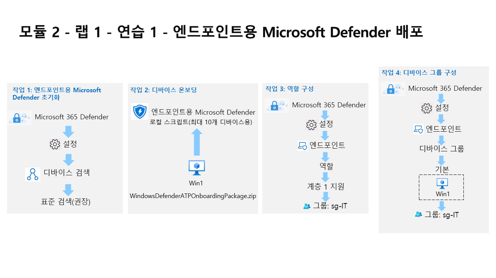

---
lab:
  title: 연습 1 - 엔드포인트용 Microsoft Defender 배포
  module: Module 2 - Mitigate threats using Microsoft Defender for Endpoint
---

# 모듈 2 - 랩 1 - 연습 1 - 엔드포인트용 Microsoft Defender 배포

## 랩 시나리오

여러분은 엔드포인트용 Microsoft Defender를 구현하고 있는 회사에서 일하는 보안 운영 분석가입니다. 귀하의 관리자가 몇몇 디바이스를 온보딩하여 보안 운영(SecOps) 팀 응답 절차에 필요한 변경 내용에 대한 인사이트를 제공하려고 합니다.

먼저 엔드포인트용 Defender 환경을 초기화합니다. 그런 다음 디바이스에서 온보딩 스크립트를 실행하여 배포할 초기 디바이스를 온보딩합니다. 환경에 대한 보안을 구성합니다. 마지막으로 디바이스 그룹을 만들고 적절한 디바이스를 할당합니다.

>**중요:**  랩 가상 머신은 다양한 모듈을 통해 사용됩니다. 가상 머신을 저장해 두세요. 저장하지 않고 랩을 종료하면 일부 구성을 다시 실행해야 합니다.

>**참고:** 이전 모듈의 작업 3을 성공적으로 완료했는지 확인합니다.

### 작업 1: 엔드포인트용 Microsoft Defender 초기화

이 작업에서는 엔드포인트용 Microsoft Defender 포털 초기화를 수행합니다.

1. **WIN1** 가상 머신에 Admin으로 로그인합니다. 암호로는 **Pa55w.rd**를 사용하여 로그인합니다.  

1. 현재 위치가 Microsoft 365 Defender 포털이 아닌 경우 Microsoft Edge 브라우저를 시작합니다.

1. Edge 브라우저에서 Microsoft 365 Defender 포털(https://security.microsoft.com) )로 이동합니다.

1. 랩 호스팅 공급자가 제공한 관리자 사용자 이름용 테넌트 전자 메일 계정을 복사하여 **로그인** 대화 상자에 붙여 넣은 후 **다음**을 선택합니다.

1. 랩 호스팅 공급자가 제공한 관리자의 테넌트 암호를 복사하여 **암호 입력** 대화 상자에 붙여 넣은 후 **로그인**을 선택합니다.

1. **팁:** 관리자의 테넌트 메일 계정 및 암호는 리소스 탭에서 찾을 수 있습니다.

1. **Microsoft 365 Defender** 포털에 있는 탐색 메뉴의 왼쪽에서 **설정**을 선택합니다. 

    >**설정** 페이지에서 **디바이스 검색**을 선택합니다. **참고:** **설정** 아래에서 **디바이스 검색**이 보이지 않으면 계정 이니셜의 오른쪽 위 원을 선택하고 **로그아웃**을 클릭하여 로그아웃합니다. 시도할 수 있는 다른 옵션은 Ctrl+F5를 사용하여 페이지를 새로 고치거나 페이지 InPrivate를 여는 것입니다.

1. **테넌트 이메일** 자격 증명을 사용하여 다시 로그인합니다. 검색 설정에서 **표준 검색(권장)** 이 선택되었는지 확인합니다.

### **힌트:** 옵션이 표시되지 않으면 페이지를 새로 고칩니다.

작업 2: 디바이스 온보딩

1. 이 작업에서는 온보딩 스크립트를 사용하여 엔드포인트용 Microsoft Defender에 디바이스를 온보딩합니다.

1. 현재 위치가 브라우저의 Microsoft 365 Defender 포털이 아닌 경우 Microsoft Edge 브라우저를 시작하고 https://security.microsoft.com) 으로 이동하고 **테넌트 메일** 자격 증명으로 로그인합니다.

1. 왼쪽 메뉴 모음에서 **설정**을 선택한 다음 설정 페이지에서 **엔드포인트**를 선택합니다.

1. 디바이스 관리 섹션에서 **온보딩**을 선택합니다. **참고:** 왼쪽 메뉴 모음의 **자산** 섹션에서 디바이스 온보딩을 수행할 수도 있습니다. 

1. 자산을 확장하고 디바이스를 선택합니다. 디바이스 인벤토리 페이지에서 컴퓨터 및 모바일이 선택된 상태에서 **디바이스 온보딩**까지 아래로 스크롤합니다.

1. 그러면 **설정 > 엔드포인트** 페이지로 이동합니다.

1. "1. 디바이스 온보딩" 영역에서 배포 방법 드롭다운에 "로컬 스크립트(최대 디바이스 10대에 사용 가능)"가 표시되었는지 확인하고 **온보딩 패키지 다운로드** 단추를 선택합니다.

1. 다운로드 팝업에서 마우스로 “WindowsDefenderATPOnboardingPackage.zip” 파일을 강조 표시하고 **폴더에 표시** 폴더 아이콘을 선택합니다.  **힌트:** 표시되지 않는 경우 파일은 c:\users\admin\downloads 디렉터리에 있어야 합니다. 
    
1. 다운로드한 zip 파일을 마우스 오른쪽 단추로 클릭하고, **모두 추출...** 을 선택하고, 완료되면 압축을 푼 파일 표시가 선택되어 있는지 확인하고, **추출**을 선택합니다. 압축을 푼 “WindowsDefenderATPLocalOnboardingScript.cmd” 파일을 마우스 오른쪽 단추로 클릭하고 **속성**을 선택합니다.

1. 속성 창의 오른쪽 아래에 있는 **차단 해제** 확인란을 선택하고 **확인**을 선택합니다. 압축을 푼 “WindowsDefenderATPLocalOnboardingScript.cmd” 파일을 마우스 오른쪽 단추로 클릭하고 **관리자 권한으로 실행**을 선택합니다.

1. **힌트:** Windows SmartScreen 창이 표시되면 **추가 정보**를 선택하고 **실행**을 선택합니다. “사용자 계정 컨트롤” 창이 표시되면 **예**를 선택하여 스크립트를 실행하고 스크립트에서 제시한 질문에 **Y**로 응답하도록 하고 **Enter** 키를 누릅니다.  

1. 스크립트 실행이 완료되면 명령 화면에 엔드포인트용 Microsoft Defender에 컴퓨터를 온보딩했습니다.라는 메시지가 표시됩니다. 

1. 아무 키나 눌러 계속합니다. 

1. 그러면 명령 프롬프트 창이 닫힙니다. Microsoft 365 Defender 포털의 온보딩 페이지로 돌아가서 “2.

1. 검색 테스트 실행” 섹션에서 **복사** 단추를 선택하여 검색 테스트 스크립트를 복사합니다. WIN1 가상 머신의 Windows 검색 창에서 **CMD**를 입력하고 명령 프롬프트 앱의 오른쪽 창에서 **관리자 권한으로 실행**을 선택합니다. “사용자 계정 컨트롤” 창이 표시되면 **예**를 선택하여 앱을 실행할 수 있도록 합니다.

    >**관리자: 명령 프롬프트** 창을 마우스 오른쪽 단추로 클릭하여 스크립트를 붙여넣고 **Enter** 키를 눌러 실행합니다.

### **참고:** 스크립트를 실행한 후 창이 자동으로 닫힙니다.

Microsoft 365 Defender 포털 왼쪽 메뉴의 **자산** 영역에서 **디바이스**를 선택합니다.

1. 디바이스가 표시되지 않으면 다음 작업을 완료하고 돌아와서 나중에 다시 확인합니다. 

1. 첫 번째 디바이스가 포털에 표시될 때까지 최대 60분이 걸릴 수 있습니다.

1. **참고:** 온보딩 프로세스를 완료하고 한 시간 후에 디바이스 목록에 디바이스가 표시되지 않으면 온보딩 또는 연결 문제가 표시될 수 있습니다.

1. 작업 3: 역할 구성

1. 이 작업에서는 디바이스 그룹에 사용할 역할을 구성합니다.

    |Microsoft 365 Defender 포털의 왼쪽 메뉴 모음에서 **설정**을 선택한 다음 **엔드포인트**를 선택합니다.|권한 영역에서 **역할**을 선택합니다.|
    |---|---|
    |**역할 켜기** 단추를 선택합니다.|**+ 항목 추가**를 선택합니다.|
    |역할 추가 대화 상자에서 다음을 입력합니다.|일반 설정|

1. 값 역할 이름 **계층 1 지원**

1. 사용 권한 라이브 응답 기능 - 고급

### 위쪽에서 **할당된 사용자 그룹** 탭을 선택합니다.

**sg-IT**를 선택하고 **선택한 그룹 추가**를 선택합니다.

1. 이 역할을 가진 Azure AD 사용자 그룹 아래에 표시되는지 확인합니다. 

1. **저장**을 선택합니다.

1. 역할을 저장하는 동안 오류가 발생하면 페이지를 새로 고치고 다시 시도합니다.

1. 작업 4: 디바이스 그룹 구성

    |이 작업에서는 액세스 제어 및 자동화 구성이 가능하도록 디바이스 그룹을 구성합니다.|Microsoft 365 Defender 포털의 왼쪽 메뉴 모음에서 **설정**을 선택한 다음 **엔드포인트**를 선택합니다.|
    |---|---|
    |권한 영역에서 **디바이스 그룹**을 선택합니다.|**+ 디바이스 그룹 추가** 아이콘을 선택합니다.|
    |일반 탭에서 다음 정보를 입력합니다.|일반 설정|

1. 값

1. 디바이스 그룹 이름

1. **주기적** 자동화 수준

1. 전체 - 자동으로 위협 수정 **다음**을 선택합니다.

1. 디바이스 탭에서 OS 조건으로 **Windows 10**을 선택하고 **다음**을 선택합니다.

1. 미리 보기 디바이스 탭에서 **미리 보기 표시**를 선택하여 WIN1 가상 머신을 확인합니다. 데이터가 아직 채워지지 않은 것일 가능성이 큽니다. 그대로 두고 **다음**을 선택합니다.

1. 사용자 액세스 탭에서 **sg-IT**를 선택한 다음 **선택한 그룹 추가** 단추를 클릭합니다.

## 이 디바이스 그룹에 대한 액세스 권한을 가진 Azure AD 사용자 그룹 아래에 표시되는지 확인합니다.
