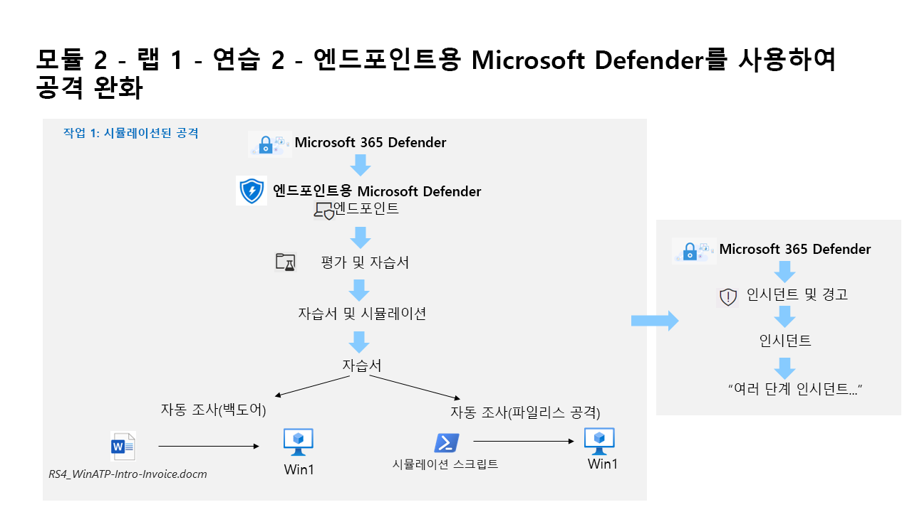

---
lab:
  title: 연습 2 - 엔드포인트용 Microsoft Defender를 사용하여 공격 완화
  module: Learning Path 2 - Mitigate threats using Microsoft Defender for Endpoint
---

# 학습 경로 2 - 랩 1 - 연습 2 - 엔드포인트용 Microsoft Defender를 사용하여 위협 완화

## 랩 시나리오

여러분은 엔드포인트용 Microsoft Defender를 구현하고 있는 회사에서 일하는 보안 운영 분석가입니다. 귀하의 관리자가 몇몇 디바이스를 온보딩하여 보안 운영(SecOps) 팀 응답 절차에 필요한 변경 내용에 대한 인사이트를 제공하려고 합니다.

엔드포인트용 Defender 공격 완화 기능을 살펴보기 위해 시뮬레이션된 공격 2개를 실행합니다.

>                **참고:** **[대화형 랩 시뮬레이션](https://mslabs.cloudguides.com/guides/SC-200%20Lab%20Simulation%20-%20Mitigate%20attacks%20with%20Microsoft%20Defender%20for%20Endpoint)** 을 사용하여 이 랩을 원하는 속도로 클릭할 수 있습니다. 대화형 시뮬레이션과 호스트된 랩 간에 약간의 차이가 있을 수 있지만 보여주는 핵심 개념과 아이디어는 동일합니다. 

### 작업 1: 디바이스 온보딩 확인

이 작업에서는 디바이스가 성공적으로 온보딩되었는지 확인하고 테스트 경고를 만듭니다.

1. 현재 위치가 Microsoft Edge 브라우저의 Microsoft 365 Defender 포털이 아닌 경우 https://security.microsoft.com) 으로 이동하고 테넌트에 대한 관리자로 로그인합니다.

1. 왼쪽 메뉴의 자산 영역에서 **디바이스****를** 선택합니다. 계속하기 전에 WIN1이 디바이스 페이지에 나타날 때까지 기다려 주세요. 그렇지 않으면, 나중에 생성될 경고를 보기 위해 이 작업을 반복해야 할 수 있습니다.

    >**참고:** 온보딩 프로세스를 완료하고 한 시간 후에 디바이스 목록에 디바이스가 표시되지 않으면 온보딩 또는 연결 문제가 표시될 수 있습니다.

1. 왼쪽 메뉴 모음에서 **설정**을 선택한 다음 설정 페이지에서 **엔드포인트**를 선택합니다.

1. 디바이스 관리 섹션에서 **온보딩을** 선택하고 *"Windows 10 및 11"* 이 운영 체제로 선택되어 있는지 확인합니다. *이제 "온보딩된 첫 번째 디바이스"* 메시지에 *완료됨*이 표시됩니다.

1. "2" 섹션 아래를 아래로 스크롤합니다 *. 검색 테스트 실행"*, 복사 단추를 선택하여 검색 테스트 스크립트를 **복사** 합니다.  

1. WIN1 가상 머신의 Windows 검색 창에서 **CMD**를 입력하고 명령 프롬프트 앱의 오른쪽 창에서 **관리자 권한으로 실행**을 선택합니다. 

1. “사용자 계정 컨트롤” 창이 표시되면 **예**를 선택하여 앱을 실행할 수 있도록 합니다. 

1. **관리자: 명령 프롬프트** 창을 마우스 오른쪽 단추로 클릭하여 스크립트를 붙여넣고 **Enter** 키를 눌러 실행합니다. **참고:** 스크립트를 실행한 후 창이 자동으로 닫힙니다.

### 작업 2: 시뮬레이션된 공격

이 작업에서는 엔드포인트용 Microsoft Defender 기능을 살펴보기 위해 시뮬레이션된 공격 2개를 실행합니다.

1. 왼쪽 메뉴의 **엔드포인트**에서 **평가 & 자습서를** 선택한 다음 왼쪽에서 **자습서 & 시뮬레이션을** 선택합니다.

1. **자습서** 탭을 선택합니다.

1. 자동 조사(백도어) 아래에 시나리오를 설명하는 메시지가 표시됩니다. 이 단락 아래에서 **연습 확인**을 클릭합니다. 시뮬레이션을 수행하는 지침이 포함된 새 브라우저 탭이 열립니다.

1. 새 브라우저 탭에서 **시뮬레이션 실행**이라는 섹션(페이지 5, 2단계부터)을 찾고 단계에 따라 공격을 실행합니다. **힌트:** 시뮬레이션 파일 *RS4_WinATP-Intro-Invoice.docm*은 **시뮬레이션 파일 가져오기** 단추를 선택하여 이전 단계에서 선택한 **연습 확인** 바로 아래 포털에서 다시 찾을 수 있습니다. 

1. 마지막 3개 단계를 반복하여 다른 자습서인 자동 조사(파일리스 공격)를 실행합니다.

### 작업 3: 공격 조사

1. Microsoft 365 Defender 포털의 왼쪽 메뉴 모음에서 **인시던트 및 경고**를 선택한 다음, **인시던트**를 선택합니다.

1. “다단계 인시던트...”라는 새 인시던트는 오른쪽 창에 있습니다. 인시던트 이름을 클릭하여 세부 정보를 로드합니다.

    >**참고:** "의심스러운..." 인시던트 가 먼저 나타날 수 있습니다. 나중에 Microsoft 365 Defender 작업 1에서 만든 원래 테스트 경고를 포함하여 단일 보안 문제를 상호 연결하는 경우 앞에서 언급한 인시던트로 바뀝니다.

1. **인시던트 관리** 단추를 선택하면 새 창 블레이드가 나타납니다. 

1. **인시던트 태그** 아래에 “자습서”를 입력하고 **자습서(새로 만들기)** 를 선택하여 새 태그를 만듭니다. 

1. **내게 할당** 토글을 선택하여 사용자 계정(Me)을 인시던트 소유자로 추가합니다. 

1. **분류** 아래에서 드롭다운 메뉴를 확장합니다. 

1. **정보, 예상 작업**에서 **보안 테스트**를 선택합니다. 

1. 원하는 경우 메모를 추가하고 **저장** 을 클릭하여 인시던트 업데이트하고 **닫기를** 선택하여 마칩니다.

1. 경고, 디바이스, 사용자, 조사, 증거 및 응답, 그래프 탭의 콘텐츠를 검토합니다. **힌트:** 일부 탭은 디스플레이 크기 때문에 숨겨질 수 있습니다. 줄임표 탭(...)을 선택하여 해당 탭을 표시합니다.

>**경고:** 시뮬레이션과 자습서는 연습 전체에서 우수한 학습 원본입니다.  포털의 시뮬레이션과 자습서는 정기적으로 추가 및 편집됩니다.  하지만 이러한 시뮬레이션과 자습서 중 일부는 이 학습 과정을 위해 설계된 랩의 성능을 저하시킬 수 있습니다.  과정에서 제공된 Azure 테넌트를 사용할 때는 이 랩에서 제공된 지침에서 권장되는 시뮬레이션과 자습서만 수행합니다.  다른 시뮬레이션과 자습서는 이 교육 과정을 완료한 *후에* 이 테넌트를 사용하여 수행할 수 있습니다.

## 이 랩을 완료했습니다.
