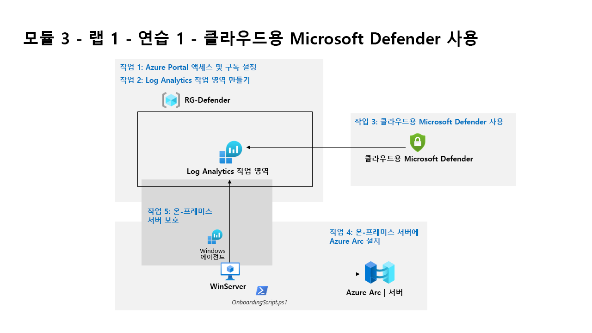

---
lab:
  title: 연습 1 - 클라우드용 Microsoft Defender 사용
  module: Learning Path 3 - Mitigate threats using Microsoft Defender for Cloud
---

# 학습 경로 3 - 랩 1 - 연습 1 - 클라우드용 Microsoft Defender 사용

## 랩 시나리오

여러분은 클라우드용 Microsoft Defender를 사용하여 클라우드 워크로드 보호를 구현하고 있는 회사에서 일하는 보안 운영 분석가입니다.  이 랩에서는 클라우드용 Microsoft Defender 사용하도록 설정합니다.

>                **참고:** **[대화형 랩 시뮬레이션](https://mslabs.cloudguides.com/guides/SC-200%20Lab%20Simulation%20-%20Enable%20Microsoft%20Defender%20for%20Cloud)** 을 사용하여 이 랩을 원하는 속도로 클릭할 수 있습니다. 대화형 시뮬레이션과 호스트된 랩 간에 약간의 차이가 있을 수 있지만 보여주는 핵심 개념과 아이디어는 동일합니다. 

### 작업 1: Azure Portal 액세스 및 구독 설정

이 작업에서는 이 랩 및 향후 랩을 완료하는 데 필요한 Azure 구독을 설정합니다.

1. **WIN1** 가상 머신에 Admin으로 로그인합니다. 암호로는 **Pa55w.rd**를 사용하여 로그인합니다.  

1. Microsoft Edge 브라우저를 열거나 이미 열려 있는 경우 새 탭을 엽니다.

1. Edge 브라우저에서 Azure Portal(https://portal.azure.com) )로 이동합니다.

1. 랩 호스팅 공급자가 제공한 관리자 사용자 이름용 테넌트 전자 메일 계정을 복사하여 **로그인** 대화 상자에 붙여 넣은 후 **다음**을 선택합니다.

1. 랩 호스팅 공급자가 제공한 관리자의 테넌트 암호를 복사하여 **암호 입력** 대화 상자에 붙여 넣은 후 **로그인**을 선택합니다.

1. Azure Portal의 검색 창에 *구독*을 입력하고 **구독**을 선택합니다. 

1. 표시된 *"Azure Pass - 스폰서쉽"* 구독(또는 선택한 언어의 동등한 이름)을 선택합니다.

    >**참고:** 구독이 표시되지 않으면 강사에게 테넌트 관리자 사용자 자격 증명을 사용하여 Azure 구독을 만드는 방법을 문의합니다. **참고:** 구독 만들기 프로세스에는 최대 10분이 걸릴 수 있습니다. 

1. **액세스 제어(IAM)** 를 선택한 다음 *, 이 리소스에 대한 액세스 권한 부여* 상자에서 **역할 할당 추가**를 선택합니다.

1. 권한 있는 **관리자 역할** 탭을 선택한 다음 **소유자를** 선택합니다. **다음**을 선택하여 계속합니다.

1. *구성원* 탭에서 **+ 멤버 선택을** 선택하고 **MOD 관리자** 계정을 선택하고 **선택을** 선택하여 계속합니다.

    >**참고:** **조건** 탭(빨간색 점 포함)이 표시되면 **다음**을 선택한 다음 * 위임 유형에서 **제한되지 않음** 을 선택합니다.

1. **검토 + 할당**을 두 번 선택하여 관리자 계정에 소유자 역할을 할당합니다.

>**중요:** 이러한 랩은 강의 중에 USD $10 미만의 Azure 서비스를 사용하도록 설계되었습니다.

### 작업 2: Log Analytics 작업 영역 만들기

이 작업에서는 클라우드용 Microsoft Defender 사용할 Log Analytics 작업 영역을 만듭니다.

1. Azure Portal의 검색 창에 Log Analytics 작업 영역을 입력하고 동일한 서비스 이름을 선택합니다.

1. 명령 모음에서 **+만들기**를 선택합니다.

1. 리소스 그룹의 **새로 만들기**를 선택합니다.

1. *RG-Defender*를 입력하고 **확인**을 선택합니다.

1. *uniquenameAzureDefender*와 같은 고유한 이름을 입력합니다.

1. **검토 + 생성**를 선택합니다.

1. 작업 영역 유효성 검사에 통과하면 **만들기**를 선택합니다. 새 작업 영역이 프로비전될 때까지 기다립니다. 몇 분 정도 걸릴 수 있습니다.

### 작업 3: 클라우드용 Microsoft Defender 사용

이 작업에서는 클라우드용 Microsoft Defender 사용하도록 설정하고 구성합니다.

1. Azure Portal의 검색 창에 *Defender*를 입력하고 **클라우드용 Microsoft Defender**를 선택합니다.

1. **시작** 페이지의 **업그레이드** 탭 아래에서 구독이 선택되어 있는지 확인한 다음, 페이지 아래쪽에서 **업그레이드** 단추를 선택합니다. 평가판 시작 알림이 표시될 때까지 기다립니다. 약 2분이 걸립니다. 

    >**힌트:** 위쪽 막대에서 종 모양 단추를 클릭하여 Azure Portal 알림을 검토할 수 있습니다.

    >**참고:** *"구독에서 Azure Defender 평가판을 시작할 수 없습니다"* 라는 오류가 표시되면 다음 단계를 계속 진행하여 5단계에서 모든 Defender 계획을 사용하도록 설정합니다.

1. 클라우드용 Microsoft Defender의 왼쪽 메뉴의 관리에서 **환경 설정**을 선택합니다.

1. **“Azure Pass - 스폰서쉽”** 구독(또는 사용 중인 언어로 동일한 이름)을 선택합니다. 

1. 이제 클라우드용 Microsoft Defender 플랜으로 보호되는 Azure 리소스를 검토합니다.

    >**중요:** 모든 Defender 계획이 *꺼져* 있는 경우 **모든 계획 사용을** 선택한 다음 **저장**을 클릭합니다. *"구독 Azure Pass의 리소스 계획이 성공적으로 저장되었습니다!"* 를 기다립니다. 기다립니다.

1. 설정 영역(저장 옆)에서 **설정 및 모니터링** 탭을 선택합니다.

1. 모니터링 확장을 검토합니다. 여기에는 Virtual Machines, 컨테이너 및 스토리지 계정에 대한 구성이 포함됩니다. 페이지 오른쪽 위에 있는 'X'를 선택하여 "설정 & 모니터링" 페이지를 닫습니다.

1. 페이지 오른쪽 위에 있는 ‘X’를 선택하여 설정 페이지를 닫고 **환경 설정**으로 돌아가서 구독 왼쪽에서 ‘>’을 선택합니다.

1. 이전 *uniquenameDefender*를 만든 Log Analytics 작업 영역을 선택하여 사용 가능한 옵션과 가격을 검토합니다.

1. **모든 계획 사용**(Defender 플랜 선택 오른쪽)을 선택한 다음 **, 저장**을 선택합니다. “작업 영역 uniquenameDefender에 대한 Microsoft Defender 플랜이 성공적으로 저장되었습니다.” 알림이 표시될 때까지 기다립니다. 기다립니다.

    >**참고:** 페이지가 표시되지 않으면 Edge 브라우저를 새로 고치고 다시 시도합니다.

1. 페이지 오른쪽 위에 있는 ‘X’를 선택하여 Defender 플랜 페이지를 닫고 **환경 설정**으로 돌아갑니다.

### 작업 4: 온-프레미스 서버에 Azure Arc 설치

이 작업에서는 온보딩을 더 쉽게 수행할 수 있도록 온-프레미스 서버에 Azure Arc를 설치합니다.

>**중요:** 다음 단계는 이전에 작업한 컴퓨터와는 다른 컴퓨터에서 수행합니다. 가상 머신 이름 참조를 찾습니다.

1. **WINServer** 가상 머신에 Administrator로 로그인합니다. 암호로는 **Passw0rd!** 를 사용합니다. 사용합니다(필요한 경우).  

1. Microsoft Edge 브라우저를 열고 https://portal.azure.com 에 있는 Azure Portal로 이동합니다.

1. 랩 호스팅 공급자가 제공한 **테넌트 전자 메일** 계정을 복사하여 **로그인** 대화 상자에 붙여 넣은 후 **다음**을 선택합니다.

1. 랩 호스팅 공급자가 제공한 **테넌트 암호**를 복사하여 **암호 입력** 대화 상자에 붙여넣은 후 **로그인**을 선택합니다.

1. Azure Portal의 검색 창에 *Arc*를 입력하고 **Azure Arc**를 선택합니다.

1. 탐색 창의 **인프라**에서 **머신** 선택

1. **+ 추가/만들기**를 선택한 다음 **, 컴퓨터 추가를** 선택합니다.

1. "단일 서버 추가" 섹션에서 **스크립트 생성** 을 선택합니다.

1. *필수 구성 요소 탭을* 읽은 다음 **다음**을 선택하여 계속합니다.

1. *Azure Arc를 사용하여 서버 추가* 페이지에서 프로젝트 *세부 정보* 아래에서 이전에 만든 리소스 그룹을 선택합니다. **힌트:** *RG-Defender*

    >**참고:** 리소스 그룹을 아직 만들지 않은 경우 다른 탭을 열고, 리소스 그룹을 만들고, 다시 시작합니다.

1. *지역의* 경우 드롭다운 목록에서 **미국 동부**를 선택합니다.

1. 서버 세부 정보 및 연결 방법 옵션을 검토합니다.  기본값을 유지하고 **다음**을 선택하여 태그 탭으로 이동합니다.

1. 사용 가능한 기본 태그를 검토합니다. **다음**을 선택하여 스크립트 다운로드 및 실행 탭으로 이동합니다.

1. 아래로 스크롤하여 **다운로드** 단추를 선택합니다. **힌트:** 브라우저에서 다운로드를 차단하는 경우 브라우저에서 다운로드를 허용하도록 설정합니다. Edge 브라우저에서 필요한 경우 줄임표 단추(...)를 선택한 다음, **유지**를 선택합니다.

1. Windows 시작 단추를 마우스 오른쪽 단추로 클릭하고 **Windows PowerShell(관리자)** 을 선택합니다.

1. UAC 프롬프트가 표시되면 “사용자 이름”으로 *Administrator*를 입력하고 “암호”로 *Passw0rd*를 입력합니다.

1. 입력: cd C:\Users\Administrator\Downloads

    >**중요:** 이 디렉터리가 없는 경우에는 잘못된 머신에서 수행하고 있을 가능성이 큽니다. 작업 4의 시작 부분으로 돌아가서 WINServer로 변경하고 다시 시작합니다.

1. *Set-ExecutionPolicy -ExecutionPolicy Unrestricted*를 입력하고 Enter 키를 누릅니다.

1. 모두 예에 해당하는 **A** 키를 누른 다음 Enter 키를 누릅니다.

1. *.\OnboardingScript.ps1*을 입력하고 Enter 키를 누릅니다.  

    >**중요:** “.\OnboardingScript.ps1 용어가 인식되지 않음...”이라는 오류가 표시되는 경우 WINServer 가상 머신에서 작업 4에 대한 단계를 수행하고 있는지 확인합니다. 여러 다운로드로 인해 파일 이름이 변경되는 다른 문제가 있을 수 있습니다. 실행 중인 디렉터리에서 *“.\OnboardingScript (1).ps1”* 또는 다른 파일 번호를 검색합니다.

1. **R** 키를 눌러 한 번 실행하고 Enter 키를 누릅니다(몇 분 정도 걸릴 수 있음).

1. 설정 프로세스에서 새 Edge 브라우저 탭을 열어 Azure Arc 에이전트를 인증합니다. 관리자 계정을 선택하고 "인증 완료" 메시지가 표시되기를 기다린 후 Windows PowerShell 창으로 돌아갑니다.

1. 설치가 완료되면 스크립트를 다운로드한 Azure Portal 페이지로 돌아가서 **닫기**를 선택합니다. **Azure Arc를 사용하여 서버 추가**를 닫고 Azure Arc **Machines** 페이지로 돌아갑니다.

1. WINServer 서버 이름이 표시되고 상태가 연결될 때까지**새로 고침**을 선택합니다.

    >**참고:** 이 과정은 몇 분 정도 걸릴 수 있습니다.

### 작업 5: 온-프레미스 서버 보호

이 작업에서는 **WINServer** 가상 머신에 *DCR(데이터 수집 규칙)* 을 추가하여 *Azure Monitor 에이전트*를 수동으로 설치합니다.

1. **클라우드용 Microsoft Defender** 이동하여 왼쪽 메뉴에서 **시작** 페이지를 선택합니다.

1. **시작** 탭을 선택합니다.

1. 아래로 스크롤하고 비 Azure 서버 추가 섹션에서 **구성**을 선택합니다.

1. 앞에서 만든 작업 영역 옆의 **업그레이드**를 선택합니다. *"작업 영역 uniquenameDefender에 대한 Microsoft Defender 계획이 성공적으로 저장되었습니다!"* 라는 알림이 표시될 때까지 몇 분 정도 기다립니다.

1. 앞에서 만든 작업 영역 옆의 **+ 서버 추가**를 선택합니다.

1. **데이터 수집 규칙** 선택

1. **+ 만들기**를 선택합니다.

1. 규칙 이름에 **WINServer** 를 입력합니다.

1. *Azure Pass - 스폰서쉽* 구독을 선택하고 리소스 그룹을 선택합니다. **힌트:** *RG-Defender*

1. 기본 *미국 동부* 지역을 유지하거나 다른 바람직한 위치를 선택할 수 있습니다.

1. *플랫폼 유형*에 대한 **Windows** 라디오 단추를 선택하고 **다음:리소스를** 선택합니다.

1. **리소스** 탭에서 **+ 리소스 추가.**

1. **scope 선택** 페이지에서 **RG-Defender**(또는 만든 리소스 그룹)에 대한 *범위* 열을 확장한 다음 **, WINServer**를 선택하고 **적용**을 선택합니다.

    >**참고:** **WINServer**가 표시되지 않으면 *리소스 종류*에 대한 열 필터를 *Server-Azure Arc*로 설정해야 할 수 있습니다.

1. **다음:수집 및 배달**을 선택합니다.

1. **수집 및 배달** 탭에서 **+ 데이터 원본 추가**를 선택합니다.

1. **데이터 원본 추가 페이지의 데이터 원본** *형식*에서 **성능 카운터를** 선택합니다.

    >**참고:** 이 랩에서는 *Windows 이벤트 로그를* 선택할 수 있습니다. 이러한 선택은 나중에 수정할 수 있습니다.

1. **데이터 원본 추가**를 선택하고 **검토 + 만들기를** 선택합니다.

1. *유효성 검사가 통과된* 후 **만들기**를 선택합니다.

1. **데이터 수집 규칙** 만들기는 **WINServer**에 *AzureMonitorWindowsAgent* 확장 설치를 시작합니다.

1. *데이터 수집 규칙* 만들기가 완료되면 *리소스, 서비스 및 문서 검색 창 검색* 창에 **WINServer**를 입력하고 *리소스*에서 **WINServer를** 선택합니다.

1. **WINServer**에서 왼쪽 메뉴를 아래로 스크롤하여 *설정* 및 *확장으로* 이동합니다.

1. **AzureMonitorWindowsAgent**는 **성공** *상태*와 함께 나열되어야 합니다.

1. 다음 랩으로 이동하고 나중에 돌아와**서 클라우드용 Microsoft Defender** **인벤토리** 섹션을 검토하여 **WINServer**가 포함되어 있는지 확인할 수 있습니다.

## 연습 2 계속 진행
