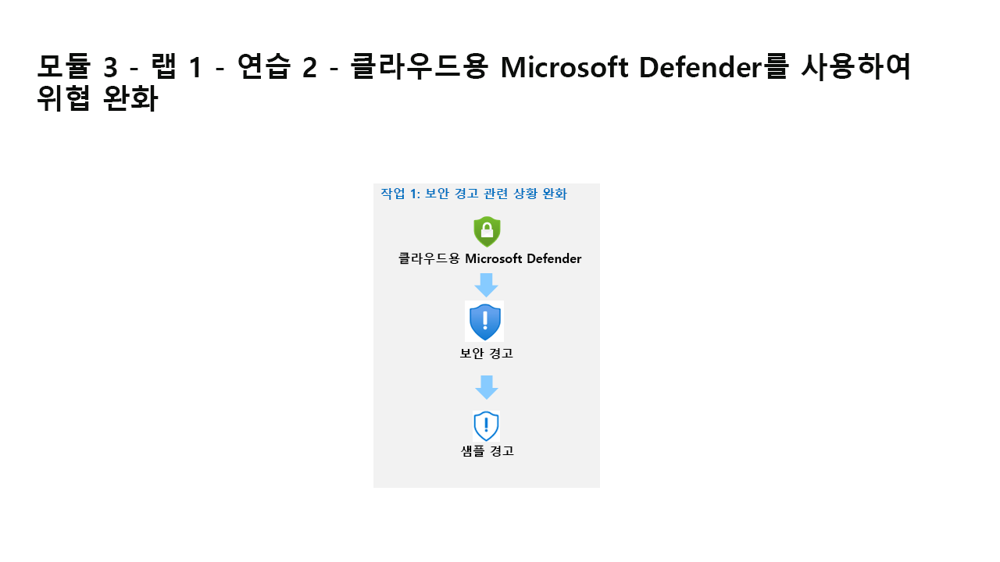

---
lab:
  title: 연습 2 - 클라우드용 Microsoft Defender를 사용하여 위협 완화
  module: Learning Path 3 - Mitigate threats using Microsoft Defender for Cloud
---

# 학습 경로 3 - 랩 1 - 연습 2 - 클라우드용 Microsoft Defender를 사용하여 위협 완화

## 랩 시나리오

여러분은 클라우드용 Microsoft Defender를 구현한 회사에서 일하는 보안 운영 분석가입니다. 클라우드용 Microsoft Defender에서 생성된 권장 사항 및 보안 경고에 응답해야 합니다.

### 작업 1: 규정 준수 살펴보기

이 작업에서는 클라우드용 Microsoft Defender에서 규정 준수 구성을 검토합니다. 

>**중요:** 다음 단계는 이전에 작업한 컴퓨터와는 다른 컴퓨터에서 수행합니다. 가상 머신 이름 참조를 찾습니다.

1. **WIN1** 가상 머신에 Admin으로 로그인합니다. 암호로는 **Pa55w.rd**를 사용하여 로그인합니다.  

1. Edge 브라우저에서 Azure Portal(https://portal.azure.com) )을 엽니다.

1. 랩 호스팅 공급자가 제공한 **테넌트 전자 메일** 계정을 복사하여 **로그인** 대화 상자에 붙여 넣은 후 **다음**을 선택합니다.

1. 랩 호스팅 공급자가 제공한 **테넌트 암호**를 복사하여 **암호 입력** 대화 상자에 붙여 넣은 후 **로그인**을 선택합니다.

1. Azure Portal의 검색 창에 *Defender*를 입력하고 **클라우드용 Microsoft Defender**를 선택합니다.

1. 클라우드 보안의 포털 메뉴에서 **규정 준수**를 선택합니다.

1. 도구 모음에서 **관리형 준수 정책**을 선택합니다.

1. 구독을 선택합니다.

1. 정책 설정 아래의 포털 메뉴에서 **보안 정책**을 선택합니다.

1. 기본적으로 사용할 수 있는 “업계 및 규정 표준”을 검토합니다.

1. **더 많은 표준 추가**를 선택하여 사용 가능한 추가 표준을 검토합니다.

1. 클라우드용 Microsoft Defender를 선택하여 기본 블레이드로 돌아갑니다.

### 작업 2: 보안 태세 및 권장 사항 살펴보기

이 작업에서는 클라우드 보안 태세 관리를 검토합니다.  보안 점수 정보는 다시 계산하는 데 24시간이 걸릴 수 있습니다.  24시간 안에 이 작업을 다시 수행하는 것이 좋습니다.

1. 클라우드 보안의 포털 메뉴에서 **보안 태세**를 선택합니다.

1. 보안 점수는 점수가 계산될 때까지 *N/A*를 표시할 가능성이 높습니다.

1. 일반 아래 포털 메뉴에서 **권장 사항**을 선택합니다.

1. 제공된 권장 사항을 살펴봅니다(24시간 후).

### 작업 3: 보안 경고 관련 상황 완화

이 작업에서는 샘플 보안 경고를 로드하여 경고 세부 정보를 검토합니다.

1. 일반 아래 포털 메뉴에서 **보안 경고**를 선택합니다.

1. 명령 모음에서 **샘플 경고**를 선택합니다. **힌트:** 명령 모음에서 줄임표(...) 단추를 선택해야 할 수 있습니다.

1. 샘플 경고 만들기(미리 보기) 창에서 구독이 선택되어 있고 모든 샘플 경고가 클라우드용 Defender 계획 영역에서 선택되어 있는지 확인합니다.

1. **샘플 경고 만들기**를 선택합니다.  

    >**참고:** 이 샘플 경고 만들기 프로세스를 완료하는 데 몇 분 정도 걸릴 수 있습니다. “샘플 경고를 성공적으로 만들었습니다.”라는 알림을 기다립니다. 완료되면 각 경고가 보안 경고 영역에 표시됩니다.

1. 주의를 끌었던 경고의 경우 다음 작업을 수행합니다.

    - 경고를 선택합니다. 그러면 경고 관련 정보가 표시됩니다. **전체 세부 정보 보기**를 선택합니다.

    - 경고 세부 정보 탭을 검토하고 읽습니다.

    - **작업 수행** 탭을 선택하거나 페이지 끝부분에 있는 **다음: 작업 수행** 단추를 선택합니다.

    - 작업 수행 정보를 검토합니다. 경고 유형에 따라 작업을 수행할 수 있는 다음 섹션을 확인합니다. 리소스 컨텍스트 검사, 위협 완화, 추가 공격 방지, 자동화된 응답 트리거, 유사한 경고 숨기기

## 이 랩을 완료했습니다.
