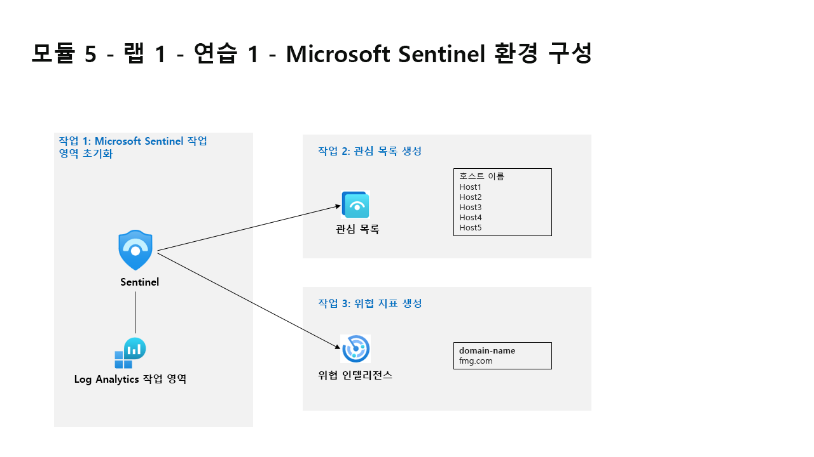

---
lab:
  title: 연습 1 - Microsoft Sentinel 환경 구성
  module: Learning Path 5 - Configure your Microsoft Sentinel environment
---

# 학습 경로 5 - 랩 1 - 연습 1 - Microsoft Sentinel 환경 구성

## 랩 시나리오



당신은 Microsoft Sentinel을 구현한 회사에서 근무하는 보안 운영 분석가입니다. 비용을 최소화하고, 규정 준수 규정을 충족하며, 보안 팀이 일상적인 업무 책임을 수행하도록 가장 관리 가능한 환경을 제공하기 위해 회사의 요구 사항을 충족하는 Microsoft Sentinel 환경을 설정할 책임이 있습니다.

>                **참고:** **[대화형 랩 시뮬레이션](https://mslabs.cloudguides.com/guides/SC-200%20Lab%20Simulation%20-%20Configure%20your%20Microsoft%20Sentinel%20environment)** 을 사용하여 이 랩을 원하는 속도로 클릭할 수 있습니다. 대화형 시뮬레이션과 호스트된 랩 간에 약간의 차이가 있을 수 있지만 보여주는 핵심 개념과 아이디어는 동일합니다. 


### 작업 1: Microsoft Sentinel 작업 영역 초기화

이 작업에서는 Microsoft Sentinel 작업 영역을 만듭니다.

1. **WIN1** 가상 머신에 Admin으로 로그인합니다. 암호로는 **Pa55w.rd**를 사용하여 로그인합니다.  

1. Edge 브라우저를 엽니다.

1. Edge 브라우저에서 Azure Portal(https://portal.azure.com )로 이동합니다.

1. 랩 호스팅 공급자가 제공한 **테넌트 전자 메일** 계정을 복사하여 **로그인** 대화 상자에 붙여넣은 후 **다음**을 선택합니다.

1. 랩 호스팅 공급자가 제공한 **테넌트 암호**를 복사하여 **암호 입력** 대화 상자에 붙여넣은 후 **로그인**을 선택합니다.

1. Azure Portal의 검색 창에 *Sentinel*을 입력하고 **Microsoft Sentinel**을 선택합니다.

1. **+ 만들기**를 선택합니다.

1. 다음으로, 이전에 만든 Log Analytics 작업 영역(예: *uniquenameDefender*)을 선택하고 **추가**를 선택합니다. 활성화는 몇 분 정도 걸릴 수 있습니다.

    >**참고:** 여기에 Log Analytics 작업 영역이 표시되지 않으면 모듈 3, 연습 1, 작업 2를 참조하여 만듭니다.

1. 새로 만든 Microsoft Sentinel 작업 영역 내를 이동하면서 사용자 인터페이스 옵션을 숙지합니다.


### 작업 2: 관심 목록 만들기

이 작업에서는 Microsoft Sentinel에서 관심 목록을 만듭니다.

1. Windows 10 화면 아래쪽의 검색 상자에 *Notepad*를 입력합니다. 결과에서 **메모장**을 선택합니다.

1. *Hostname*을 입력하고 Enter 키를 눌러 새 줄을 시작합니다.

1. 메모장의 행 2에서 다음 호스트 이름을 각각 다른 줄에 복사합니다.

    ```Notepad
    Host1
    Host2
    Host3
    Host4
    Host5
    ```

1. 메뉴에서 **파일 - 다른 이름으로 저장**을 선택하고, 파일 이름을 *HighValue.csv*로 지정하고, 파일 형식을 **모든 파일( *.* )** 로 변경하고, **저장**을 선택합니다. **힌트:** 파일은 *Documents* 폴더에 저장할 수 있습니다.

1. 메모장을 닫습니다.

1. Microsoft Sentinel의 구성 영역에서 **관심 목록** 옵션을 선택합니다.

1. 명령 모음에서 **+ 새 항목 추가**를 선택합니다.

1. 관심 목록 마법사에 다음 정보를 입력합니다.

    |일반 설정|값|
    |---|---|
    |Name|**HighValueHosts**|
    |설명|**중요 호스트**|
    |관심 목록 별칭|**HighValueHosts**|

1. **다음: 원본 >** 을 선택합니다.

1. 파일 업로드에서 **파일 찾아보기**를 선택하고 방금 만든 *HighValue.csv* 파일을 찾습니다.

1. SearchKey 필드에서 **Hostname**을 선택합니다.

1. **다음: 검토 및 만들기 >** 를 선택합니다.

1. 입력한 설정을 검토하고 **만들기**를 선택합니다.

1. 화면에 관심 목록 페이지가 다시 표시됩니다.

1. *HighValueHosts* 관심 목록을 선택하고 오른쪽 창에서 **로그에서 보기**를 선택합니다.

    >**중요:** 관심 목록이 표시되는 데 최대 10분이 걸릴 수 있습니다. **다음 작업을 계속 진행하고 다음 랩에서 이 명령을 실행하세요**.
    
    >**참고:** 이제 KQL 문에서 _GetWatchlist('HighValueHosts')를 사용하여 목록에 액세스할 수 있습니다. 참조할 열은 *Hostname*입니다.

1. 오른쪽 위에 있는 ‘x’를 선택하여 로그 창을 닫고 **확인**을 선택하여 저장되지 않은 편집 내용을 삭제합니다.


### 작업 3: 위협 표시기 만들기

이 작업에서는 Microsoft Sentinel에서 표시기를 만듭니다.

1. Microsoft Sentinel의 위협 관리 영역에서 **위협 인텔리전스** 옵션을 선택합니다.

1. 명령 모음에서 **+ 새 항목 추가**를 선택합니다.

1. 유형 드롭다운에서 사용 가능한 여러 표시기 유형을 검토합니다. **domain-name**을 선택합니다. 

1. 도메인의 경우 도메인 이름을 입력합니다(예: *contoso.com* 입력).

1. 위협 형식에 대해 **악성 활동**을 적어 놓고 **확인**을 선택합니다.

1. 이름에는 도메인에 사용한 것과 같은 값을 입력합니다.

1. *유효 기간(시작)* 필드의 값을 오늘 날짜로 설정합니다.

1. **적용**을 선택합니다.

1. 일반 영역에서 **로그** 옵션을 선택합니다. “항상 쿼리 표시” 옵션을 사용하지 않도록 설정하고 쿼리 창을 닫아 KQL 문을 실행할 수 있습니다.

1. 다음 KQL 문을 실행합니다.

    ```KQL
    ThreatIntelligenceIndicator
    ```

    >**참고:** 표시기가 표시되려면 최대 5분이 소요될 수 있습니다.

1. 결과를 오른쪽으로 스크롤하여 DomainName 열을 확인합니다. 다음 KQL 문을 실행하여 DomainName 열만 표시할 수도 있습니다. 

    ```KQL
    ThreatIntelligenceIndicator | project DomainName
    ```


### 작업 4: 로그 보존 구성

이 작업에서는 SecurityEvent 테이블의 보존 기간을 변경합니다.

1. Microsoft Sentinel의 *구성* 영역에서 **설정** 옵션을 선택합니다.

1. **작업 영역 설정**을 선택합니다.

1. Log Analytics 작업 영역의 *설정* 영역에서 **테이블** 옵션을 선택합니다.

1. **SecurityEvent** 테이블을 검색하여 선택한 다음, 줄임표 단추(...)를 선택합니다.

1. **테이블 관리**를 선택합니다.

1. 총 보존 기간은 **180일**을 선택합니다. *보관 기간*은 (기본값) *대화형 보존*에서 30일을 사용하기 때문에 150일입니다.

1. 변경 내용을 적용하려면 **저장**을 선택합니다.


## 이 랩을 완료했습니다.
