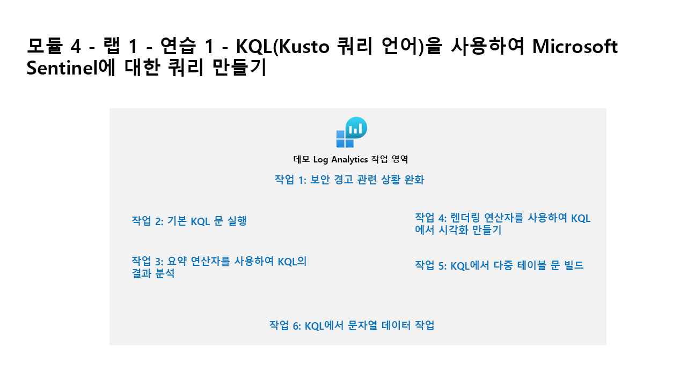

---
lab:
  title: 연습 1 - KQL(Kusto 쿼리 언어)을 사용하여 Microsoft Sentinel에 대한 쿼리 만들기
  module: Learning Path 6 - Create queries for Microsoft Sentinel using Kusto Query Language (KQL)
---

# 학습 경로 6 - 랩 1 - 연습 1 - KQL(Kusto 쿼리 언어)을 사용하여 Microsoft Sentinel에 대한 쿼리 만들기

## 랩 시나리오



당신은 Microsoft Sentinel을 구현한 회사에서 근무하는 보안 운영 분석가입니다. 로그 데이터 분석을 수행하여 악의적인 활동을 검색하고, 시각화를 표시하고, 위협 헌팅을 수행할 책임이 있습니다. 로그 데이터를 쿼리하려면 KQL(Kusto Query Language)을 사용합니다.

>**중요:** 학습 경로 #6의 랩 연습은 *독립 실행형* 환경에서 진행됩니다. 랩을 완료하기 전에 종료하면 구성을 다시 실행해야 합니다.

>**참고:** 이 랩 프로필은 Microsoft Sentinel이 **defenderWorkspace**라는 이름으로 사용자의 Azure 구독에 사전 배포되는 동안, 완전히 빌드하는 데 15분 이상 소요됩니다.

<!--- >**Tip:** This lab involves entering many KQL scripts into Microsoft Sentinel. The scripts were provided in a file at the beginning of this lab. An alternate location to download them is:  <https://github.com/MicrosoftLearning/SC-200T00A-Microsoft-Security-Operations-Analyst/tree/master/Allfiles> --->

### 이 랩의 예상 완료 시간은 60분입니다.

### 작업 1: KQL 테스트 영역 준비

이 작업에서는 Marketplace에서 **Microsoft Sentinel 교육 랩 솔루션**을 설치합니다. 이 솔루션은 KQL 문장 작성 연습에 사용할 수 있는 샘플 데이터로 Log Analytics 작업 영역을 채웁니다.

1. **WIN1** 가상 머신에 Admin으로 로그인합니다. 암호로는 **Pa55w.rd**를 사용하여 로그인합니다.  

1. Microsoft Edge 브라우저에서 <https://portal.azure.com>으로 이동하여 할당된 자격 증명으로 로그인합니다.

1. Azure 검색 창에 **Microsoft Sentinel 교육 랩 솔루션**을 입력하고 결과에서 선택합니다.

    >**힌트:** Marketplace 섹션에 있습니다.

1. **Microsoft Sentinel 교육 랩 솔루션** 페이지에서 **만들기**를 선택하여 솔루션을 설치합니다.

1. **Microsoft Sentinel 교육 랩 솔루션 만들기** 페이지에서 **defender-RG** 리소스 그룹과 **defenderWorkspace** 작업 영역을 선택합니다.

1. **검토 + 만들기**를 선택하여 솔루션을 배포합니다.

1. 유효성 검사가 완료되면 **만들기**를 선택하여 솔루션을 배포합니다.

  >**참고:** 솔루션을 완전히 배포하고 모든 리소스를 사용할 수 있기까지 약 10분 정도 시간이 걸립니다.

1. 배포가 완료될 때까지 기다린 다음, 이동 경로 탐색에서 **홈**을 선택합니다.

### 작업 2: Log Analytics 작업 영역 살펴보기

1. Azure Portal 검색 창에 **Microsoft Sentinel**을 입력하고 결과에서 선택합니다.

1. Microsoft Sentinel 페이지에서 **defenderWorkspace** 작업 영역을 선택합니다.

1. Microsoft Sentinel에서 **일반** 섹션을 확장하고 탐색 메뉴에서 **로그**를 선택합니다.

1. 표시되는 Log Analytics 비디오 팝업 창을 닫습니다.

1. **쿼리 허브**를 닫습니다.

1. 드롭다운 메뉴를 사용하여 **단순 모드**를 **KQL 모드**로 변경하세요.

1. 화면 왼쪽의 *스키마 및 필터 창*에 나열된 사용 가능한 테이블 및 기타 도구를 살펴봅니다.

1. 쿼리 편집기에서 다음 쿼리를 입력하고 **실행** 단추를 선택합니다. 아래쪽 창에서 쿼리 결과가 표시됩니다.

    ```KQL
    SecurityEvent_CL
    ```

    >**참고:** *SecurityEvent_CL* 테이블은 Microsoft Sentinel 교육 랩 솔루션에서 만든 사용자 지정 테이블입니다. 여기에는 KQL 문 작성을 연습하는 데 사용할 수 있는 샘플 데이터가 포함되어 있습니다.

1. 필터가 다음과 같이 설정되어 있는지 확인하세요. **표시: 1000개 결과**

1. 첫 번째 레코드 옆에 있는 **>** 을 선택하여 해당 행의 정보를 펼칩니다.

### 작업 3: 기본 KQL 문 실행

이 작업에서는 기본적인 KQL 문을 빌드합니다.

>**중요:**  각 쿼리에 대해 쿼리 창에서 이전 문을 지우거나, 마지막으로 연 탭 뒤에 있는 **+** 를 선택하여 새 쿼리 창을 엽니다(최대 25개).

1. 다음 문은 테이블의 모든 열에서 값을 검색하는 **search** 연산자를 보여 줍니다.

1. 쿼리 창에서 *시간 범위*는 기본적으로 **지난 24시간**으로 설정되어야 합니다.

1. 쿼리 창에서 다음 문을 입력하고 **실행**을 선택합니다.

    ```KQL
    search "Computer"
    ```

    >**참고:** 특정 테이블이나 정규화 절 없이 *Search* 연산자를 사용하는 것은 테이블별 및 열별 텍스트 필터링보다 효율성이 떨어집니다.

1. 다음 문은 **in** 절 내에 나열된 테이블에서 **search**를 보여 줍니다. 쿼리 창에서 다음 문을 입력하고 **실행**을 선택합니다.

    ```KQL
    search in (SecurityEvent_CL,App*) "new"
    ```

1. 쿼리 창에서 *Time range*를 다시 **Last 24 hours**로 변경합니다.

1. 다음 문은 특정 조건자를 필터링하는 **where** 연산자를 보여 줍니다. 쿼리 창에서 다음 문을 입력하고 **실행**을 선택합니다.

    >**중요:** 아래 코드 블록에서 각 쿼리를 입력한 후 **실행**을 선택해야 합니다.

    ```KQL
    SecurityEvent_CL  
    | where TimeGenerated > ago(7d)
    ```

    >**참고:** 이제 TimeGenerated 열로 필터링하므로 *시간 범위*에 *쿼리에서 설정됨*이 표시됩니다.

    ```KQL
    SecurityEvent_CL  
    | where TimeGenerated > ago(7d) and EventID_s == 4624
    ```

    ```KQL
    SecurityEvent_CL  
    | where TimeGenerated > ago(7d)
    | where EventID_s == 4624  
    | where AccountType_s =~ "user"
    ```

    ```KQL
    SecurityEvent_CL  
    | where TimeGenerated > ago(7d) and EventID_s in (4624, 4625)
 
    ```

1. 다음 문에는 **let** 문을 사용하여 변수를 선언하는 방법이 나와 있습니다.** 쿼리 창에서 다음 문을 입력하고 **실행**을 선택합니다.

    ```KQL
    let timeOffset = 1h;
    let discardEventID = 4688;
    SecurityEvent_CL
    | where TimeGenerated > ago(timeOffset*2) and TimeGenerated < ago(timeOffset)
    | where EventID_s != discardEventID
    ```

1. 다음 문에는 **let** 문을 사용하여 동적 목록을 선언하는 방법이 나와 있습니다.** 쿼리 창에서 다음 문을 입력하고 **실행**을 선택합니다.

    ```KQL
    let suspiciousAccounts = datatable(account: string) [
      @"NA\timadmin", 
      @"NT AUTHORITY\SYSTEM"
    ];
    SecurityEvent_CL  
    | where TimeGenerated > ago(7d)
    | where Account_s in (suspiciousAccounts)
    ```

    >**팁:** 쿼리 창에서 줄임표(...)를 선택하여 쿼리 서식을 간편하게 다시 지정할 수 있으며 **양식 쿼리**를 선택할 수 있습니다.

1. 다음 문에는 **let** 문을 사용하여 동적 테이블을 선언하는 방법이 나와 있습니다.** 쿼리 창에서 다음 문을 입력하고 **실행**을 선택합니다.

    ```KQL
    let LowActivityAccounts =
        SecurityEvent_CL 
        | summarize cnt = count() by Account_s 
        | where cnt < 1000;
    LowActivityAccounts | where Account_s contains "sql"
    ```

    <!--- 1. Change the **Time range** to **Last hour** in the Query Window. This limits our results for the following statements.

    1. The following statement demonstrates the **extend** operator, which creates a calculated column and adds it to the result set. In the Query Window, enter the following statement and select **Run**: 

    ```KQL
    SecurityEvent_CL  
    | where TimeGenerated > ago(7d) 
    | where ProcessName != "" and Process != "" 
    | extend StartDir =  substring(ProcessName,0, string_size(ProcessName)-string_size(Process))
    ```

    1. The following statement demonstrates the **order by** operator, which sorts the rows of the input table by one or more columns in ascending or descending order. The **order by** operator is an alias to the **sort by** operator. In the Query Window, enter the following statement and select **Run**: 

    ```KQL
    SecurityEvent_CL  
    | where TimeGenerated > ago(7d) 
    | where ProcessName != "" and Process != "" 
    | extend StartDir =  substring(ProcessName,0, string_size(ProcessName)-string_size(Process)) 
    | order by StartDir desc, Process asc
    ```

    1. The following statements demonstrate the **project** operator, which selects the columns to include in the order specified. In the Query Window, enter the following statement and select **Run**: 

    ```KQL
    SecurityEvent_CL  
    | where TimeGenerated > ago(7d) 
    | where ProcessName != "" and Process != "" 
    | extend StartDir =  substring(ProcessName,0, string_size(ProcessName)-string_size(Process)) 
    | order by StartDir desc, Process asc 
    | project Process, StartDir
    ```

    1. The following statements demonstrate the **project-away** operator, which selects the columns to exclude from the output. In the Query Window, enter the following statement and select **Run**: 

    ```KQL
    SecurityEvent_CL  
    | where TimeGenerated > ago(7d) 
    | where ProcessName != "" and Process != "" 
    | extend StartDir =  substring(ProcessName,0, string_size(ProcessName)-string_size(Process)) 
    | order by StartDir desc, Process asc 
    | project-away ProcessName --->
    ```

### Task 4: Analyze Results in KQL with the Summarize Operator

In this task, you'll build KQL statements to aggregate data. **Summarize** groups the rows according to the **by** group columns, and calculates aggregations over each group.

1. The following statement demonstrates the **count()** function, which returns a count of the group. In the Query Window enter the following statement and select **Run**: 

    ```KQL
    SecurityEvent_CL  
    | where TimeGenerated > ago(7d) and EventID_s == 4688  
    | summarize count() by Computer
    ```

1. 다음 문은 **count()** 함수를 보여 주지만 이 예제에서는 열 이름을 *cnt*로 지정합니다. 쿼리 창에서 다음 문을 입력하고 **실행**을 선택합니다. 

    ```KQL
    SecurityEvent_CL  
    | where TimeGenerated > ago(7d) and EventID_s == 4624  
    | summarize cnt=count() by AccountType_s, Computer
    ```

1. 다음 문은 그룹 요소의 대략적인 고유 개수를 반환하는 **dcount()** 함수를 보여 줍니다. 쿼리 창에서 다음 문을 입력하고 **실행**을 선택합니다.

    ```KQL
    SigninLogs_CL  
    | where TimeGenerated > ago(7d)
    | summarize dcount(IpAddress)
    ```

1. 다음 문은 동일한 계정에 대해 여러 애플리케이션에서 잘못된 암호 오류를 검색하는 규칙입니다. 쿼리 창에서 다음 문을 입력하고 **실행**을 선택합니다.

    ```KQL
    let timeframe = 30d;
    let threshold = 1;
    SigninLogs_CL
    | where TimeGenerated >= ago(timeframe)
    | where ResultDescription has "Invalid password"
    | summarize applicationCount = dcount(AppDisplayName_s) by UserPrincipalName_s, IPAddress
    | where applicationCount >= threshold
    ```

1. 다음 문은 인수가 최대화될 때 하나 이상의 식을 반환하는 **arg_max()** 함수를 보여 줍니다. 다음 문은 컴퓨터 *VictimPC2*의 SecurityEvent_CL 테이블에서 가장 최근 행을 반환합니다. arg_max 함수의 *는 행의 모든 열을 요청합니다. 쿼리 창에서 다음 문을 입력하고 **실행**을 선택합니다.

    ```KQL
    SecurityEvent_CL  
    | where Computer == "VictimPC2"
    | summarize arg_max(TimeGenerated,*) by Computer
    ```

1. 다음 문은 인수가 최소화될 때 하나 이상의 식을 반환하는 **arg_min()** 함수를 보여 줍니다. 이 문에서는 컴퓨터 *VictimPC2*의 가장 오래된 SecurityEvent_CL이 결과 집합으로 반환됩니다. 쿼리 창에서 다음 문을 입력하고 **실행**을 선택합니다.

    ```KQL
    SecurityEvent_CL  
    | where Computer == "VictimPC2"
    | summarize arg_min(TimeGenerated,*) by Computer
    ```

1. 다음 문은 파이프 순서에 따라 결과를 이해하는 것의 중요성을 보여 줍니다.** 쿼리 창에서 다음 쿼리를 입력하고 각 쿼리를 개별적으로 실행합니다.

    1. **쿼리 1**에는 마지막 작업이 로그인이었던 계정이 있습니다. 먼저 SecurityEvent_CL 테이블이 요약되고 각 계정에 대한 최신 행이 반환됩니다. 그런 다음 EventID_s가 4624(로그인)인 행만 반환됩니다.

        ```KQL
        SecurityEvent_CL  
        | summarize arg_max(TimeGenerated, *) by Account_s 
        | where EventID_s == 4624  
        ```

    1. **쿼리 2**에는 로그인한 계정에 대한 가장 최근 로그인이 있습니다. SecurityEvent_CL 테이블은 EventID_s = 4624만 포함하도록 필터링됩니다. 그러면 해당 결과가 계정별로 최신 로그인 행에 대해 요약됩니다.

        ```KQL
        SecurityEvent_CL  
        | where EventID_s == 4624  
        | summarize arg_max(TimeGenerated, *) by Account_s
        ```

    >**참고:**  오른쪽 아래에서 “쿼리 세부 정보” 링크를 선택하여 “Total CPU” 및 “Data used for processed query”를 검토하고 두 문의 데이터를 비교할 수도 있습니다.

1. 다음 문은 그룹 내의 모든 값 목록을 반환하는 **make_list()** 함수를 보여 줍니다.** 이 KQL 쿼리는 먼저 where 연산자를 사용하여 EventID_s를 필터링합니다. 그런 다음 각 컴퓨터에서 결과는 계정의 JSON 배열입니다. 결과 JSON 배열에는 중복된 계정이 포함됩니다. 쿼리 창에서 다음 문을 입력하고 **실행**을 선택합니다. 

    ```KQL
    SecurityEvent_CL  
    | where TimeGenerated > ago(7d)
    | where EventID_s == 4624  
    | summarize make_list(Account_s) by Computer
    ```

1. 다음 문은 그룹 내의 고유 값 세트를 반환하는 **make_set()** 함수를 보여 줍니다.** 이 KQL 쿼리는 먼저 where 연산자를 사용하여 EventID_s를 필터링합니다. 그런 다음 각 컴퓨터에서 결과는 고유한 계정의 JSON 배열입니다. 쿼리 창에서 다음 문을 입력하고 **실행**을 선택합니다. 

    ```KQL
    SecurityEvent_CL  
    | where TimeGenerated > ago(7d)
    | where EventID_s == 4624  
    | summarize make_set(Account_s) by Computer
    ```

### 작업 5: Render 연산자를 사용하여 KQL에서 시각화 만들기

이 작업에서는 KQL 문을 사용하여 시각화를 생성합니다.

1. 다음 문은 **막대형 차트** 시각화를 사용하여 결과를 그래픽 출력으로 렌더링하는 **render** 연산자를 보여 줍니다. 쿼리 창에서 다음 문을 입력하고 **실행**을 선택합니다. 

    ```KQL
    SecurityEvent_CL  
    | where TimeGenerated > ago(7d)
    | summarize count() by Account_s
    | render barchart
    ```

1. 다음 문은 시계열을 사용하여 결과를 시각화하는 **render** 연산자를 보여 줍니다. **bin()** 함수는 시간 범위의 모든 값을 반올림하고 그룹화하며, **요약**과 함께 자주 사용됩니다. 분산된 값 집합이 있는 경우 값이 특정 값의 더 작은 집합으로 그룹화됩니다. 생성된 결과 및 **render** 연산자에 대한 파이프를 **시간 차트**와 결합하면 시계열 시각화가 제공됩니다. 쿼리 창에서 다음 문을 입력하고 **실행**을 선택합니다. 

    ```KQL
    SecurityEvent_CL  
    | where TimeGenerated > ago(7d)
    | summarize count() by bin(TimeGenerated, 1m)
    | render timechart
    ```

### 작업 6: KQL에서 다중 테이블 문 빌드

이 작업에서는 다중 테이블 KQL 문을 작성합니다.

1. 쿼리 창에서 **시간 범위**를 **지난 7일**로 변경합니다. 이렇게 하면 다음 문에 대한 결과가 제한됩니다.

1. 다음 문은 두 개 이상의 테이블을 사용하고 모든 행을 반환하는 **union** 연산자를 보여 줍니다. 결과가 파이프 문자에 어떻게 전달되고 영향을 받는지 이해하는 것은 중요합니다. 쿼리 창에서 다음 문을 입력하고 각 쿼리에 대해 개별적으로 **실행**을 선택하여 결과를 확인합니다.

    1. **쿼리 1**은 SecurityEvent_CL의 모든 행과 SigninLogs_CL의 모든 행을 반환합니다.

        ```KQL
        SecurityEvent_CL  
        | union SigninLogs_CL  
        ```

    1. **쿼리 2**는 SecurityEvent_CL의 모든 행과 SigninLogs_CL의 모든 행의 수인 하나의 행과 열을 반환합니다.

        ```KQL
        SecurityEvent_CL  
        | union SigninLogs_CL  
        | summarize count() 
        ```

    1. **쿼리 3**은 SecurityEvent_CL의 모든 행과 SigninLogs_CL의 행 하나를 반환합니다. SigninLogs_CL의 마지막 행에는 총 행 수의 요약된 개수가 포함됩니다.

        ```KQL
        SecurityEvent_CL  
        | union (SigninLogs_CL | summarize count() | project count_)
        ```

    >**참고:** 결과의 '빈 행'에는 SigninLogs_CL의 요약된 개수가 표시됩니다.

1. 다음 문은 와일드카드를 사용하여 여러 테이블을 결합하기 위한 **union** 연산자 지원을 보여 줍니다. 쿼리 창에서 다음 문을 입력하고 **실행**을 선택합니다. 

    ```KQL
    union App*  
    | summarize count() by Type
    ```

1. 다음 문은 두 테이블의 행을 병합하여 각 테이블에서 지정된 열의 값 일치 여부를 확인하여 새 테이블을 생성하는 **join** 연산자를 보여 줍니다. 쿼리 창에서 다음 문을 입력하고 **실행**을 선택합니다.

    ```KQL
    SecurityEvent_CL  
    | where EventID_s == 4624 
    | summarize LogOnCount=count() by  EventID_s, Account_s
    | project LogOnCount, Account_s
    | join kind = inner( 
     SecurityEvent_CL  
    | where EventID_s == 4634 
    | summarize LogOffCount=count() by  EventID_s, Account_s
    | project LogOffCount, Account_s
    ) on Account_s
    ```

    >**중요:** 조인에서 지정된 첫 번째 테이블은 왼쪽 테이블로 간주됩니다. **join** 연산자 뒤의 테이블은 오른쪽 테이블입니다. 테이블의 열로 작업을 할 때는 참조 대상 테이블 열을 구분하기 위해 $left.Column name 이름 및 $right.Column 이름을 사용합니다. **join** 연산자는 전체 형식 범위인 flouter, inner, innerunique, leftanti, leftantisemi, leftouter, leftsemi, rightanti, rightantisemi, rightouter, rightsemi를 지원합니다.

1. 쿼리 창에서 **시간 범위**를 **지난 7일**로 그대로 둘 수 있습니다.

### 작업 7: KQL에서 문자열 데이터 작업

이 작업에서는 KQL 문을 사용하여 구조화된 문자열 필드 및 구조화되지 않은 문자열 필드 작업을 수행합니다.

1. 다음 문은 원본 문자열에서 정규식에 대한 일치를 가져오는 **extract** 함수를 보여 줍니다. 추출된 하위 문자열을 지정된 형식으로 변환하는 옵션이 있습니다. 쿼리 창에서 다음 문을 입력하고 **실행**을 선택합니다. 

    ```KQL
    print extract("x=([0-9.]+)", 1, "hello x=45.6|wo") == "45.6"
    ```

1. 다음 문에서는 **extract** 함수를 사용하여 SecurityEvent_CL 테이블의 Account_s 필드에서 Account_s Name을 가져옵니다. 쿼리 창에서 다음 문을 입력하고 **실행**을 선택합니다. 

    ```KQL
    SecurityEvent_CL  
    | where EventID_s == 4672 and AccountType_s == 'User' 
    | extend Account_Name = extract(@"^(.*\\)?([^@]*)(@.*)?$", 2, tolower(Account_s))
    | summarize LoginCount = count() by Account_Name
    | where Account_Name != "" 
    | where LoginCount < 10
    ```

1. 다음 문은 문자열 식을 평가하고 해당 값을 하나 이상의 계산 열로 구문 분석하는 **parse** 연산자를 보여 줍니다. 비정형 데이터를 구조화하는 데 사용합니다. 쿼리 창에서 다음 문을 입력하고 **실행**을 선택합니다.

    ```KQL
    let Traces = datatable(EventText:string)
    [
    "Event: NotifySliceRelease (resourceName=PipelineScheduler, totalSlices=27, sliceNumber=23, lockTime=02/17/2016 08:40:01, releaseTime=02/17/2016 08:40:01, previousLockTime=02/17/2016 08:39:01)",
    "Event: NotifySliceRelease (resourceName=PipelineScheduler, totalSlices=27, sliceNumber=15, lockTime=02/17/2016 08:40:00, releaseTime=02/17/2016 08:40:00, previousLockTime=02/17/2016 08:39:00)",
    "Event: NotifySliceRelease (resourceName=PipelineScheduler, totalSlices=27, sliceNumber=20, lockTime=02/17/2016 08:40:01, releaseTime=02/17/2016 08:40:01, previousLockTime=02/17/2016 08:39:01)",
    "Event: NotifySliceRelease (resourceName=PipelineScheduler, totalSlices=27, sliceNumber=22, lockTime=02/17/2016 08:41:01, releaseTime=02/17/2016 08:41:00, previousLockTime=02/17/2016 08:40:01)",
    "Event: NotifySliceRelease (resourceName=PipelineScheduler, totalSlices=27, sliceNumber=16, lockTime=02/17/2016 08:41:00, releaseTime=02/17/2016 08:41:00, previousLockTime=02/17/2016 08:40:00)"
    ];
    Traces   
    | parse EventText with * "resourceName=" resourceName ", totalSlices=" totalSlices:long * "sliceNumber=" sliceNumber:long * "lockTime=" lockTime ", releaseTime=" releaseTime:date "," * "previousLockTime=" previousLockTime:date ")" *  
    | project resourceName, totalSlices, sliceNumber, lockTime, releaseTime, previousLockTime
    ```

    <!--- 1. The following statement demonstrates working with **dynamic** fields, which are special since they can take on any value of other data types. In this example, The DeviceDetail_s field from the SigninLogs_CL table is of type **dynamic**. In the Query Window, enter the following statement and select **Run**:

    ```KQL
    SigninLogs
    | extend OS = DeviceDetail.operatingSystem
    ```

     1. The following example shows how to break out packed fields for SigninLogs_CL. In the Query Window, enter the following statement and select **Run**:

    ```KQL
    SigninLogs_CL 
    | extend OS = DeviceDetail.operatingSystem, Browser = DeviceDetail.browser 
    | extend StatusCode = tostring(Status.errorCode), StatusDetails = tostring(Status.additionalDetails) 
    | extend Date = startofday(TimeGenerated) 
    | summarize count() by Date, Identity, UserDisplayName, UserPrincipalName, IPAddress, ResultType, ResultDescription, StatusCode, StatusDetails 
    | sort by Date

    SigninLogs_CL 
    | extend OS = todynamic(DeviceDetail_s)
    | where OS = DeviceDetail_s.operatingSystem, Browser = DeviceDetail_s.browser
    | extend StatusCode = tostring(Status_s.errorCode), StatusDetails = tostring(Status_s.additionalDetails) 
    | extend Date = startofday(TimeGenerated) 
    | summarize count() by Date, UserDisplayName_s, UserPrincipalName_s, IPAddress, ResultType, ResultDescription, StatusCode, StatusDetails, OS, Browser 
    | sort by Date

    ```

    >**Important:** Although the dynamic type appears JSON-like, it can hold values that the JSON model does not represent because they do not exist in JSON. Therefore, in serializing dynamic values into a JSON representation, values that JSON cannot represent are serialized into string values. --->

1. 다음 문은 문자열 필드에 저장된 JSON을 조작하는 연산자를 보여 줍니다. 대부분의 로그는 JSON 형식으로 데이터를 제출합니다. 이 경우 JSON 데이터를 쿼리 가능한 필드로 변환하는 방법을 알아야 합니다. 쿼리 창에서 다음 문을 입력하고 **실행**을 선택합니다.

    ```KQL
    SigninLogs_CL 
    | extend AuthDetails =  parse_json(AuthenticationDetails_s) 
    | extend AuthMethod =  AuthDetails[0].authenticationMethod 
    | extend AuthResult = AuthDetails[0].["authenticationStepResultDetail"] 
    | project AuthMethod, AuthResult, AuthDetails 
    ```

1. 다음 문은 동적 배열을 행(다중 값 확장)으로 변환하는 **mv-expand** 연산자를 보여 줍니다.

    ```KQL
    SigninLogs_CL 
    | mv-expand AuthDetails = parse_json(AuthenticationDetails_s) 
    | project AuthDetails
    ```

1. ">"를 선택하여 첫 번째 행을 확장한 다음 *AuthDetails* 옆에서 다시 확장된 결과를 검토합니다.

1. 다음 문은 각 레코드에 하위 쿼리를 적용하고 모든 하위 쿼리 결과의 합집합을 반환하는 **mv-apply** 연산자를 보여 줍니다.

    ```KQL
    SigninLogs_CL 
    | mv-apply AuthDetails = parse_json(AuthenticationDetails_s) on
    (where AuthDetails.authenticationMethod == "Password")
    ```

1. **함수**는 다른 로그 쿼리에서 명령으로 저장된 이름과 함께 사용할 수 있는 로그 쿼리입니다. **함수**를 만들려면 쿼리를 실행한 후 **저장** 단추를 선택한 다음, 드롭다운에서 **함수로 저장**을 선택합니다. 원하는 이름(예: *PrivLogins*)을 **함수 이름** 상자에 입력하고, **레거시 범주**(예: *일반*)를 입력한 뒤, **저장**을 선택합니다. 이 함수는 함수의 별칭을 사용하여 KQL에서 사용할 수 있습니다.

    ```KQL
    PrivLogins  
    ```

## 이 랩을 완료했습니다.
