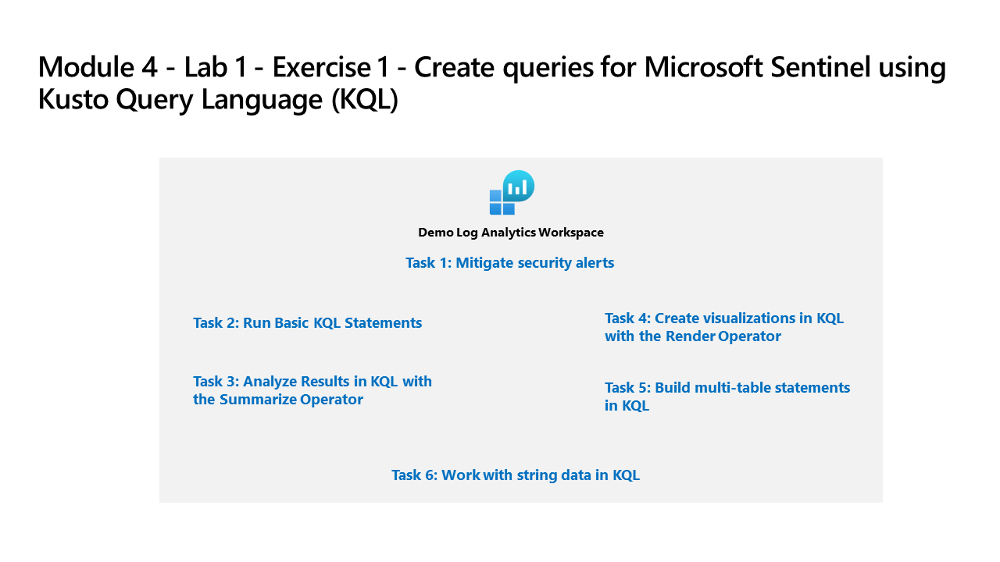

---
lab:
  title: 연습 1 - KQL(Kusto 쿼리 언어)을 사용하여 Microsoft Sentinel에 대한 쿼리 만들기
  module: Learning Path 6 - Create queries for Microsoft Sentinel using Kusto Query Language (KQL)
---

# 학습 경로 6 - 랩 1 - 연습 1 - KQL(Kusto 쿼리 언어)을 사용하여 Microsoft Sentinel에 대한 쿼리 만들기

## 랩 시나리오



당신은 Microsoft Sentinel을 구현한 회사에서 근무하는 보안 운영 분석가입니다. 로그 데이터 분석을 수행하여 악의적인 활동을 검색하고, 시각화를 표시하고, 위협 헌팅을 수행할 책임이 있습니다. 로그 데이터를 쿼리하려면 KQL(Kusto Query Language)을 사용합니다.

>**참고:** Microsoft의 *SFI(Secure Future Initiative)* 에 따라 위치, 사용자 이름, IP 주소, 리소스 ID 등 *PII(개인 식별 정보)* 로 간주될 수 있는 모든 정보입니다. *SigninLogs*와 같은 LA 데모 테이블에서 제거되었습니다. 이로 인해 일부 쿼리에 대한 *결과를 찾을 수 없습니다*.

>**중요:** 이 랩에서는 많은 KQL 스크립트를 Microsoft Sentinel에 입력합니다. 스크립트는 이 랩의 시작 부분에 있는 파일에 제공되었습니다. 스크립트를 다운로드할 대체 위치는 <https://github.com/MicrosoftLearning/SC-200T00A-Microsoft-Security-Operations-Analyst/tree/master/Allfiles>입니다.

### 이 랩의 예상 완료 시간은 60분입니다.

### 작업 1: KQL 테스트 영역 액세스

이 작업에서는 KQL 문 작성을 연습할 수 있는 Log Analytics 환경에 액세스합니다.

  >**참고:** 기본 기간에 대해 *결과를 찾을 수 없습니다*라는 메시지가 표시되면 *시간 범위*를 *지난 7일*로 변경합니다.

1. **WIN1** 가상 머신에 Admin으로 로그인합니다. 암호로는 **Pa55w.rd**를 사용하여 로그인합니다.  

1. Microsoft Edge 브라우저에서 <https://aka.ms/lademo>(으)로 이동하여 관리자 자격 증명으로 로그인합니다.

1. 표시되는 Log Analytics 비디오 팝업 창을 닫습니다.

1. 화면 왼쪽의 *스키마 및 필터 창*에 나열된 사용 가능한 테이블 및 기타 도구를 살펴봅니다.

1. 쿼리 편집기에서 다음 쿼리를 입력하고 **실행** 단추를 선택합니다. 아래쪽 창에서 쿼리 결과가 표시됩니다.

    ```KQL
    SecurityEvent
    ```

1. 최대 결과 수(30,000개)에 도달했습니다.

1. 쿼리 창에서 *시간 범위*를 **지난 7일**로 변경합니다.

1. 첫 번째 레코드 옆에 있는 **>** 을 선택하여 해당 행의 정보를 펼칩니다.

### 작업 2: 기본 KQL 문 실행

이 작업에서는 기본적인 KQL 문을 빌드합니다.

>**중요:**  각 쿼리에 대해 쿼리 창에서 이전 문을 지우거나, 마지막으로 연 탭 뒤에 있는 **+** 를 선택하여 새 쿼리 창을 엽니다(최대 25개).

1. 다음 문은 테이블의 모든 열에서 값을 검색하는 **search** 연산자를 보여 줍니다.

1. 쿼리 창에서 *시간 범위*를 **지난 30분**으로 변경합니다.

1. 쿼리 창에서 다음 문을 입력하고 **실행**을 선택합니다.

    ```KQL
    search "location"
    ```

    >**참고:** 특정 테이블이나 정규화 절 없이 *Search* 연산자를 사용하는 것은 테이블별 및 열별 텍스트 필터링보다 효율성이 떨어집니다.

1. 다음 문은 **in** 절 내에 나열된 테이블에서 **search**를 보여 줍니다. 쿼리 창에서 다음 문을 입력하고 **실행**을 선택합니다.

    ```KQL
    search in (SecurityEvent,App*) "new"
    ```

1. 쿼리 창에서 *Time range*를 다시 **Last 24 hours**로 변경합니다.

1. 다음 문은 특정 조건자를 필터링하는 **where** 연산자를 보여 줍니다. 쿼리 창에서 다음 문을 입력하고 **실행**을 선택합니다.

    >**중요:** 아래 코드 블록에서 각 쿼리를 입력한 후 **실행**을 선택해야 합니다.

    ```KQL
    SecurityEvent  
    | where TimeGenerated > ago(7d)
    ```

    >**참고:** 이제 TimeGenerated 열로 필터링하므로 *시간 범위*에 *쿼리에서 설정됨*이 표시됩니다.

    ```KQL
    SecurityEvent  
    | where TimeGenerated > ago(7d) and EventID == 4624
    ```

    ```KQL
    SecurityEvent  
    | where TimeGenerated > ago(7d)
    | where EventID == 4624  
    | where AccountType =~ "user"
    ```

    ```KQL
    SecurityEvent  
    | where TimeGenerated > ago(7d) and EventID in (4624, 4625)
 
    ```

1. 다음 문에는 **let** 문을 사용하여 변수를 선언하는 방법이 나와 있습니다.** 쿼리 창에서 다음 문을 입력하고 **실행**을 선택합니다. 

    ```KQL
    let timeOffset = 1h;
    let discardEventId = 4688;
    SecurityEvent
    | where TimeGenerated > ago(timeOffset*2) and TimeGenerated < ago(timeOffset)
    | where EventID != discardEventId
    ```

1. 다음 문에는 **let** 문을 사용하여 동적 목록을 선언하는 방법이 나와 있습니다.** 쿼리 창에서 다음 문을 입력하고 **실행**을 선택합니다. 

    ```KQL
    let suspiciousAccounts = datatable(account: string) [
      @"NA\timadmin", 
      @"NT AUTHORITY\SYSTEM"
    ];
    SecurityEvent  
    | where TimeGenerated > ago(7d)
    | where Account in (suspiciousAccounts)
    ```

    >**팁:** 쿼리 창에서 줄임표(...)를 선택하여 쿼리 서식을 간편하게 다시 지정할 수 있으며 **양식 쿼리**를 선택할 수 있습니다.

1. 다음 문에는 **let** 문을 사용하여 동적 테이블을 선언하는 방법이 나와 있습니다.** 쿼리 창에서 다음 문을 입력하고 **실행**을 선택합니다. 

    ```KQL
    let LowActivityAccounts =
        SecurityEvent 
        | summarize cnt = count() by Account 
        | where cnt < 1000;
    LowActivityAccounts | where Account contains "sql"
    ```

1. 쿼리 창에서 **시간 범위**를 **마지막 시간**으로 변경합니다. 이렇게 하면 다음 문에 대한 결과가 제한됩니다.

1. 다음 문은 계산 열을 만들고 결과 집합에 추가하는 **extend** 연산자를 보여 줍니다. 쿼리 창에서 다음 문을 입력하고 **실행**을 선택합니다. 

    ```KQL
    SecurityEvent  
    | where TimeGenerated > ago(7d) 
    | where ProcessName != "" and Process != "" 
    | extend StartDir =  substring(ProcessName,0, string_size(ProcessName)-string_size(Process))
    ```

1. 다음 문은 하나 이상의 열을 기준으로 입력 테이블의 행을 오름차순 또는 내림차순으로 정렬하는 **order by** 연산자를 보여 줍니다. **order by** 연산자는 **sort by** 연산자의 별칭입니다. 쿼리 창에서 다음 문을 입력하고 **실행**을 선택합니다. 

    ```KQL
    SecurityEvent  
    | where TimeGenerated > ago(7d) 
    | where ProcessName != "" and Process != "" 
    | extend StartDir =  substring(ProcessName,0, string_size(ProcessName)-string_size(Process)) 
    | order by StartDir desc, Process asc
    ```

1. 다음 문은 지정된 순서에 포함할 열을 선택하는 **project** 연산자를 보여 줍니다. 쿼리 창에서 다음 문을 입력하고 **실행**을 선택합니다. 

    ```KQL
    SecurityEvent  
    | where TimeGenerated > ago(7d) 
    | where ProcessName != "" and Process != "" 
    | extend StartDir =  substring(ProcessName,0, string_size(ProcessName)-string_size(Process)) 
    | order by StartDir desc, Process asc 
    | project Process, StartDir
    ```

1. 다음 문은 출력에서 제외할 열을 선택하는 **project-away** 연산자를 보여 줍니다. 쿼리 창에서 다음 문을 입력하고 **실행**을 선택합니다. 

    ```KQL
    SecurityEvent  
    | where TimeGenerated > ago(7d) 
    | where ProcessName != "" and Process != "" 
    | extend StartDir =  substring(ProcessName,0, string_size(ProcessName)-string_size(Process)) 
    | order by StartDir desc, Process asc 
    | project-away ProcessName
    ```

### 작업 3: Summarize 연산자를 사용하여 KQL에서 결과 분석

이 작업에서는 데이터를 집계하는 KQL 문을 빌드합니다. **요약**에서는 **by** 그룹 열에 따라 행을 그룹화하고 각 그룹에 대한 집계를 계산합니다.

1. 다음 문은 그룹 수를 반환하는 **count()** 함수를 보여 줍니다. 쿼리 창에서 다음 문을 입력하고 **실행**을 선택합니다. 

    ```KQL
    SecurityEvent  
    | where TimeGenerated > ago(7d) and EventID == 4688  
    | summarize count() by Process, Computer
    ```

1. 다음 문은 **count()** 함수를 보여 주지만 이 예제에서는 열 이름을 *cnt*로 지정합니다. 쿼리 창에서 다음 문을 입력하고 **실행**을 선택합니다. 

    ```KQL
    SecurityEvent  
    | where TimeGenerated > ago(7d) and EventID == 4624  
    | summarize cnt=count() by AccountType, Computer
    ```

1. 다음 문은 그룹 요소의 대략적인 고유 개수를 반환하는 **dcount()** 함수를 보여 줍니다. 쿼리 창에서 다음 문을 입력하고 **실행**을 선택합니다. 

    ```KQL
    SecurityEvent  
    | where TimeGenerated > ago(7d)
    | summarize dcount(IpAddress)
    ```

1. 다음 문은 동일한 계정에 대해 여러 애플리케이션에서 잘못된 암호 오류를 검색하는 규칙입니다. 쿼리 창에서 다음 문을 입력하고 **실행**을 선택합니다. 

    ```KQL
    let timeframe = 30d;
    let threshold = 1;
    SigninLogs
    | where TimeGenerated >= ago(timeframe)
    | where ResultDescription has "Invalid password"
    | summarize applicationCount = dcount(AppDisplayName) by UserPrincipalName, IPAddress
    | where applicationCount >= threshold
    ```

1. 다음 문은 인수가 최대화될 때 하나 이상의 식을 반환하는 **arg_max()** 함수를 보여 줍니다. 다음 문은 SQL10.NA.contosohotels.com 컴퓨터의 SecurityEvent 테이블에서 최신 행을 반환합니다. arg_max 함수의 *는 행의 모든 열을 요청합니다. 쿼리 창에서 다음 문을 입력하고 **실행**을 선택합니다. 

    ```KQL
    SecurityEvent  
    | where Computer == "SQL10.na.contosohotels.com"
    | summarize arg_max(TimeGenerated,*) by Computer
    ```

1. 다음 문은 인수가 최소화될 때 하나 이상의 식을 반환하는 **arg_min()** 함수를 보여 줍니다. 이 문에서는 컴퓨터 SQL10.NA.contosohotels.com의 가장 오래된 SecurityEvent가 결과 집합으로 반환됩니다. 쿼리 창에서 다음 문을 입력하고 **실행**을 선택합니다. 

    ```KQL
    SecurityEvent  
    | where Computer == "SQL10.na.contosohotels.com"
    | summarize arg_min(TimeGenerated,*) by Computer
    ```

1. 다음 문은 파이프 순서에 따라 결과를 이해하는 것의 중요성을 보여 줍니다.** 쿼리 창에서 다음 쿼리를 입력하고 각 쿼리를 개별적으로 실행합니다. 

    1. **쿼리 1**에는 마지막 작업이 로그인이었던 계정이 있습니다. 먼저 SecurityEvent 테이블이 요약되고 각 계정에 대한 최신 행이 반환됩니다. 그런 다음 EventID가 4624(로그인)인 행만 반환됩니다.

        ```KQL
        SecurityEvent  
        | summarize arg_max(TimeGenerated, *) by Account 
        | where EventID == 4624  
        ```

    1. **쿼리 2**에는 로그인한 계정에 대한 가장 최근 로그인이 있습니다. SecurityEvent 테이블은 EventID = 4624만 포함하도록 필터링됩니다. 그러면 해당 결과가 계정별로 최신 로그인 행에 대해 요약됩니다.

        ```KQL
        SecurityEvent  
        | where EventID == 4624  
        | summarize arg_max(TimeGenerated, *) by Account
        ```

    >**참고:**  오른쪽 아래에서 “쿼리 세부 정보” 링크를 선택하여 “Total CPU” 및 “Data used for processed query”를 검토하고 두 문의 데이터를 비교할 수도 있습니다.

1. 다음 문은 그룹 내의 모든 값 목록을 반환하는 **make_list()** 함수를 보여 줍니다.** 이 KQL 쿼리는 먼저 where 연산자를 사용하여 EventID를 필터링합니다. 그런 다음 각 컴퓨터에서 결과는 계정의 JSON 배열입니다. 결과 JSON 배열에는 중복된 계정이 포함됩니다. 쿼리 창에서 다음 문을 입력하고 **실행**을 선택합니다. 

    ```KQL
    SecurityEvent  
    | where TimeGenerated > ago(7d)
    | where EventID == 4624  
    | summarize make_list(Account) by Computer
    ```

1. 다음 문은 그룹 내의 고유 값 세트를 반환하는 **make_set()** 함수를 보여 줍니다.** 이 KQL 쿼리는 먼저 where 연산자를 사용하여 EventID를 필터링합니다. 그런 다음 각 컴퓨터에서 결과는 고유한 계정의 JSON 배열입니다. 쿼리 창에서 다음 문을 입력하고 **실행**을 선택합니다. 

    ```KQL
    SecurityEvent  
    | where TimeGenerated > ago(7d)
    | where EventID == 4624  
    | summarize make_set(Account) by Computer
    ```


### 작업 4: Render 연산자를 사용하여 KQL에서 시각화 만들기

이 작업에서는 KQL 문을 사용하여 시각화를 생성합니다.

1. 다음 문은 **막대형 차트** 시각화를 사용하여 결과를 그래픽 출력으로 렌더링하는 **render** 연산자를 보여 줍니다. 쿼리 창에서 다음 문을 입력하고 **실행**을 선택합니다. 

    ```KQL
    SecurityEvent  
    | where TimeGenerated > ago(7d)
    | summarize count() by Account
    | render barchart
    ```

1. 다음 문은 시계열을 사용하여 결과를 시각화하는 **render** 연산자를 보여 줍니다. **bin()** 함수는 시간 범위의 모든 값을 반올림하고 그룹화하며, **요약**과 함께 자주 사용됩니다. 분산된 값 집합이 있는 경우 값이 특정 값의 더 작은 집합으로 그룹화됩니다. 생성된 결과 및 **render** 연산자에 대한 파이프를 **시간 차트**와 결합하면 시계열 시각화가 제공됩니다. 쿼리 창에서 다음 문을 입력하고 **실행**을 선택합니다. 

    ```KQL
    SecurityEvent  
    | where TimeGenerated > ago(7d)
    | summarize count() by bin(TimeGenerated, 1m)
    | render timechart
    ```


### 작업 5: KQL에서 다중 테이블 문 작성

이 작업에서는 다중 테이블 KQL 문을 작성합니다.

>**중요:** *SigninLogs* 테이블의 항목이 제거되었으므로 다음 쿼리 중 일부는 현재 이 랩에 사용되는 LA 데모 환경에서 *결과를 생성하지 않습니다*. 그러나 KQL 쿼리는 중요한 개념과 사용 사례를 보여 주므로 검토하는 데 시간이 걸릴 수 있습니다.

1. 쿼리 창에서 **시간 범위**를 **지난 7일**로 변경합니다. 이렇게 하면 다음 문에 대한 결과가 제한됩니다.

1. 다음 문은 두 개 이상의 테이블을 사용하고 모든 행을 반환하는 **union** 연산자를 보여 줍니다. 결과가 파이프 문자에 어떻게 전달되고 영향을 받는지 이해하는 것은 중요합니다. 쿼리 창에서 다음 문을 입력하고 각 쿼리에 대해 개별적으로 **실행**을 선택하여 결과를 확인합니다.

    1. **쿼리 1**은 SecurityEvent의 모든 행과 SigninLogs의 모든 행을 반환합니다.

        ```KQL
        SecurityEvent  
        | union SigninLogs  
        ```

    1. **쿼리 2**는 SecurityEvent의 모든 행과 SigninLogs의 모든 행의 수인 하나의 행과 열을 반환합니다.

        ```KQL
        SecurityEvent  
        | union SigninLogs  
        | summarize count() 
        ```

    1. **쿼리 3**은 SecurityEvent의 모든 행과 SigninLogs의 행 하나를 반환합니다. SigninLogs의 마지막 행에는 총 행 수의 요약된 개수가 포함됩니다.

        ```KQL
        SecurityEvent  
        | union (SigninLogs | summarize count() | project count_)
        ```

    >**참고:** 결과의 '빈 행'에는 SigninLogs의 요약된 개수가 표시됩니다.

1. 다음 문은 와일드카드를 사용하여 여러 테이블을 결합하기 위한 **union** 연산자 지원을 보여 줍니다. 쿼리 창에서 다음 문을 입력하고 **실행**을 선택합니다. 

    ```KQL
    union App*  
    | summarize count() by Type
    ```

1. 다음 문은 두 테이블의 행을 병합하여 각 테이블에서 지정된 열의 값 일치 여부를 확인하여 새 테이블을 생성하는 **join** 연산자를 보여 줍니다. 쿼리 창에서 다음 문을 입력하고 **실행**을 선택합니다.

    ```KQL
    SecurityEvent  
    | where EventID == 4624 
    | summarize LogOnCount=count() by  EventID, Account
    | project LogOnCount, Account
    | join kind = inner( 
     SecurityEvent  
    | where EventID == 4634 
    | summarize LogOffCount=count() by  EventID, Account
    | project LogOffCount, Account
    ) on Account
    ```

    >**중요:** 조인에서 지정된 첫 번째 테이블은 왼쪽 테이블로 간주됩니다. **join** 연산자 뒤의 테이블은 오른쪽 테이블입니다. 테이블의 열로 작업을 할 때는 참조 대상 테이블 열을 구분하기 위해 $left.Column name 이름 및 $right.Column 이름을 사용합니다. **join** 연산자는 전체 형식 범위인 flouter, inner, innerunique, leftanti, leftantisemi, leftouter, leftsemi, rightanti, rightantisemi, rightouter, rightsemi를 지원합니다.

1. 쿼리 창에서 **시간 범위**를 **지난 7일**로 그대로 둘 수 있습니다.

### 작업 6: KQL에서 문자열 데이터 작업

이 작업에서는 KQL 문을 사용하여 구조화된 문자열 필드 및 구조화되지 않은 문자열 필드 작업을 수행합니다.

1. 다음 문은 원본 문자열에서 정규식에 대한 일치를 가져오는 **extract** 함수를 보여 줍니다. 추출된 하위 문자열을 지정된 형식으로 변환하는 옵션이 있습니다. 쿼리 창에서 다음 문을 입력하고 **실행**을 선택합니다. 

    ```KQL
    print extract("x=([0-9.]+)", 1, "hello x=45.6|wo") == "45.6"
    ```

1. 다음 문에서는 **extract** 함수를 사용하여 SecurityEvent 테이블의 Account 필드에서 Account Name을 가져옵니다. 쿼리 창에서 다음 문을 입력하고 **실행**을 선택합니다. 

    ```KQL
    SecurityEvent  
    | where EventID == 4672 and AccountType == 'User' 
    | extend Account_Name = extract(@"^(.*\\)?([^@]*)(@.*)?$", 2, tolower(Account))
    | summarize LoginCount = count() by Account_Name
    | where Account_Name != "" 
    | where LoginCount < 10
    ```

1. 다음 문은 문자열 식을 평가하고 해당 값을 하나 이상의 계산 열로 구문 분석하는 **parse** 연산자를 보여 줍니다. 비정형 데이터를 구조화하는 데 사용합니다. 쿼리 창에서 다음 문을 입력하고 **실행**을 선택합니다. 

    ```KQL
    let Traces = datatable(EventText:string)
    [
    "Event: NotifySliceRelease (resourceName=PipelineScheduler, totalSlices=27, sliceNumber=23, lockTime=02/17/2016 08:40:01, releaseTime=02/17/2016 08:40:01, previousLockTime=02/17/2016 08:39:01)",
    "Event: NotifySliceRelease (resourceName=PipelineScheduler, totalSlices=27, sliceNumber=15, lockTime=02/17/2016 08:40:00, releaseTime=02/17/2016 08:40:00, previousLockTime=02/17/2016 08:39:00)",
    "Event: NotifySliceRelease (resourceName=PipelineScheduler, totalSlices=27, sliceNumber=20, lockTime=02/17/2016 08:40:01, releaseTime=02/17/2016 08:40:01, previousLockTime=02/17/2016 08:39:01)",
    "Event: NotifySliceRelease (resourceName=PipelineScheduler, totalSlices=27, sliceNumber=22, lockTime=02/17/2016 08:41:01, releaseTime=02/17/2016 08:41:00, previousLockTime=02/17/2016 08:40:01)",
    "Event: NotifySliceRelease (resourceName=PipelineScheduler, totalSlices=27, sliceNumber=16, lockTime=02/17/2016 08:41:00, releaseTime=02/17/2016 08:41:00, previousLockTime=02/17/2016 08:40:00)"
    ];
    Traces   
    | parse EventText with * "resourceName=" resourceName ", totalSlices=" totalSlices:long * "sliceNumber=" sliceNumber:long * "lockTime=" lockTime ", releaseTime=" releaseTime:date "," * "previousLockTime=" previousLockTime:date ")" *  
    | project resourceName, totalSlices, sliceNumber, lockTime, releaseTime, previousLockTime
    ```

    >**중요**: 다음 쿼리는 이 랩에 사용되는 LA 데모 환경에서 *현재 결과를 생성하지 않습니다*. *SigninLogs* 테이블의 항목이 제거되었습니다. 그러나 KQL 쿼리는 중요한 개념과 사용 사례를 보여 주므로 검토하는 데 시간이 걸릴 수 있습니다.

1. 다음 문은 다른 데이터 형식의 모든 값을 사용할 수 있어서 특별한 **dynamic** 필드를 사용하는 방법을 보여 줍니다. 이 예제에서 SigninLogs 테이블의 DeviceDetail 필드는 **동적** 형식입니다. 쿼리 창에서 다음 문을 입력하고 **실행**을 선택합니다. 

    ```KQL
    SigninLogs 
    | extend OS = DeviceDetail.operatingSystem
    ```

1. 다음 예제에서는 SigninLogs에 대해 압축된 필드를 분리하는 방법을 보여 줍니다. 쿼리 창에서 다음 문을 입력하고 **실행**을 선택합니다.

    ```KQL
    SigninLogs 
    | extend OS = DeviceDetail.operatingSystem, Browser = DeviceDetail.browser 
    | extend StatusCode = tostring(Status.errorCode), StatusDetails = tostring(Status.additionalDetails) 
    | extend Date = startofday(TimeGenerated) 
    | summarize count() by Date, Identity, UserDisplayName, UserPrincipalName, IPAddress, ResultType, ResultDescription, StatusCode, StatusDetails 
    | sort by Date
    ```

    >**중요:** dynamic 형식은 JSON과 유사하게 표시되지만 JSON 모델이 JSON에 없기 때문에 나타내지 않는 값을 보유할 수 있습니다. 따라서 동적 값을 JSON 표현으로 직렬화할 때 JSON이 나타낼 수 없는 값은 문자열 값으로 직렬화됩니다. 

1. 다음 문은 문자열 필드에 저장된 JSON을 조작하는 연산자를 보여 줍니다. 대부분의 로그는 JSON 형식으로 데이터를 제출합니다. 이 경우 JSON 데이터를 쿼리 가능한 필드로 변환하는 방법을 알아야 합니다. 쿼리 창에서 다음 문을 입력하고 **실행**을 선택합니다.

    ```KQL
    SigninLogs 
    | extend AuthDetails =  parse_json(AuthenticationDetails) 
    | extend AuthMethod =  AuthDetails[0].authenticationMethod 
    | extend AuthResult = AuthDetails[0].["authenticationStepResultDetail"] 
    | project AuthMethod, AuthResult, AuthDetails 
    ```

1. 다음 문은 동적 배열을 행(다중 값 확장)으로 변환하는 **mv-expand** 연산자를 보여 줍니다.

    ```KQL
    SigninLogs 
    | mv-expand AuthDetails = parse_json(AuthenticationDetails) 
    | project AuthDetails
    ```

1. ">"를 선택하여 첫 번째 행을 확장한 다음 *AuthDetails* 옆에서 다시 확장된 결과를 검토합니다.

1. 다음 문은 각 레코드에 하위 쿼리를 적용하고 모든 하위 쿼리 결과의 합집합을 반환하는 **mv-apply** 연산자를 보여 줍니다.

    ```KQL
    SigninLogs 
    | mv-apply AuthDetails = parse_json(AuthenticationDetails) on
    (where AuthDetails.authenticationMethod == "Password")
    ```

1. **함수**는 다른 로그 쿼리에서 명령으로 저장된 이름과 함께 사용할 수 있는 로그 쿼리입니다. **함수**를 만들려면 쿼리를 실행한 후 **저장** 단추를 선택한 다음, 드롭다운에서 **함수로 저장**을 선택합니다. 원하는 이름(예: *PrivLogins*)을 **함수 이름** 상자에 입력하고, **레거시 범주**(예: *일반*)를 입력한 뒤, **저장**을 선택합니다. 이 함수는 함수의 별칭을 사용하여 KQL에서 사용할 수 있습니다.

    >**참고:** 계정에 읽기 권한자 권한만 있으므로 이 랩에 사용되는 lademo 환경에서는 이 작업을 수행할 수 없지만 쿼리를 보다 효율적이고 효과적으로 만드는 것이 중요한 개념입니다. 

    ```KQL
    PrivLogins  
    ```

## 이 랩을 완료했습니다.
