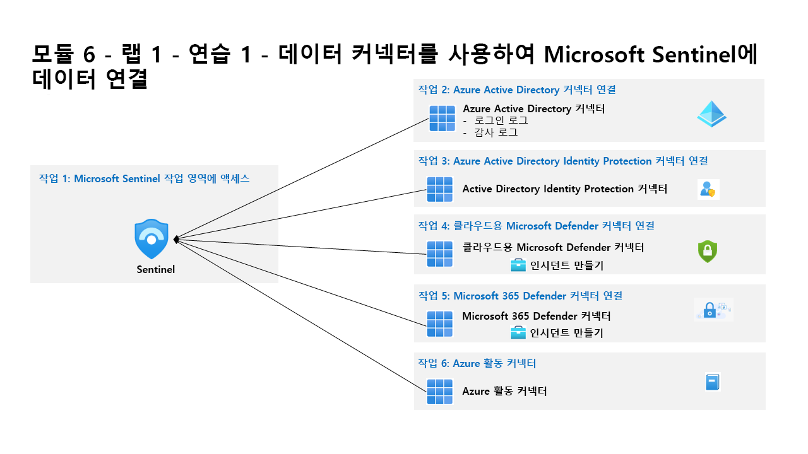

---
lab:
  title: 연습 1 - 데이터 커넥터를 사용하여 Microsoft Sentinel에 데이터 연결
  module: Learning Path 6 - Connect logs to Microsoft Sentinel
---

# 학습 경로 6 - 랩 1 - 연습 1 - 데이터 커넥터를 사용하여 Microsoft Sentinel에 데이터 연결

## 랩 시나리오

당신은 Microsoft Sentinel을 구현한 회사에서 근무하는 보안 운영 분석가입니다. 조직에 있는 많은 데이터 원본의 로그 데이터를 연결하는 방법을 알아야 합니다. 조직에는 Microsoft 365, Microsoft 365 Defender, Azure 리소스, 비 Azure 가상 머신 등의 데이터가 있습니다. 먼저 Microsoft 원본 연결을 시작합니다.

### 작업 1: Microsoft Sentinel 작업 영역에 액세스

이 작업에서는 Microsoft Sentinel 작업 영역에 액세스합니다.

1. **WIN1** 가상 머신에 Admin으로 로그인합니다. 암호로는 **Pa55w.rd**를 사용하여 로그인합니다.  

1. Microsoft Edge 브라우저를 엽니다.

1. Edge 브라우저에서 Azure Portal(https://portal.azure.com )로 이동합니다.

1. 랩 호스팅 공급자가 제공한 **테넌트 전자 메일** 계정을 복사하여 **로그인** 대화 상자에 붙여 넣은 후 **다음**을 선택합니다.

1. 랩 호스팅 공급자가 제공한 **테넌트 암호**를 복사하여 **암호 입력** 대화 상자에 붙여 넣은 후 **로그인**을 선택합니다.

1. Azure Portal의 검색 창에 *Sentinel*을 입력하고 **Microsoft Sentinel**을 선택합니다.

1. 이전 랩에서 만든 Microsoft Sentinel 작업 영역을 선택합니다.

### 작업 2: Azure Active Directory 커넥터 연결

이 작업에서는 Microsoft Sentinel에 Azure Active Directory 커넥터를 연결합니다.

1. 구성 영역에서 **데이터 커넥터**를 선택합니다. 데이터 커넥터 페이지에서 **Azure Active Directory** 커넥터를 검색하고 목록에서 선택합니다.

1. 커넥터 정보 블레이드에서 **커넥터 페이지 열기**를 선택합니다.

1. 구성 영역에서 **로그인 로그** 및 **감사 로그** 옵션을 선택하고 **변경 내용 적용**을 선택합니다.

### 작업 3: Azure Active Directory ID 보호 커넥터 연결

이 작업에서는 Microsoft Sentinel에 Azure Active Directory ID 보호 커넥터를 연결합니다.

1. 데이터 커넥터 탭에서 **Azure Active Directory ID 보호** 커넥터를 검색하고 목록에서 선택합니다.

1. 커넥터 정보 블레이드에서 **커넥터 페이지 열기**를 선택합니다.

1. 구성 영역에서 **연결** 단추를 선택합니다.

### 작업 4: 클라우드용 Microsoft Defender 커넥터 연결

이 작업에서는 클라우드용 Microsoft Defender 커넥터를 연결합니다.

1. 데이터 커넥터 탭에서 **클라우드용 Microsoft Defender** 커넥터를 검색하고 목록에서 선택합니다.

1. 커넥터 정보 블레이드에서 **커넥터 페이지 열기**를 선택합니다.

1. 구성 영역의 구독 아래에서 “Azure Pass - 스폰서쉽” 구독 확인란을 선택하고 **상태** 옵션을 오른쪽으로 밀어 **연결됨**을 표시합니다.

1. 이제 “상태”가 연결됨으로 설정되고 “양방향 동기화”가 사용으로 설정됩니다. 

1. 아래로 스크롤하여 “인시던트 만들기 - 권장됨!” 영역에서 **사용**을 선택합니다. 이 옵션은 해당 서비스에 대한 분석 규칙을 자동으로 만듭니다. 여기서 사용되지 않는 경우 나중에 수동으로 추가하거나, 분석 블레이드 내에서 해당 구성을 변경할 수 있습니다.

### 작업 5: Microsoft 365 Defender 커넥터 연결

이 작업에서는 Microsoft 365 Defender 커넥터를 연결합니다.

1. 데이터 커넥터 탭에서 **Microsoft 365 Defender(미리 보기)** 커넥터를 검색하고 목록에서 선택합니다.

1. 커넥터 정보 블레이드에서 **커넥터 페이지 열기**를 선택합니다.

1. 구성 영역에서 **인시던트 및 경고 연결**을 선택합니다. 

1. “이벤트 연결”에서 **이름** 확인란을 선택하여 “엔드포인트용 Microsoft Defender”에 대한 모든 확인란을 선택합니다.

1. “Office 365용 Microsoft Defender”에 대해 동일하게 반복합니다.

1. 페이지 아래쪽으로 스크롤하여 **변경 내용 적용**을 선택합니다.

### 작업 6: Azure 활동 커넥터

이 작업에서는 Azure 활동 커넥터를 연결합니다.

1. 데이터 커넥터 탭에서 **Azure 활동** 커넥터를 검색하고 목록에서 선택합니다.

1. 커넥터 정보 블레이드에서 **커넥터 페이지 열기**를 선택합니다.

1. 구성 영역에서 아래로 스크롤하고 “2. 구독 연결...”에서 **Azure Policy 할당 마법사 시작>** 을 선택합니다.

1. **기본 사항** 탭의 **범위** 아래에서 줄임표 단추(...)를 선택하고, 드롭다운 목록에서 “Azure Pass - 스폰서쉽” 구독을 선택하고, **선택**을 클릭합니다.

1. **매개 변수** 탭을 선택하고 **기본 Log Analytics 작업 영역** 드롭다운 목록에서 *uniquenameDefender* 작업 영역을 선택합니다.

1. **수정** 탭에서 **수정 작업 만들기** 확인란을 선택합니다.

1. **검토 + 만들기** 단추를 선택하여 구성을 검토합니다.

1. **만들기**를 선택하여 완료합니다.

## 연습 2 계속 진행
