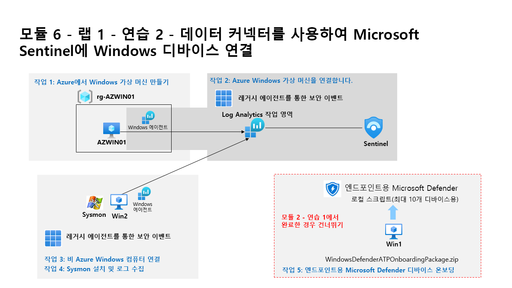

---
lab:
  title: 연습 2 - 데이터 커넥터를 사용하여 Microsoft Sentinel에 Windows 디바이스 연결
  module: Learning Path 6 - Connect logs to Microsoft Sentinel
---

# 학습 경로 6 - 랩 1 - 연습 2 - 데이터 커넥터를 사용하여 Microsoft Sentinel에 Windows 디바이스 연결

## 랩 시나리오

당신은 Microsoft Sentinel을 구현한 회사에서 근무하는 보안 운영 분석가입니다. 조직에 있는 많은 데이터 원본의 로그 데이터를 연결하는 방법을 알아야 합니다. 다음 데이터 원본은 온-프레미스 환경 또는 기타 퍼블릭 클라우드와 같은 Azure 내부 및 외부의 Windows 가상 머신입니다.

>**참고:** **[대화형 랩 시뮬레이션](https://mslabs.cloudguides.com/guides/SC-200%20Lab%20Simulation%20-%20Connect%20Windows%20devices%20to%20Microsoft%20Sentinel%20using%20data%20connectors)** 을 사용하여 이 랩을 원하는 속도로 클릭할 수 있습니다. 대화형 시뮬레이션과 호스트된 랩 간에 약간의 차이가 있을 수 있지만 보여주는 핵심 개념과 아이디어는 동일합니다. 

### 작업 1: Azure에서 Windows 가상 머신 만들기

이 작업에서는 Azure에서 Windows 가상 머신을 만듭니다.

1. **WIN1** 가상 머신에 Admin으로 로그인합니다. 암호로는 **Pa55w.rd**를 사용하여 로그인합니다.  

1. Microsoft Edge 브라우저에서 https://portal.azure.com의 Azure Portal로 이동합니다.

1. 랩 호스팅 공급자가 제공한 **테넌트 전자 메일** 계정을 복사하여 **로그인** 대화 상자에 붙여 넣은 후 **다음**을 선택합니다.

1. 랩 호스팅 공급자가 제공한 **테넌트 암호**를 복사하여 **암호 입력** 대화 상자에 붙여 넣은 후 **로그인**을 선택합니다.

1. 
          **+ 리소스 만들기**를 선택합니다. **힌트:** 이미 Azure Portal에 있는 경우 위쪽 막대에서 *Microsoft Azure*를 선택하여 홈으로 이동해야 할 수 있습니다.

1. **서비스 및 마켓플레이스 검색** 상자에 *Windows 10*을 입력하고 드롭다운 목록에서 **Microsoft Window 10**을 선택합니다.

1. **Microsoft Window 10** 상자를 선택합니다.

1. *플랜* 드롭다운 목록을 열고 **Windows 10 Enterprise 버전 22H2**를 선택합니다.

1. **미리 설정된 구성으로 시작**을 선택하여 계속 진행합니다.

1. **개발/테스트**를 선택한 다음, **VM 계속 만들기**를 선택합니다.

1. 리소스 그룹에 대해 **새로 만들기**를 선택하고, RG-AZWIN01을 이름으로 입력하고, **확인**을 선택합니다.**

    >**참고:** 이는 추적을 위한 새 리소스 그룹입니다. 

1. 가상 머신 이름에 AZWIN01을 입력합니다.**

1. 지역 기본값으로 **미국 동부**를 그대로 둡니다.**

1. 아래로 스크롤하여 가상 머신의 *이미지*를 검토합니다. 비어 있는 경우 **Windows 10 Enterprise, 버전 22H2**를 선택합니다.

1. 가상 머신의 *크기*를 검토합니다. 비어 있는 것 같은 경우 **모든 크기 보기**를 선택하고 *Azure 사용자들이 가장 많이 사용함*에서 첫 번째 VM 크기를 선택하고 **선택**을 선택합니다.

    >**참고:** 다음 메시지가 표시되면: *이 이미지는 Azure Automanage에서 지원되지 않습니다. 이 기능을 사용하지 않도록 설정하려면 관리 탭으로 이동합니다. 그렇지 않은 경우 지원되는 이미지를 선택합니다.* 관리 탭으로 이동하여 "Automanage"를 사용하지 않도록 설정합니다. 나중에 만들기 프로세스가 성공합니다.

1. 아래로 스크롤하여 선택한 *사용자 이름*을 입력합니다. **힌트:** admin 또는 root 같은 예약어를 사용하지 마세요.

1. 선택한 암호를 입력합니다.** **힌트:** 테넌트 암호를 다시 사용하는 것이 더 간편할 수 있습니다. {b>리소스<b} 탭에서 찾을 수 있습니다.

1. 페이지 아래쪽으로 스크롤하고 라이선스 아래 확인란을 선택하여 적격 라이선스가 있는지 확인합니다.**

1. **검토 + 만들기**를 선택하고 유효성 검사를 통과할 때까지 기다립니다.

    >**참고:** *네트워킹* 유효성 검사에 실패한 경우 해당 탭을 선택하고 콘텐츠를 검토한 다음 다시 **검토 + 만들기**를 선택합니다.

1. **만들기**를 실행합니다. 리소스가 작성될 때까지 기다립니다. 몇 분 정도 걸릴 수 있습니다.

### 작업 2: Azure Windows 가상 머신을 연결합니다.

이 작업에서는 Microsoft Sentinel에 Azure Windows 가상 머신을 연결합니다.

1. Azure Portal의 검색 창에 *Sentinel*을 입력하고 **Microsoft Sentinel**을 선택합니다.

1. 앞에서 만든 Microsoft Sentinel 작업 영역을 선택합니다.

1. 1. Microsoft Sentinel 왼쪽 메뉴에서 *콘텐츠 관리* 섹션까지 아래로 스크롤하고 **콘텐츠 허브**를 선택합니다.

1. *콘텐츠 허브*에서 **Windows 보안 이벤트** 솔루션을 검색하고 목록에서 선택합니다.

1. *Windows 보안 이벤트* 솔루션 페이지에서 **설치**를 선택합니다.

1. 설치가 완료되면 **관리**를 선택합니다.

    >**참고:** *Windows 보안 이벤트* 솔루션은 *AMA를 통한 Windows 보안 이벤트*와 *레거시 에이전트를 통한 보안 이벤트* 데이터 커넥터를 모두 설치합니다. 또한 2개의 통합 문서, 20개의 분석 규칙 및 43개의 헌팅 쿼리가 포함되어 있습니다.

1. *AMA를 통한 Windows 보안 이벤트* 데이터 커넥터를 선택하고 커넥터 정보 블레이드에서 **커넥터 페이지 열기**를 선택합니다.

1. *구성* 섹션의 *지침* 탭에서 **데이터 수집 규칙 만들기**를 선택합니다.

1. 규칙 이름에 **AZWINDCR**을 입력하고 **다음: 리소스**를 선택합니다.

1. **+리소스 추가**를 선택하여 앞서 만든 가상 머신을 선택합니다.

1. **RG-AZWIN01**을 확장한 다음, **AZWIN01**을 선택합니다.

1. **적용**을 선택한 후 **다음: 수집**을 선택합니다.

1. 다양한 보안 이벤트 컬렉션 옵션을 검토합니다. *모든 보안 이벤트*를 유지하고 **다음: 검토 + 만들기**를 선택합니다.

1. 데이터 수집 규칙을 저장하려면 **만들기**를 선택합니다.

1. 잠시 기다린 다음, **새로 고침**을 선택하여 나열된 새 데이터 수집 규칙을 확인합니다.

### 작업 3: 비 Azure Windows 컴퓨터 연결

이 작업에서는 Azure Arc에 연결된 비 Azure Windows 가상 머신을 Microsoft Sentinel에 추가합니다.  

   >**참고:** AMA를 통한 Windows 보안 이벤트 데이터 커넥터는 비 Azure 디바이스에 대한 Azure Arc가 필요합니다.**

1. Microsoft Sentinel 작업 영역의 *AMA를 통한 Windows 보안 이벤트* 데이터 커넥터 구성에 있어야 합니다.

1. **지침** 탭의 *구성* 섹션에서 *연필* 아이콘을 선택하여 **AZWINDCR** *데이터 수집 규칙*을 편집합니다.

1. **다음: 리소스**를 클릭하고 *리소스* 탭의 *범위*에서 *구독*을 확장합니다.

    >**힌트:** *범위* 열 앞에 있는 ">"를 선택하여 전체 *범위* 계층 구조를 확장할 수 있습니다.

1. **RG-Defender**(또는 만든 리소스 그룹)를 확장한 다음 **WINServer**를 선택합니다.

    >**중요:** WINServer가 표시되지 않으면 이 서버에 Azure Arc를 설치한 학습 경로 3, 연습 1, 작업 4를 참조하세요.

1. **적용**을 선택합니다.

1. **다음: 수집**을 선택하고 **다음: 검토 + 만들기**를 선택합니다.

1. *유효성 검사 통과*가 표시되면 **만들기**를 선택합니다.

## 연습 3 계속 진행
