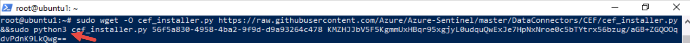

---
lab:
  title: 연습 3 - 데이터 커넥터를 사용하여 Microsoft Sentinel에 Linux 호스트 연결
  module: Module 6 - Connect logs to Microsoft Sentinel
---

# <a name="module-6---lab-1---exercise-3---connect-linux-hosts-to-microsoft-sentinel-using-data-connectors"></a>모듈 6 - 랩 1 - 연습 3 - 데이터 커넥터를 사용하여 Microsoft Sentinel에 Linux 호스트 연결

## <a name="lab-scenario"></a>랩 시나리오


당신은 Microsoft Sentinel을 구현한 회사에서 근무하는 보안 운영 분석가입니다. 조직에 있는 많은 데이터 원본의 로그 데이터를 연결하는 방법을 알아야 합니다. 다음 데이터 원본은 CEF(Common Event Formatting) 및 Syslog 커넥터를 사용하는 Linux 가상 머신입니다.


>**중요:** 다음 작업에는 서로 다른 가상 머신에서 수행되는 단계가 있습니다. 가상 머신 이름 참조를 찾습니다.

### <a name="task-1-access-the-microsoft-sentinel-workspace"></a>작업 1: Microsoft Sentinel 작업 영역에 액세스

이 작업에서는 Microsoft Sentinel 작업 영역에 액세스합니다.

1. **WIN1** 가상 머신에 Admin으로 로그인합니다. 암호로는 **Pa55w.rd**를 사용하여 로그인합니다.  

1. 새 Microsoft Edge 브라우저를 시작합니다.

1. Edge 브라우저에서 Azure Portal(https://portal.azure.com )로 이동합니다.

1. 랩 호스팅 공급자가 제공한 **테넌트 전자 메일** 계정을 복사하여 **로그인** 대화 상자에 붙여 넣은 후 **다음**을 선택합니다.

1. 랩 호스팅 공급자가 제공한 **테넌트 암호**를 복사하여 **암호 입력** 대화 상자에 붙여 넣은 후 **로그인**을 선택합니다.

1. Azure Portal의 검색 창에 *Sentinel*을 입력하고 **Microsoft Sentinel**을 선택합니다.

1. 이전 랩에서 만든 Microsoft Sentinel 작업 영역을 선택합니다.


### <a name="task-2-connect-a-linux-host-using-the-common-event-format-connector"></a>작업 2: Common Event Format 커넥터를 사용하여 Linux 호스트 연결

이 작업에서는 CEF(Common Event Format) 커넥터를 사용하여 Microsoft Sentinel에 Linux 호스트를 연결합니다.

1. Microsoft Sentinel의 구성 영역에서 **데이터 커넥터**를 선택합니다. 데이터 커넥터 탭에서 **CEF(Common Event Format)** 커넥터를 검색하고 목록에서 선택합니다.

1. 커넥터 정보 블레이드에서 **커넥터 페이지 열기**를 선택합니다.

1. 구성에서 1.2 Linux 머신에 CEF 수집기 설치에 나와 있는 명령을 클립보드에 복사합니다. 

1. **LIN1** 가상 머신을 시작합니다. 랩 호스터가 제공한 사용자 이름 및 암호를 사용하여 로그인합니다. **힌트:** 로그인 프롬프트를 보려면 Enter 키를 눌러야 할 수 있습니다. 

1. LIN1 서버의 IP 주소를 적어 둡니다. 아래 스크린샷을 예제로 참조하세요.

    

1. **WIN1** 가상 머신으로 돌아갑니다. 시작 메뉴 아이콘을 마우스 오른쪽 단추로 클릭하여 관리자 권한으로 Windows PowerShell을 시작하고 **Windows PowerShell(관리자)** 를 선택합니다. 표시되는 사용자 계정 컨트롤 창에서 **예**를 선택하여 앱을 실행할 수 있도록 합니다. **힌트:** 이전 연습에서 이미 열려 있는 Windows PowerShell 창이 있을 수 있습니다.

1. 구체적인 Linux 서버 정보에 맞게 다음 PowerShell 명령을 수정하여 입력하고 Enter 키를 누릅니다.

    ```PowerShell
    ssh insert-your-linux-IP-address-here -l insert-linux-user-name-here
    ```

1. 예를 입력하여 연결을 확인한 다음, 사용자의 암호를 입력하고 Enter 키를 누릅니다. 화면이 이제 다음과 같이 표시됩니다.

    

1. 이제 이전 단계의 1.2 Linux 머신에 CEF 수집기 설치 명령을 붙여넣을 준비가 되었습니다. Azure의 스크립트가 클립보드에 있는지 확인합니다. PowerShell에서 상단 표시줄을 마우스 오른쪽 단추로 클릭하고 **편집**, **붙여넣기**를 차례로 선택합니다. 

1. 붙여넣은 후 Enter 키를 누르기 전에 아래와 같이 단어 *python*에 문자 **3**을 추가합니다.

    


1. 스크립트가 조정되면 Enter 키를 누릅니다. 스크립트가 Linux 서버에 대해 원격으로 실행됩니다. 스크립트가 올바르게 처리되면 이 화면과 비슷하게 됩니다.

    

1. **종료**를 입력하여 LIN1에 대한 원격 셸 연결을 닫습니다.


### <a name="task-3-connect-a-linux-host-using-the-syslog-connector"></a>작업 3: Syslog 커넥터를 사용하여 Linux 호스트 연결

이 작업에서는 Syslog 커넥터를 사용하여 Microsoft Sentinel에 Linux 호스트를 연결합니다.

1. Microsoft Sentinel 포털이 열려 있는 Edge 브라우저로 돌아가서 오른쪽 위 모서리에서 ‘x’를 선택하여 “CEF(Common Event Format)” 데이터 커넥터 페이지를 닫습니다. 

1. 데이터 커넥터 탭에서 **Syslog** 커넥터를 검색하고 목록에서 선택합니다.

1. 커넥터 정보 블레이드에서 **커넥터 페이지 열기**를 선택합니다.

1. 구성에서 **Azure 이외의 Linux 머신에 에이전트 설치**섹션을 엽니다.

1. **Azure 외 Linux 컴퓨터용 에이전트 다운로드 및 설치** 링크를 선택합니다. 

    >**참고:** Log Analytics 작업 영역에는 연결된 3개의 Windows 컴퓨터가 표시됩니다. 이는 이전에 연결된 WIN2, WINServer, AZWIN01 가상 머신에 해당합니다.

1. **Linux 서버** 탭을 선택합니다.

    >**참고:** Log Analytics 작업 영역에는 연결된 1개의 Linux 컴퓨터가 표시됩니다. 이는 이전에 CEF 커넥터와 연결된 LIN1(ubuntu1) 가상 머신에 해당합니다.

1. **Log Analytics 에이전트 지침**을 선택합니다.

1. *Linux용 에이전트 다운로드 및 설치* 영역의 명령을 클립보드에 복사합니다.

1. LIN2 가상 머신을 시작합니다. 랩 호스터가 제공한 암호로 사용자 이름으로 로그인합니다. **힌트:** 로그인 프롬프트를 보려면 Enter 키를 눌러야 할 수 있습니다.

1. LIN2 서버의 IP 주소를 적어 둡니다. 아래 스크린샷을 예제로 참조하세요.

    

1. **WIN1** 가상 머신으로 돌아갑니다. 이전 작업에 사용된 Windows PowerShell을 선택합니다.

1. 구체적인 Linux 서버 정보에 맞게 다음 PowerShell 명령을 수정하여 입력하고 Enter 키를 누릅니다.

    ```PowerShell
    ssh insert-your-linux-IP-address-here -l insert-linux-user-name-here
    ```

1. 예를 입력하여 연결을 확인한 다음, 사용자의 암호를 입력하고 Enter 키를 누릅니다. 화면이 이제 다음과 같이 표시됩니다.

    

1. 이제 이전 단계의 Linux용 에이전트 다운로드 및 설치 명령을 붙여넣을 준비가 되었습니다. 스크립트가 클립보드에 있는지 확인합니다. PowerShell에서 상단 표시줄을 마우스 오른쪽 단추로 클릭하고 **편집**, **붙여넣기**를 차례로 선택합니다.

1. 스크립트를 붙여넣은 후에 Enter 키를 누릅니다. 스크립트가 Linux 서버에 대해 원격으로 실행됩니다. 연결 시도 간격

1. 완료되면 **종료**를 입력하여 LIN2에 대한 원격 셸 연결을 닫습니다.


### <a name="task-4-configure-the-facilities-you-want-to-collect-and-their-severities-for-the-syslog-connector"></a>작업 4: Syslog 커넥터용으로 수집할 기능 및 해당 심각도 구성

이 작업에서는 Syslog 수집 기능을 구성합니다.

1. Microsoft Sentinel 포털이 열려 있는 Edge 브라우저로 돌아가서 오른쪽 위 모서리에서 ‘x’를 두 번 선택하여 “Log Analytics 작업 영역” 페이지와 “Syslog” 데이터 커넥터 페이지를 닫습니다.

1. Microsoft Sentinel 포털의 구성에서 **설정** 선택한 다음, **작업 영역 설정** 탭을 선택합니다.

1. **설정** 영역에서 **레거시 에이전트 관리**를 선택합니다.

1. **Syslog** 탭을 선택합니다.

1. **+ 기능 추가** 단추를 선택합니다.

1. *기능 이름* 드롭다운 메뉴에서 **인증**을 선택합니다.

1. **+ 기능 추가** 단추를 다시 선택합니다.

1. 기능 이름 드롭다운 메뉴에서 **authpriv**를 선택합니다.

1. **적용**을 선택하여 변경 내용을 저장합니다.

## <a name="proceed-to-exercise-4"></a>연습 4 계속 진행
