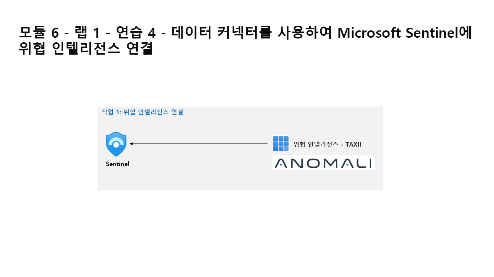

---
lab:
  title: 연습 4 - 데이터 커넥터를 사용하여 Defender XDR을 Microsoft Sentinel에 연결
  module: Learning Path 6 - Connect logs to Microsoft Sentinel
---

# 학습 경로 6 - 랩 1 - 연습 4 - 데이터 커넥터를 사용하여 Defender XDR을 Microsoft Sentinel에 연결

## 랩 시나리오

Microsoft Defender XDR과 Microsoft Sentinel을 모두 배포한 회사에서 근무하는 보안 운영 분석가라고 가정합니다. Microsoft Sentinel을 Defender XDR에 연결하는 통합 보안 운영 플랫폼을 준비해야 합니다. 다음 단계는 Defender XDR Content Hub 솔루션을 설치하고 Defender XDR 데이터 커넥터를 Microsoft Sentinel에 배포하는 것입니다.

>**중요:** Azure Microsoft Sentinel 포털과 Microsoft Defender XDR 포털의 Sentinel 간에는 기능 차이**[포털 기능 차이](https://learn.microsoft.com/azure/sentinel/microsoft-sentinel-defender-portal#capability-differences-between-portals)** 가 있습니다.

### 작업 1: Defender XDR 연결

이 작업에서는 Microsoft Defender XDR 커넥터를 배포합니다.

1. WIN1 가상 머신에 Admin으로 로그인합니다. 암호로는 **Pa55w.rd**를 사용하여 로그인합니다.  

1. Microsoft Edge 브라우저에서(<https://portal.azure.com>)의 Azure Portal로 이동합니다.

1. 랩 호스팅 공급자가 제공한 **테넌트 전자 메일** 계정을 복사하여 **로그인** 대화 상자에 붙여 넣은 후 **다음**을 선택합니다.

1. 랩 호스팅 공급자가 제공한 **테넌트 암호**를 복사하여 **암호 입력** 대화 상자에 붙여 넣은 후 **로그인**을 선택합니다.

1. Azure Portal의 검색 창에 *Sentinel*을 입력하고 **Microsoft Sentinel**을 선택합니다.

1. 앞에서 만든 Microsoft Sentinel 작업 영역을 선택합니다.

1. Microsoft Sentinel 왼쪽 메뉴에서 **콘텐츠 관리** 섹션까지 아래로 스크롤하고 **콘텐츠 허브**를 선택합니다.

1. *콘텐츠 허브*에서 **Microsoft Defender XDR** 솔루션을 검색하고 목록에서 선택합니다.

1. *Microsoft Defender XDR* 솔루션 세부 정보 페이지에서 **설치**를 선택합니다.

1. 설치가 완료되면 **Microsoft Defender XDR** 솔루션을 검색하여 선택합니다.

1. *Microsoft Defender XDR* 솔루션 세부 정보 페이지에서 **관리** 선택

1. *Microsoft Defender XDR* 데이터 커넥터 확인란을 선택하고 **커넥터 페이지 열기**를 선택합니다.

1. *구성* 섹션의 *지침* 탭에서 다음 확인란을 **선택 해제**합니다. *이 제품에 대한 모든 Microsoft 인시던트 만들기 규칙을 해제합니다. 권장*. 그리고 **인시던트 및 경고 연결** 단추를 선택합니다.

1. 연결이 성공했다는 메시지가 표시됩니다.

### 작업 2: Microsoft Sentinel 및 Microsoft Defender XDR 연결

이 작업에서는 Microsoft Sentinel 작업 영역을 Microsoft Defender XDR에 연결합니다.

>**참고:** Microsoft Defender XDR 포털의 Microsoft Sentinel은 공개 미리 보기 상태로 제공되며 사용자 인터페이스 환경 및 단계는 랩 지침과 다를 수 있습니다.

1. **WIN1** 가상 머신에 *Admin*으로 로그인합니다. 암호로는 **Pa55w.rd**를 사용하여 로그인합니다.  

1. 새 Microsoft Edge 브라우저를 시작합니다.

1. Edge 브라우저에서 <https://security.microsoft.com>의 Microsoft Defender XDR 포털로 이동합니다.

1. 랩 호스팅 공급자가 제공한 관리자 사용자 이름용 테넌트 전자 메일 계정을 복사하여 **로그인** 대화 상자에 붙여 넣은 후 **다음**을 선택합니다.

1. 랩 호스팅 공급자가 제공한 관리자의 테넌트 암호를 복사하여 **암호 입력** 대화 상자에 붙여 넣은 후 **로그인**을 선택합니다.

    >**팁:** 관리자의 테넌트 메일 계정 및 암호는 리소스 탭에서 찾을 수 있습니다.

1. **Defender XDR** 포털의 **홈** 화면에서 *SIEM과 XDR을 한곳에서 관리하세요*라는 메시지와 함께 맨 위에 배너가 표시됩니다. **작업 영역 연결** 단추를 선택합니다.

1. *작업 영역 선택* 페이지에서 앞서 만든 **Microsoft Sentinel** 작업 영역을 선택합니다.

    >**힌트:** *uniquenameDefender* 같은 이름이 있어야 합니다.

1. **다음** 버튼을 선택합니다.

    >**참고:** *다음* 단추가 사용하지 않도록 설정되거나 회색으로 표시되어 있고 Microsoft Sentinel 작업 영역이 Defender XDR에 *온보딩되지 않음*을 나타내는 오류 메시지가 표시되면 동기화하는 데 5~10분이 걸릴 수 있으므로 Defender XDR 포털 페이지를 새로 고쳐 보세요.

1. *변경 내용 검토* 페이지에서 *작업 영역* 선택 항목이 올바른지 확인하고 *작업 영역이 연결되면 예상되는 사항* 아래에 있는 글머리 기호 항목을 검토합니다. **연결** 단추를 선택합니다.

1. *작업 영역에 연결하는 중*이라는 메시지에 이어 *작업 영역이 연결됨*이라는 메시지가 표시됩니다.

1. **닫기** 버튼을 선택합니다.

1. **Defender XDR** 포털의 **홈** 화면에서 *통합 SIEM 및 XDR이 준비됨*이라는 메시지와 함께 맨 위에 배너가 표시됩니다. **헌팅 시작** 단추를 선택합니다.

1. *고급 헌팅*에 "Sentinel에서 콘텐츠 탐색"이라는 메시지가 표시됩니다. 왼쪽 메뉴 창의 해당하는 탭에서 *Microsoft Sentinel* 테이블, 함수 및 쿼리를 확인합니다.

1. 축소된 경우 왼쪽 주 메뉴 창을 확장하고 새 **Microsoft Sentinel** 메뉴 항목을 확장합니다. *위협 관리*, *콘텐츠 관리* 및 *구성* 선택 항목이 표시됩니다.

 >**참고:** 또한 Microsoft Sentinel과 Microsoft Defender XDR 간의 동기화를 완료하는 데 몇 분 정도 걸릴 수 있으므로 설치된 *데이터 커넥터*가 보이지 않을 수 있습니다.

## 랩을 완료했습니다.
