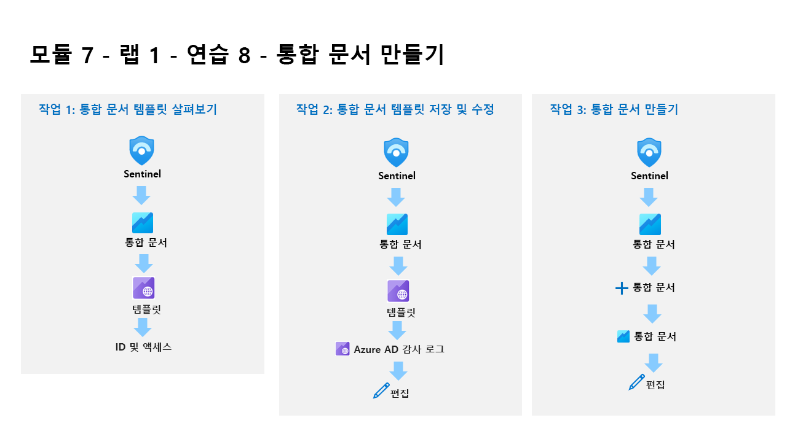

---
lab:
  title: 연습 10 - 통합 문서 만들기
  module: Module 7 - Create detections and perform investigations using Microsoft Sentinel
ms.openlocfilehash: 265718067e07c114f7d03bb1fde109994a522b47
ms.sourcegitcommit: f8918eddeaa7a7a480e92d0e5f2f71143c729d60
ms.translationtype: HT
ms.contentlocale: ko-KR
ms.lasthandoff: 07/08/2022
ms.locfileid: "147038052"
---
# 모듈 7 - 랩 1 - 연습 10 - 통합 문서 만들기

## 랩 시나리오

당신은 Microsoft Sentinel을 구현한 회사에서 근무하는 보안 운영 분석가입니다. Microsoft Sentinel에 데이터 원본을 연결한 후에는 사용자 지정 대시보드를 만들 때 다양한 기능을 제공하는 Azure Monitor 통합 문서의 Microsoft Sentinel 채택을 사용하여 데이터를 시각화하고 모니터링할 수 있습니다. 

Microsoft Sentinel을 사용하면 데이터에 대한 사용자 지정 통합 문서를 만들 수 있으며 데이터 원본을 연결하는 즉시 데이터를 신속하게 파악할 수 있는 기본 제공 통합 문서 템플릿도 제공됩니다.

### 작업 1: 통합 문서 템플릿 살펴보기

이 작업에서는 Microsoft Sentinel 통합 문서 템플릿을 살펴봅니다.

1. WIN1 가상 머신에 Admin으로 로그인합니다. 암호로는 **Pa55w.rd** 를 사용하여 로그인합니다.  

1. Edge 브라우저에서 Azure Portal(https://portal.azure.com )로 이동합니다.

1. 랩 호스팅 공급자가 제공한 **테넌트 전자 메일** 계정을 복사하여 **로그인** 대화 상자에 붙여넣은 후 **다음** 을 선택합니다.

1. 랩 호스팅 공급자가 제공한 **테넌트 암호** 를 복사하여 **암호 입력** 대화 상자에 붙여넣은 후 **로그인** 을 선택합니다.

1. Azure Portal의 검색 창에 *Sentinel* 을 입력하고 **Microsoft Sentinel** 을 선택합니다.

1. Microsoft Sentinel 작업 영역을 선택합니다.

1. **통합 문서** 를 선택합니다. 템플릿 탭은 기본적으로 선택되어 있습니다.

1. **ID 및 액세스** 템플릿 통합 문서를 검색하고 선택합니다. 오른쪽 창에서 아래로 스크롤하여 **템플릿 보기** 단추를 선택합니다.

1. 통합 문서의 콘텐츠를 검토합니다. 보안 로그를 수집 및 분석하고 감사 및 로그인 로그를 사용하여 Microsoft 제품 사용에 대한 인사이트를 수집하여 ID 및 액세스 작업에 대한 인사이트를 보여 줍니다.

1. 오른쪽 위에 있는 **X** 를 선택하여 통합 문서를 닫습니다.

### 작업 2: 통합 문서 템플릿 저장 및 수정

이 작업에서는 통합 문서 템플릿을 저장하고 수정합니다.

1. **Microsoft Sentinel - 통합 문서 - 템플릿** 탭으로 돌아가야 합니다. **Azure AD 감사 로그** 를 검색하고 선택한 다음, 오른쪽 창에서 아래로 스크롤하여 **저장** 단추를 선택합니다. 

1. **미국 동부** 를 지역의 기본값으로 유지하고 **확인** 을 선택합니다.

1. **저장된 통합 문서 보기** 단추를 선택합니다.

1. 명령 모음에서 **편집** 을 선택하여 통합 문서의 변경 내용을 사용하도록 설정합니다.

1. 통합 문서를 비교하는 새로운 기능을 알려 주는 배너를 읽습니다. 배너를 선택하여 메시지를 해제합니다.

1. 사용자 활동 영역까지 아래로 스크롤하고 해당 열의 형식을 지정하기 위해 그래프에서 “작업 수” 및 “추세”에 대한 색을 확인합니다. 그리드 아래에서 **편집** 단추를 선택합니다.

1. 쿼리 실행 명령 모음의 오른쪽에 있는 **열 설정** 단추를 선택합니다. **힌트:** 이 단추는 KQL 쿼리의 데이터가 있는 경우에만 나타납니다.

1. 표시되는 열 설정 편집 블레이드의 열 내에서 **작업 수(열 지도 + 형식 지정됨)** 를 선택합니다. 

1. 설정, 특히 열 렌더러에 대한 옵션을 검토합니다. 색상표의 경우 **32색 범주** 를 선택합니다.

1. 열 내에서 **추세(Spark 선 + 형식 지정됨)** 를 선택합니다.

1. 설정을 검토합니다. *열 렌더러* 의 경우 **Spark 영역** 을 선택한 다음, 색상표에서 원하는 색을 선택합니다.

1. **저장 후 닫기** 를 선택합니다. 이제 하나의 타일/그리드 컨트롤을 사용하여 다른 타일/그리드에서 결과를 필터링하는 방법을 검토하겠습니다.

1. 쿼리 항목 편집: 쿼리 - 2 명령 모음에서 **고급 설정** 단추를 선택합니다.

1. *항목이 선택되면 매개 변수 내보내기* 설정을 검토합니다. 사용자 정보 필드가 선택되어 있습니다.

1. 아래로 스크롤하여 쿼리 아래쪽에서(위쪽 메뉴가 아님) **편집 완료** 를 선택합니다. 작업 수 및 추세의 변경된 색을 확인합니다. 

1. 화면 오른쪽의 상위 활성 사용자 원형 차트 아래에서 **편집** 을 선택합니다.  

1. 로그 쿼리에서 사용자 정보를 찾습니다.  이 쿼리는 다른 쿼리에서 내보낸 매개 변수를 사용하여 결과를 필터링합니다.

1. 아래로 스크롤하여 쿼리 아래쪽에서(위쪽 메뉴가 아님) **편집 완료** 를 선택합니다.

1. 위로 스크롤하여 위쪽 메뉴에서 **편집 완료** 를 선택하고 **저장** 아이콘을 선택합니다. 오른쪽 위에 있는 **X** 를 선택하여 통합 문서를 닫습니다.

### 작업 3: 통합 문서 만들기

이 작업에서는 고급 시각화를 사용하여 새 통합 문서를 만듭니다.

1. Microsoft Sentinel 포털의 **통합 문서** 영역으로 돌아가야 합니다.

1. **+ 통합 문서 추가** 를 선택하여 새 통합 문서를 처음부터 만듭니다. 

    >**참고:** 새 통합 문서이지만 시작 템플릿이 사용됩니다.

1. 통합 문서를 편집하려면 **편집** 을 선택합니다.

1. 통합 문서의 첫 번째 단락 아래에서 **편집** 단추를 선택합니다. 

1. ## 새 통합 문서 위에 #내 통합 문서를 입력합니다. 

1. 텍스트 항목 편집: 텍스트 - 2의 경우 아래쪽 메뉴에서 **편집 완료** 를 선택합니다. 헤더 크기가 증가했고 헤더 이름이 변경되었습니다.

1. 표시되는 유일한 막대형 차트 그래프 아래에서 **편집** 을 선택합니다.

1. 모든 테이블에서 개수의 *union* 문을 제공하는 KQL 문을 검토합니다.

1. 쿼리 항목 편집: 쿼리 - 2의 경우 아래로 스크롤하여 아래쪽 메뉴에서 **편집 완료** 를 선택합니다.

1. 막대형 차트 그래프의 편집 단추 옆에 있는 줄임표( **...** )를 선택하고, **+ 추가** 를 선택한 다음, **쿼리 추가** 를 선택합니다.

1. 쿼리 상자에 **SecurityEvent** 를 입력합니다.

1. 시간 범위를 **지난 4시간** 으로 변경합니다.

1. 시각화를 **시간 차트** 로 변경합니다.

1. 쿼리의 명령 모음에서 **스타일** 을 선택합니다.

1. **이 항목을 사용자 지정 너비로 만들기** 상자를 선택합니다.

1. 백분율 너비를 **25** 로, 최대 너비를 **25** 로 설정합니다. 

1. 이제 쿼리의 명령 모음에서 **고급 설정** 을 선택합니다.

1. **편집하지 않을 때 새로 고침 아이콘 표시** 상자를 선택합니다. 

1. 새 쿼리 항목 편집: 쿼리 - 2의 경우 아래로 스크롤하여 아래쪽 메뉴에서 **편집 완료** 를 선택합니다.

1. 아래로 스크롤하고 통합 문서 아래쪽에서 **+ 추가**, **쿼리 추가** 를 차례로 선택합니다.

1. 쿼리 상자에 **SecurityEvent** 를 입력합니다.

1. 시간 범위를 **지난 4시간** 으로 변경합니다.

1. 시각화를 **눈금** 으로 변경합니다.

1. 쿼리의 명령 모음에서 **스타일** 을 선택합니다.

1. **이 항목을 사용자 지정 너비로 만들기** 상자를 선택합니다.

1. 백분율 너비를 **75** 로, 최대 너비를 **75** 로 설정합니다. 

1. 새 *쿼리 항목 편집: 쿼리 - 3* 의 경우 아래로 스크롤하여 아래쪽 메뉴에서 **편집 완료** 를 선택합니다.

1. 통합 문서의 명령 모음에서 **편집 완료** 를 선택합니다.

1. **저장** 아이콘을 선택하고, 제목을 **내 통합 문서** 로 변경하고, 다른 값을 기본값으로 유지합니다. 다시 **저장** 을 선택하여 변경 내용을 커밋합니다. 

1. 오른쪽 위에 있는 **X** 를 선택하여 통합 문서를 닫거나 Microsoft Sentinel 포털에서 **통합 문서** 를 선택합니다.

1. 통합 문서 페이지로 돌아가서 **내 통합 문서** 탭을 선택합니다.

1. 방금 만든 통합 문서인 **내 통합 문서** 를 선택합니다.

1. 오른쪽 창에서 **저장된 통합 문서 보기** 를 선택하여 통합 문서를 검토합니다.

## 연습 11 계속 진행
