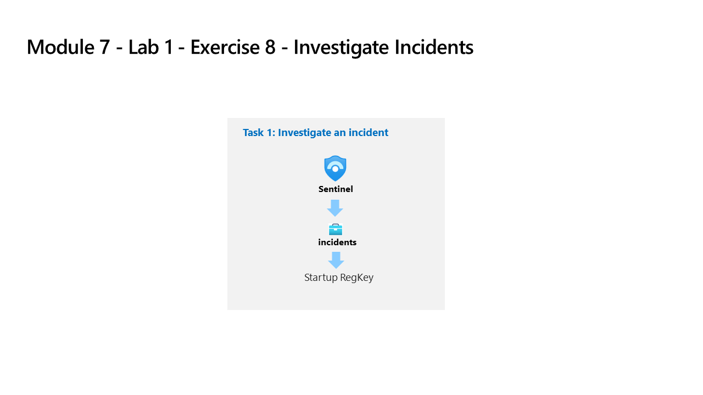

---
lab:
  title: 연습 10 - 통합 문서 만들기
  module: Module 7 - Create detections and perform investigations using Microsoft Sentinel
---

# 모듈 7 - 랩 1 - 연습 10 - 통합 문서 만들기

## 랩 시나리오

You are a Security Operations Analyst working at a company that implemented Microsoft Sentinel. Once you have connected your data sources to Microsoft Sentinel, you can visualize and monitor the data using the Microsoft Sentinel adoption of Azure Monitor Workbooks, which provides versatility in creating custom dashboards. 

Microsoft Sentinel을 사용하면 데이터에 대한 사용자 지정 통합 문서를 만들 수 있으며 데이터 원본을 연결하는 즉시 데이터를 신속하게 파악할 수 있는 기본 제공 통합 문서 템플릿도 제공됩니다.

### 작업 1: 통합 문서 템플릿 살펴보기

이 작업에서는 Microsoft Sentinel 통합 문서 템플릿을 살펴봅니다.

1. WIN1 가상 머신에 Admin으로 로그인합니다. 암호로는 **Pa55w.rd**를 사용하여 로그인합니다.  

1. Edge 브라우저에서 Azure Portal(https://portal.azure.com )로 이동합니다.

1. 랩 호스팅 공급자가 제공한 **테넌트 전자 메일** 계정을 복사하여 **로그인** 대화 상자에 붙여넣은 후 **다음**을 선택합니다.

1. 랩 호스팅 공급자가 제공한 **테넌트 암호**를 복사하여 **암호 입력** 대화 상자에 붙여넣은 후 **로그인**을 선택합니다.

1. Azure Portal의 검색 창에 *Sentinel*을 입력하고 **Microsoft Sentinel**을 선택합니다.

1. Microsoft Sentinel 작업 영역을 선택합니다.

1. Select <bpt id="p1">**</bpt>Workbooks<ept id="p1">**</ept>. The <bpt id="p1">*</bpt>Templates<ept id="p1">*</ept> tab is selected by default.

1. Search for and select the <bpt id="p1">**</bpt>Identity &amp; Access<ept id="p1">**</ept> template workbook. In the right pane, scroll down and select the <bpt id="p1">**</bpt>View template<ept id="p1">**</ept> button.

1. Review the contents of the workbook. It shows insights into Identity and access operations by collecting and analyzing security logs, using the audit and sign-in logs to gather insights into use of Microsoft products.

1. 오른쪽 위에 있는 **X**를 선택하여 통합 문서를 닫습니다.

### 작업 2: 통합 문서 템플릿 저장 및 수정

이 작업에서는 통합 문서 템플릿을 저장하고 수정합니다.

1. **Microsoft Sentinel - 통합 문서 - 템플릿** 탭으로 돌아가야 합니다. **Azure AD 감사 로그**를 검색하고 선택한 다음, 오른쪽 창에서 아래로 스크롤하여 **저장** 단추를 선택합니다. 

1. **미국 동부**를 지역의 기본값으로 유지하고 **확인**을 선택합니다.

1. **저장된 통합 문서 보기** 단추를 선택합니다.

1. 명령 모음에서 **편집**을 선택하여 통합 문서의 변경 내용을 사용하도록 설정합니다.

1. Read the banner that informs you of a new feature to compare workbooks. Dismiss the message by selecting the banner.

1. 당신은 Microsoft Sentinel을 구현한 회사에서 근무하는 보안 운영 분석가입니다.

1. Microsoft Sentinel에 데이터 원본을 연결한 후에는 사용자 지정 대시보드를 만들 때 다양한 기능을 제공하는 Azure Monitor 통합 문서의 Microsoft Sentinel 채택을 사용하여 데이터를 시각화하고 모니터링할 수 있습니다.

1. 표시되는 열 설정 편집 블레이드의 열 내에서 **작업 수(열 지도 + 형식 지정됨)** 를 선택합니다. 

1. Review the settings, in particular the options for <bpt id="p1">*</bpt>Column renderer<ept id="p1">*</ept>. For <bpt id="p1">*</bpt>Color palette<ept id="p1">*</ept>, select <bpt id="p2">**</bpt>32-color categorical<ept id="p2">**</ept>.

1. 열 내에서 **추세(Spark 선 + 형식 지정됨)** 를 선택합니다.

1. 설정을 검토합니다. *열 렌더러*의 경우 **Spark 영역**을 선택한 다음, 색상표에서 원하는 색을 선택합니다.

1. Select <bpt id="p1">**</bpt>Save and Close<ept id="p1">**</ept>. Now we are going to review how one tile/grid control can be used to filter the results in another tile/grid.

1. 쿼리 항목 편집: 쿼리 - 2 명령 모음에서 **고급 설정** 단추를 선택합니다.

1. Review the <bpt id="p1">*</bpt>When items are selected, export parameters<ept id="p1">*</ept> setting. Notice the <bpt id="p1">*</bpt>UserInfo<ept id="p1">*</ept> field is selected.

1. Scroll down and select <bpt id="p1">**</bpt>Done Editing<ept id="p1">**</ept> at the bottom of the query (not the top menu). Look at the changed colors for <bpt id="p1">*</bpt>Operations count<ept id="p1">*</ept> and <bpt id="p2">*</bpt>Trend<ept id="p2">*</ept>.

1. 화면 오른쪽의 상위 활성 사용자 원형 차트 아래에서 **편집**을 선택합니다.  

1. In the <bpt id="p1">*</bpt>Logs query<ept id="p1">*</ept>, locate <bpt id="p2">*</bpt>UserInfo<ept id="p2">*</ept>. The query is using the parameter exported from the other query to filter results.

1. 아래로 스크롤하여 쿼리 아래쪽에서(위쪽 메뉴가 아님) **편집 완료**를 선택합니다.

1. Scroll up and select <bpt id="p1">**</bpt>Done Editing<ept id="p1">**</ept> at the top menu and select the <bpt id="p2">**</bpt>Save<ept id="p2">**</ept> icon. Close the workbook by selecting the <bpt id="p1">**</bpt>X<ept id="p1">**</ept> in the top-right corner.

### 작업 3: 통합 문서 만들기

이 작업에서는 고급 시각화를 사용하여 새 통합 문서를 만듭니다.

1. Microsoft Sentinel 포털의 **통합 문서** 영역으로 돌아가야 합니다.

1. **+ 통합 문서 추가**를 선택하여 새 통합 문서를 처음부터 만듭니다. 

    >**참고:** 새 통합 문서이지만 시작 템플릿이 사용됩니다.

1. 통합 문서를 편집하려면 **편집**을 선택합니다.

1. 통합 문서의 첫 번째 단락 아래에서 **편집** 단추를 선택합니다. 

1. ## 새 통합 문서 위에 #내 통합 문서를 입력합니다. 

1. Select <bpt id="p1">**</bpt>Done Editing<ept id="p1">**</ept> on the bottom menu, for the <bpt id="p2">*</bpt>Editing text item: text - 2<ept id="p2">*</ept>. Notice that your header increased size and name changed.

1. 표시되는 유일한 막대형 차트 그래프 아래에서 **편집**을 선택합니다.

1. 모든 테이블에서 개수의 *union* 문을 제공하는 KQL 문을 검토합니다.

1. 쿼리 항목 편집: 쿼리 - 2의 경우 아래로 스크롤하여 아래쪽 메뉴에서 **편집 완료**를 선택합니다.

1. 막대형 차트 그래프의 편집 단추 옆에 있는 줄임표( **...** )를 선택하고, **+ 추가**를 선택한 다음, **쿼리 추가**를 선택합니다.

1. 쿼리 상자에 **SecurityEvent**를 입력합니다.

1. 시간 범위를 **지난 4시간**으로 변경합니다.

1. 시각화를 **시간 차트**로 변경합니다.

1. 쿼리의 명령 모음에서 **스타일**을 선택합니다.

1. **이 항목을 사용자 지정 너비로 만들기** 상자를 선택합니다.

1. 백분율 너비를 **25**로, 최대 너비를 **25**로 설정합니다. 

1. 이제 쿼리의 명령 모음에서 **고급 설정**을 선택합니다.

1. **편집하지 않을 때 새로 고침 아이콘 표시** 상자를 선택합니다. 

1. 새 쿼리 항목 편집: 쿼리 - 2의 경우 아래로 스크롤하여 아래쪽 메뉴에서 **편집 완료**를 선택합니다.

1. 아래로 스크롤하고 통합 문서 아래쪽에서 **+ 추가**, **쿼리 추가**를 차례로 선택합니다.

1. 쿼리 상자에 **SecurityEvent**를 입력합니다.

1. 시간 범위를 **지난 4시간**으로 변경합니다.

1. 시각화를 **눈금**으로 변경합니다.

1. 쿼리의 명령 모음에서 **스타일**을 선택합니다.

1. **이 항목을 사용자 지정 너비로 만들기** 상자를 선택합니다.

1. 백분율 너비를 **75**로, 최대 너비를 **75**로 설정합니다. 

1. 새 *쿼리 항목 편집: 쿼리 - 3*의 경우 아래로 스크롤하여 아래쪽 메뉴에서 **편집 완료**를 선택합니다.

1. 통합 문서의 명령 모음에서 **편집 완료**를 선택합니다.

1. Select the <bpt id="p1">**</bpt>Save<ept id="p1">**</ept> icon, change the <bpt id="p2">*</bpt>Title<ept id="p2">*</ept> to <bpt id="p3">**</bpt>My Workbook<ept id="p3">**</ept> and leave other values as default. Select <bpt id="p1">**</bpt>Save<ept id="p1">**</ept> again to commit the changes. 

1. 오른쪽 위에 있는 **X**를 선택하여 통합 문서를 닫거나 Microsoft Sentinel 포털에서 **통합 문서**를 선택합니다.

1. 통합 문서 페이지로 돌아가서 **내 통합 문서** 탭을 선택합니다.

1. 방금 만든 통합 문서인 **내 통합 문서**를 선택합니다.

1. 오른쪽 창에서 **저장된 통합 문서 보기**를 선택하여 통합 문서를 검토합니다.

## 연습 11 계속 진행
