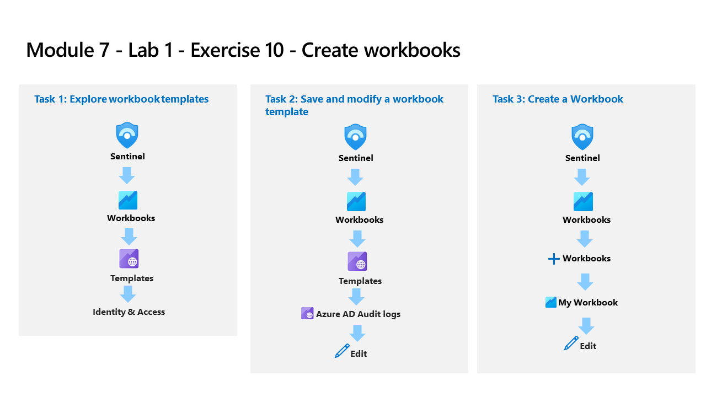

---
lab:
  title: 연습 10 - 통합 문서 만들기
  module: Learning Path 7 - Create detections and perform investigations using Microsoft Sentinel
---

# 학습 경로 7 - 랩 1 - 연습 10 - 통합 문서 만들기

## 랩 시나리오

당신은 Microsoft Sentinel을 구현한 회사에서 근무하는 보안 운영 분석가입니다. Microsoft Sentinel에 데이터 원본을 연결한 후에는 사용자 지정 대시보드를 만들 때 다양한 기능을 제공하는 Azure Monitor 통합 문서의 Microsoft Sentinel 채택을 사용하여 데이터를 시각화하고 모니터링할 수 있습니다. 

Microsoft Sentinel을 사용하면 데이터에 대한 사용자 지정 통합 문서를 만들 수 있으며 데이터 원본을 연결하는 즉시 데이터를 신속하게 파악할 수 있는 기본 제공 통합 문서 템플릿도 제공됩니다.

>**참고:** **[대화형 랩 시뮬레이션](https://mslabs.cloudguides.com/guides/SC-200%20Lab%20Simulation%20-%20Create%20workbooks)** 을 사용하여 이 랩을 원하는 속도로 클릭할 수 있습니다. 대화형 시뮬레이션과 호스트된 랩 간에 약간의 차이가 있을 수 있지만 보여주는 핵심 개념과 아이디어는 동일합니다. 

### 작업 1: 통합 문서 템플릿 살펴보기

이 작업에서는 Microsoft Sentinel 통합 문서 템플릿을 살펴봅니다.

1. WIN1 가상 머신에 Admin으로 로그인합니다. 암호로는 **Pa55w.rd**를 사용하여 로그인합니다.  

1. Edge 브라우저에서 Azure Portal(https://portal.azure.com )로 이동합니다.

1. 랩 호스팅 공급자가 제공한 **테넌트 전자 메일** 계정을 복사하여 **로그인** 대화 상자에 붙여넣은 후 **다음**을 선택합니다.

1. 랩 호스팅 공급자가 제공한 **테넌트 암호**를 복사하여 **암호 입력** 대화 상자에 붙여넣은 후 **로그인**을 선택합니다.

1. Azure Portal의 검색 창에 *Sentinel*을 입력하고 **Microsoft Sentinel**을 선택합니다.

1. Microsoft Sentinel 작업 영역을 선택합니다.

1. *위협 관리* 왼쪽 블레이드에서 **통합 문서**를 선택합니다. 템플릿 탭은 기본적으로 선택되어 있습니다.**

1. **Azure 작업** 템플릿 통합 문서를 검색하고 선택합니다. 오른쪽 창에서 아래로 스크롤하여 **템플릿 보기** 단추를 선택합니다.

1. 통합 문서의 콘텐츠를 검토합니다. 활동 로그에서 데이터를 수집하고 분석하여 Azure 구독 작업에 대한 인사이트를 보여 줍니다.

1. 오른쪽 위에 있는 **X**를 선택하여 통합 문서를 닫습니다.

### 작업 2: 통합 문서 템플릿 저장 및 수정

이 작업에서는 통합 문서 템플릿을 저장하고 수정합니다.

1. **Microsoft Sentinel - 통합 문서 - 템플릿** 탭으로 돌아가야 합니다. 다시 아래로 스크롤하여 *Azure 작업* 통합 문서의 **저장** 단추를 선택합니다. 

1. **미국 동부**를 지역의 기본값으로 유지하고 **확인**을 선택합니다.**

1. **저장된 통합 문서 보기** 단추를 선택합니다.

1. 통합 문서의 변경 내용을 사용하도록 설정하려면 명령 모음에서 **편집**을 선택합니다.

1. 해당 열의 형식을 지정하려고 하므로 *시간 경과에 따른 발신자 작업* 영역까지 아래로 스크롤하여 *작업* 열의 색을 살펴봅니다. 그리드 아래에서 **편집** 단추를 선택합니다.

1. 쿼리 실행 명령 모음의 오른쪽에 있는 **열 설정** 단추를 선택합니다.** **힌트:** 이 단추는 KQL 쿼리의 데이터가 있는 경우에만 나타납니다.

1. 표시되는 *열 설정 편집* 블레이드의 *열* 내에서 **작업**을 선택합니다.

1. *열 렌더러* 값을 **히트맵**으로 변경합니다. *색상표*에서 아래로 스크롤하여 **32색 범주형**을 선택합니다.

1. **저장 후 닫기**를 선택합니다. *작업* 열의 변경 내용을 확인합니다.

1. 쿼리 하단(상단 메뉴 아님)에서 **편집 완료**를 선택합니다.

1. 이제 상단 메뉴에서 **편집 완료**를 선택하고 **저장** 아이콘을 선택합니다. 

1. 오른쪽 위에 있는 **X**를 선택하여 통합 문서를 닫습니다.

### 작업 3: 통합 문서 만들기

이 작업에서는 고급 시각화를 사용하여 새 통합 문서를 만듭니다.

1. Microsoft Sentinel 포털의 **통합 문서** 영역으로 돌아가야 합니다.

1. **+ 통합 문서 추가**를 선택하여 새 통합 문서를 처음부터 만듭니다. 

    >**참고:** 새 통합 문서이지만 시작 템플릿이 사용됩니다.

1. 통합 문서를 편집하려면 **편집**을 선택합니다.

1. 통합 문서의 첫 번째 단락 아래에서 **편집** 단추를 선택합니다.

1. ## 새 통합 문서 위의 새 줄에 #내 통합 문서를 입력합니다.****

1. 섹션 하단의 **편집 완료**, *텍스트 항목 편집: 텍스트 - 2*를 선택합니다. 헤더 크기가 증가했고 헤더 이름이 변경되었습니다.

1. 표시되는 유일한 막대형 차트 그래프 아래에서 **편집**을 선택합니다.

1. 모든 테이블에서 개수의 *union* 문을 제공하는 KQL 문을 검토합니다.

1. 쿼리 항목 편집: 쿼리 - 2의 경우 아래로 스크롤하여 아래쪽 메뉴에서 **편집 완료**를 선택합니다.**

1. 막대형 차트 그래프의 편집 단추 옆에 있는 줄임표(**...**)를 선택하고, **+ 추가**를 선택한 다음, **쿼리 추가**를 선택합니다.**

1. 쿼리 상자에 **SecurityEvent**를 입력합니다.

1. 시간 범위를 **지난 1시간**으로 변경합니다.**

1. 시각화를 **시간 차트**로 변경합니다.**

1. 쿼리 명령 모음에서 **스타일** 탭을 선택합니다.

1. **이 항목을 사용자 지정 너비로 만들기** 상자를 선택합니다.

1. 백분율 너비를 **25**로, 최대 너비를 **25**로 설정합니다.****

1. 이제 쿼리 명령 모음에서 **고급 설정** 탭을 선택합니다.

1. **편집하지 않을 때 새로 고침 아이콘 표시** 상자를 선택합니다. 

1. 새 쿼리 항목 편집: 쿼리 - 2의 경우 아래로 스크롤하여 아래쪽 메뉴에서 **편집 완료**를 선택합니다.**

1. 아래로 스크롤하고 통합 문서 아래쪽에서 **+ 추가**, **쿼리 추가**를 차례로 선택합니다.

1. 쿼리 상자에 **SecurityEvent**를 입력합니다.

1. 시간 범위를 **지난 1시간**으로 변경합니다.**

1. 시각화를 **눈금**으로 변경합니다.**

1. 쿼리의 명령 모음에서 **스타일**을 선택합니다.

1. **이 항목을 사용자 지정 너비로 만들기** 상자를 선택합니다.

1. 백분율 너비를 **75**로, 최대 너비를 **75**로 설정합니다.****

1. 새 *쿼리 항목 편집: 쿼리 - 3*의 경우 아래로 스크롤하여 아래쪽 메뉴에서 **편집 완료**를 선택합니다.

1. 통합 문서의 상단 명령 모음에서 **편집 완료**를 선택합니다.

1. **저장** 아이콘을 선택하고, 제목을 **내 통합 문서**로 변경합니다.**

1. 필요한 경우 **RG-Defender** 리소스 그룹을 선택하고 다른 값은 기본값으로 둡니다.

1.  **적용**을 선택하여 변경 내용을 커밋합니다. 

1. 오른쪽 위에 있는 **X**를 선택하여 통합 문서를 닫거나 Microsoft Sentinel 포털에서 **통합 문서**를 선택합니다.

1. 통합 문서 페이지로 돌아가서 **내 통합 문서** 탭을 선택합니다.**

1. 방금 만든 통합 문서인 **내 통합 문서**를 선택합니다.

1. 오른쪽 창에서 **저장된 통합 문서 보기**를 선택하여 통합 문서를 검토합니다.

## 연습 11 계속 진행
