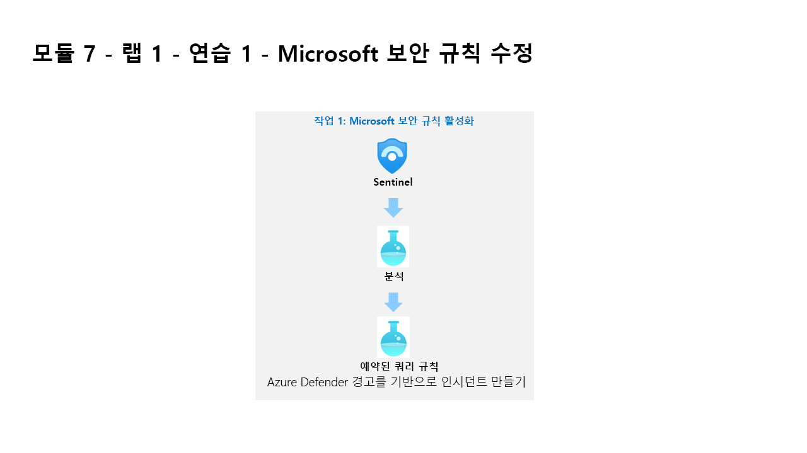

---
lab:
  title: 연습 1 - Microsoft 보안 규칙 수정
  module: Module 7 - Create detections and perform investigations using Microsoft Sentinel
ms.openlocfilehash: 92e54277d1d8c51dd0ddde982409f991bfbe0766
ms.sourcegitcommit: 1b122762798f79fe9862bc662a7dc55f40b15dd5
ms.translationtype: HT
ms.contentlocale: ko-KR
ms.lasthandoff: 05/27/2022
ms.locfileid: "145912163"
---
# 모듈 7 - 랩 1 - 연습 1 - Microsoft 보안 규칙 수정

## 랩 시나리오

당신은 Microsoft Sentinel을 구현한 회사에서 근무하는 보안 운영 분석가입니다. Microsoft Sentinel을 사용하여 위협을 검색하고 완화하는 방법을 파악해야 합니다. 먼저 클라우드용 Defender에서 Microsoft Sentinel로 들어오는 경고를 심각도별로 필터링해야 합니다. 

### 작업 1: Microsoft 보안 규칙 활성화

이 작업에서는 Microsoft 보안 규칙을 활성화합니다.

1. WIN1 가상 머신에 Admin으로 로그인합니다. 암호로는 **Pa55w.rd** 를 사용하여 로그인합니다.  

1. Edge 브라우저에서 Azure Portal(https://portal.azure.com) )로 이동합니다.

1. 랩 호스팅 공급자가 제공한 **테넌트 전자 메일** 계정을 복사하여 **로그인** 대화 상자에 붙여 넣은 후 **다음** 을 선택합니다.

1. 랩 호스팅 공급자가 제공한 **테넌트 암호** 를 복사하여 **암호 입력** 대화 상자에 붙여 넣은 후 **로그인** 을 선택합니다.

1. Azure Portal의 검색 창에 *Sentinel* 을 입력하고 **Microsoft Sentinel** 을 선택합니다.

1. 이전 랩에서 만든 Microsoft Sentinel 작업 영역을 선택합니다.

1. 구성 영역에서 **분석** 을 선택합니다. 기본적으로 활성 규칙이 표시됩니다.

1. **CLoud용 Microsoft Defender를 기반으로 인시던트 만들기** 를 선택합니다. 이 경고는 “모듈 6 - 연습 1 - 작업 4”에서 구성한 클라우드용 Defender 커넥터에 의해 자동으로 생성되었습니다. 

1. 오른쪽 블레이드에서 **편집** 단추를 선택합니다.

1. 페이지를 아래로 스크롤하고 “분석 규칙 논리 - 심각도로 필터링”에서 사용자 지정 드롭다운 목록을 선택합니다.

1. 심각도 수준에 대해 **낮음** 의 선택을 취소하고 규칙으로 돌아갑니다.

1. 하단에서 **다음: 자동화된 응답** 단추를 선택한 후, **다음: 검토** 단추를 클릭합니다.

1. 변경 내용을 검토하고 **저장** 단추를 선택합니다. Analytics 규칙이 저장됩니다.

# 연습 2 계속 진행
