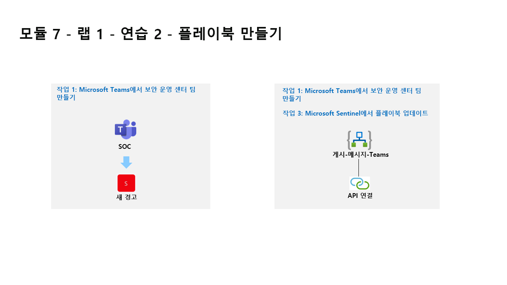

---
lab:
  title: 연습 2 - 플레이북 만들기
  module: Module 7 - Create detections and perform investigations using Microsoft Sentinel
ms.openlocfilehash: db4d3e74419475539b412afdb1b3e935f89d95b1
ms.sourcegitcommit: 1b122762798f79fe9862bc662a7dc55f40b15dd5
ms.translationtype: HT
ms.contentlocale: ko-KR
ms.lasthandoff: 05/27/2022
ms.locfileid: "145912160"
---
# 모듈 7 - 랩 1 - 연습 2 - 플레이북 만들기

## 랩 시나리오

당신은 Microsoft Sentinel을 구현한 회사에서 근무하는 보안 운영 분석가입니다. Microsoft Sentinel을 사용하여 위협을 검색하고 완화하는 방법을 파악해야 합니다. 이제 Microsoft Sentinel에서 루틴으로 실행할 수 있는 작업에 응답하고 이를 수정하려고 합니다.

플레이북을 사용하면 위협 대응을 자동화 및 오케스트레이션하고, 내부 및 외부의 다른 시스템과 통합할 수 있으며, 분석 규칙 또는 자동화 규칙에 의해 트리거될 때 특정 경고 또는 인시던트에 대응하여 자동으로 실행되도록 설정할 수 있습니다. 

### 작업 1: Microsoft Teams에서 보안 운영 센터 팀 만들기

이 작업에서는 랩에 사용할 Microsoft Teams 팀을 만듭니다.

1. WIN1 가상 머신에 Admin으로 로그인합니다. 암호로는 **Pa55w.rd** 를 사용하여 로그인합니다.  

1. Edge 브라우저에서 새 탭을 열고 Microsoft Teams 포털(https://teams.microsoft.com) )로 이동합니다.

1. 랩 호스팅 공급자가 제공한 **테넌트 전자 메일** 계정을 복사하여 **로그인** 대화 상자에 붙여넣은 후 **다음** 을 선택합니다.

1. 랩 호스팅 공급자가 제공한 **테넌트 암호** 를 복사하여 **암호 입력** 대화 상자에 붙여넣은 후 **로그인** 을 선택합니다.

1. Teams 팝업이 표시되면 닫습니다.

1. 아직 선택하지 않은 경우 왼쪽 메뉴에서 **Teams** 를 선택한 다음, 아래쪽에서 **참가 또는 팀 만들기** 를 선택합니다.

1. 기본 창에서 **팀 만들기** 단추를 선택합니다.

1. **처음부터** 단추를 선택합니다.

1. **프라이빗** 단추를 선택합니다.

1. 팀 이름을 지정합니다. **SOC** 를 입력하고 **만들기** 단추를 선택합니다.

1. SOC 화면에 구성원을 추가하고 **건너뛰기** 단추를 선택합니다. 

1. Teams 블레이드를 아래로 스크롤하여 새로 만든 SOC 팀을 찾고, 이름 오른쪽에서 줄임표 **(...)** 를 선택하고, **채널 추가** 를 선택합니다.

1. 채널 이름을 *New Alerts* 로 입력하고 **추가** 단추를 선택합니다.

### 작업 2: Microsoft Sentinel 플레이북 만들기

이 작업에서는 Microsoft Sentinel에서 플레이북으로 사용할 논리 앱을 만듭니다.

1. Edge 브라우저에서 Azure Portal(https://portal.azure.com )로 이동합니다.

1. 랩 호스팅 공급자가 제공한 **테넌트 전자 메일** 계정을 복사하여 **로그인** 대화 상자에 붙여넣은 후 **다음** 을 선택합니다.

1. 랩 호스팅 공급자가 제공한 **테넌트 암호** 를 복사하여 **암호 입력** 대화 상자에 붙여넣은 후 **로그인** 을 선택합니다.

1. Azure Portal의 검색 창에 *Sentinel* 을 입력하고 **Microsoft Sentinel** 을 선택합니다.

1. 앞에서 만든 Microsoft Sentinel 작업 영역을 선택합니다.

1. 페이지 왼쪽의 콘텐츠 관리 영역에서 **커뮤니티** 페이지를 선택합니다.

1. 오른쪽 창에서 **커뮤니티 콘텐츠 온보딩** 링크를 선택합니다. 그러면 Microsoft Sentinel용 Edge 브라우저 GitHub 콘텐츠에 새 탭이 열립니다.

1. **Playbooks** 폴더를 선택합니다.

1. **Post-Message-Teams** 폴더를 선택합니다.

1. readme.md 상자에서 두 번째 빠른 배포 옵션, **경고 트리거를 사용하여 배포** 로 아래로 스크롤하고 **Azure에 배포** 단추를 선택합니다.  

    >**매우 중요**: 두 개의 서로 다른 Microsoft Sentinel 트리거인 인시던트 및 경고를 사용합니다. 경고(두 번째)를 선택해야 합니다.

1. Azure 구독이 선택되어 있는지 확인합니다.

1. 리소스 그룹에서 **새로 만들기** 를 선택하고, *RG-Playbooks* 를 입력한 후, **확인** 을 선택합니다.

1. 지역 기본값으로 **미국 동부** 를 그대로 둡니다.

1. 플레이북 이름이 “PostMessageTeams-OnAlert”인지 확인하고 **검토 + 만들기** 를 선택합니다. **힌트:** 이름이 다른 경우 GitHub로 돌아가서 **경고 트리거로 배포** 플레이북을 선택합니다.

1. 이제 **만들기** 를 선택합니다. 

    >**참고:** 다음 작업으로 진행하기 전에 배포가 완료될 때까지 기다립니다.

### 작업 3: Microsoft Sentinel에서 플레이북 업데이트

이 작업에서는 만든 새 플레이북을 적절한 연결 정보로 업데이트합니다.

1. Azure Portal의 검색 창에 *Sentinel* 을 입력하고 **Microsoft Sentinel** 을 선택합니다.

1. Microsoft Sentinel 작업 영역을 선택합니다.

1. 구성 영역에서 **자동화** 를 선택하고 **활성 플레이북** 탭을 선택합니다.

1. **PostMessageTeams-OnAlert** 플레이북을 선택합니다. **힌트:** 플레이북이 표시되지 않으면 Ctrl+F5를 눌러 Azure Portal 페이지를 새로 고칩니다.

1. 명령 메뉴의 *PostMessageTeams-OnAlert* 의 논리 앱 페이지에서 **편집** 을 선택합니다.

1. 첫 번째 블록 **Microsoft Sentinel 경고** 를 선택합니다.

1. **연결 변경** 링크를 선택합니다.

1. **새로 추가** 를 선택하고 **로그인** 을 선택합니다. 새 창에서 메시지가 표시되면 Azure 구독 관리자 자격 증명을 선택합니다. 이제 블록의 마지막 줄에 “관리자-사용자-이름에 연결됨”이 표시되어야 합니다.

1. 이제 두 번째 블록인 **경고 - 인시던트 가져오기** 를 선택합니다.

1. **연결 변경** 링크를 선택합니다.

1. 표시 이름 아래에 Azure 관리자 사용자 이름이 있는 연결을 선택합니다. **힌트:** admin@ZZZZZZ.onmicrosoft.com. 이제 블록의 마지막 줄에 “관리자-사용자-이름에 연결됨”이 표시되어야 합니다.

1. 이제 세 번째 블록인 **연결** 을 선택합니다.

1. **새로 추가** 를 선택하고 메시지가 표시되면 Azure 관리자 자격 증명을 선택합니다. 이제 블록의 마지막 줄에 “관리자-사용자-이름에 연결됨”이 표시되어야 합니다.

1. 이제 블록 이름이 **메시지(V3) 게시** 로 바뀌었습니다. *팀* 필드의 끝에서 **X** 를 선택하여 콘텐츠를 지웁니다. 필드가 Microsoft Teams에서 사용 가능한 팀 목록이 포함된 드롭다운으로 변경됩니다. **SOC** 를 선택합니다.

1. 채널 필드에 대해 동일한 작업을 수행합니다. 필드 끝에 있는 **X** 를 선택하여 콘텐츠를 지웁니다. 필드가 SOC Teams 채널 목록이 포함된 드롭다운으로 변경됩니다. **새 경고** 를 선택합니다.

1. 명령 모음에서 **저장** 을 선택합니다.

이후의 랩에서 이 논리 앱을 사용할 예정입니다.

## 연습 3 계속 진행
