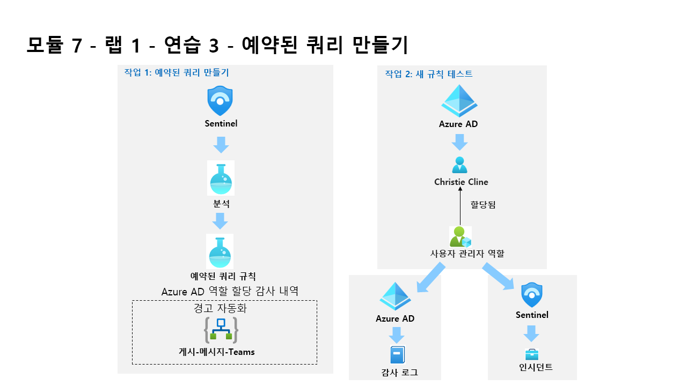

---
lab:
  title: 연습 3 - 템플릿에서 예약된 쿼리 만들기
  module: Learning Path 7 - Create detections and perform investigations using Microsoft Sentinel
---

# 학습 경로 7 - 랩 1 - 연습 3 - 템플릿에서 예약된 쿼리 만들기

## 랩 시나리오

당신은 Microsoft Sentinel을 구현한 회사에서 근무하는 보안 운영 분석가입니다. Microsoft Sentinel을 사용하여 위협을 검색하고 완화하는 방법을 파악해야 합니다. 데이터 원본을 Microsoft Sentinel에 연결한 후, 사용자 환경에서 위협 및 비정상적인 동작을 검색하는 데 도움이 되는 사용자 지정 분석 규칙을 만듭니다.

분석 규칙은 사용자 환경에서 특정 이벤트 또는 이벤트 세트를 검색하고, 특정 이벤트 임계값 또는 조건에 도달하면 경고를 생성하고, SOC에서 심사 및 조사를 위해 인시던트를 생성하고, 자동화된 추적 및 수정 프로세스를 통해 위협에 대응합니다.

>**참고:** **[대화형 랩 시뮬레이션](https://mslabs.cloudguides.com/guides/SC-200%20Lab%20Simulation%20-%20Create%20a%20scheduled%20query)** 을 사용하여 이 랩을 원하는 속도로 클릭할 수 있습니다. 대화형 시뮬레이션과 호스트된 랩 간에 약간의 차이가 있을 수 있지만 보여주는 핵심 개념과 아이디어는 동일합니다. 

### 작업 1: 예약된 쿼리 만들기

이 작업에서는 예약된 쿼리를 만들고 이를 이전 연습에서 만든 Teams 채널에 연결합니다.

1. WIN1 가상 머신에 Admin으로 로그인합니다. 암호로는 **Pa55w.rd**를 사용하여 로그인합니다.  

1. 랩 호스팅 공급자가 제공한 **테넌트 전자 메일** 계정을 복사하여 **로그인** 대화 상자에 붙여넣은 후 **다음**을 선택합니다.

1. 랩 호스팅 공급자가 제공한 **테넌트 암호**를 복사하여 **암호 입력** 대화 상자에 붙여넣은 후 **로그인**을 선택합니다.

1. Azure Portal의 검색 창에 *Sentinel*을 입력하고 **Microsoft Sentinel**을 선택합니다.

1. Microsoft Sentinel 작업 영역을 선택합니다.

1. 구성 영역에서 **분석**을 선택합니다.

1. 명령 모음의 *규칙 템플릿* 탭에 있는지 확인하고 **새 CloudShell 사용자** 규칙을 검색합니다.

1. 규칙 요약 블레이드에서 *데이터 원본: Azure 활동* 아래의 녹색 아이콘을 검토하여 데이터를 수신하고 있는지 확인합니다.

    >**참고:** 연결된 상태에서 표시되지 않으면 학습 경로 6 랩, 연습 1의 작업 3을 완료했는지 확인합니다.

1. 계속하려면 **규칙 만들기**를 선택합니다.

1. Analytics 규칙 마법사의 *일반* 탭에서 *심각도*를 **보통**으로 변경합니다.

1. **다음: 규칙 논리 설정 >** 단추를 선택합니다.

1. 규칙 쿼리의 경우 **쿼리 결과 보기**를 선택합니다. 어떤 결과나 오류도 수신되어서는 안 됩니다.

1. 오른쪽 위 **X**를 선택하여 로그 창을 닫고 **확인**을 선택하여 취소하고 변경 내용을 저장하여 마법사로 돌아갑니다.**

1. 아래로 스크롤하여 쿼리 예약에서 다음을 설정합니다.**

    |설정|값|
    |---|---|
    |쿼리 실행 간격|5분|
    |마지막부터 데이터 조회|1일|

    >**참고:** 같은 데이터에 대해 의도적으로 여러 인시던트를 생성합니다. 그러면 랩에서 해당 경고를 사용할 수 있기 때문입니다.

1. 경고 임계값 영역에서 경고가 모든 이벤트를 등록하도록 하므로 값을 변경하지 않고 그대로 둡니다.**

1. 쿼리가 위에 지정된 경고 임계값보다 더 많은 결과를 반환하는 한 이벤트 그룹화 영역에서는 실행될 때마다 단일 경고를 생성하려고 하므로 **모든 이벤트를 단일 경고로 그룹화**합니다.**

1. 하단에서 **다음: 인시던트 설정 >** 단추를 선택합니다. 

1. 인시던트 설정 탭에서 기본 옵션을 검토합니다.**

1. 하단에서 **다음: 자동화된 응답 >** 단추를 선택합니다.

1. *자동화 규칙* 아래의 *자동 응답* 탭에서 **+ 새로 추가**를 선택합니다.

1. 자동화 규칙 이름에 **계층 2**를 입력합니다.**

1. 작업에서 **소유자 할당**을 선택합니다.**

1. 그런 다음, **나에게 할당**을 선택합니다. 그런 다음 **+ 작업 추가**를 선택합니다.

1. *그런 다음* 드롭다운 메뉴를 사용하여 **플레이북 실행**을 선택합니다.

1. 플레이북 권한에 관한 *정보(i)* 메시지와 **플레이북 권한 관리 링크**가 있는 두 번째 드롭다운 메뉴가 나타납니다.

    >**참고:** 플레이북은 권한이 구성될 때까지 드롭다운 목록에서 회색으로 표시됩니다.

1. **플레이북 권한 관리 링크**를 선택합니다.

1. *권한 관리* 페이지에서 이전 랩에서 만든 **RG-플레이북** 리소스 그룹을 선택하고 **적용**을 선택합니다.

1. 드롭다운 메뉴에서 이전 연습에서 만든 플레이북 **PostMessageTeams-OnIncident**를 선택합니다.

1. **적용**을 선택합니다.

1. 하단에서 **다음: 검토 및 만들기 >** 단추를 선택합니다.
  
1. **저장**을 선택합니다.

### 작업 2: 새 규칙 테스트

이 작업에서는 새로운 예약된 쿼리 규칙을 테스트합니다.

1. Azure Portal의 상단 표시줄에서 Cloud Shell에 해당하는 아이콘 **>_** 을 선택합니다. 디스플레이 해상도가 너무 낮은 경우 줄임표 아이콘 **(...)** 을 먼저 선택해야 할 수도 있습니다.

1. *Azure Cloud Shell 시작* 창에서 **Powershell**을 선택합니다.

1. *시작* 페이지에서 **스토리지 계정 탑재**를 선택한 다음, *스토리지 계정 구독* 드롭다운 메뉴 항목에서 **Azure Pass - 스폰서쉽**을 선택하고 **적용** 단추를 선택합니다.

    >**중요:** *스토리지 계정이 필요하지 않음* 라디오 단추 옵션을 선택하지 마세요. 이로 인해 인시던트 만들기가 실패하게 됩니다.

1. *스토리지 계정 탑재* 페이지에서 **스토리지 계정을 만듭니다**를 선택한 후 **다음**을 선택합니다.

1. Cloud Shell이 프로비전될 때까지 기다린 후 Azure Cloud Shell 창을 닫습니다.

1. Azure Portal의 검색 창에 *작업*을 입력한 다음 **활동 로그**를 선택합니다.

1. 다음 *작업 이름* 항목이 나타나는지 확인합니다. **스토리지 계정 키 나열** 및 **스토리지 계정 만들기 업데이트**. 이는 앞서 검토한 KQL 쿼리가 경고를 생성하기 위해 일치하는 작업입니다. **힌트:** 목록을 업데이트하려면 **새로 고침**을 선택해야 할 수도 있습니다.

1. Azure Portal의 검색 창에 *Sentinel*을 입력하고 **Microsoft Sentinel**을 선택합니다.

1. Microsoft Sentinel 작업 영역을 선택합니다.

1. 위협 관리에서 **인시던트** 메뉴 옵션을 선택합니다.**

1. **자동 새로 고침 인시던트** 토글을 선택합니다.

1. 새로 만든 인시던트가 표시됩니다.

    >**참고:** 인시던트를 트리거하는 이벤트를 처리하는 데 5분 이상 걸릴 수 있습니다. 다음 연습을 계속합니다. 나중에 이 보기로 다시 돌아옵니다.

1. 인시던트를 선택하고 오른쪽 블레이드의 정보를 검토합니다.

1. Microsoft Edge 브라우저에서 탭을 선택하여 Microsoft Teams로 돌아갑니다. 닫은 경우 새 탭을 열고 <https://teams.microsoft.com>을 입력합니다. *SOC* Teams로 이동하여 새 경고 채널을 선택하고 인시던트에 대한 메시지 게시물을 확인합니다.**

## 연습 4 계속 진행
