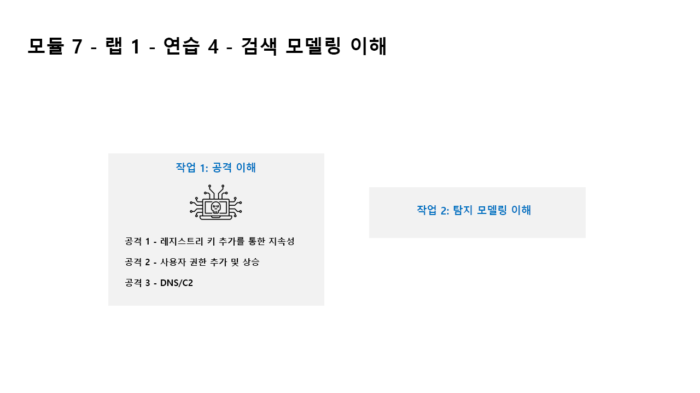

---
lab:
  title: 연습 5 - 검색 모델링 이해
  module: Module 7 - Create detections and perform investigations using Microsoft Sentinel
---

# <a name="module-7---lab-1---exercise-5---understand-detection-modeling"></a>모듈 7 - 랩 1 - 연습 5 - 검색 모델링 이해


### <a name="task-1-understand-the-attacks"></a>작업 1: 공격 이해

>**중요: 이 연습에서는 작업을 수행하지 않습니다.**  이러한 지침은 다음 연습에서 수행할 공격에 대한 설명일 뿐입니다. 이 페이지를 주의 깊게 읽으세요.

공격 패턴은 오픈 소스 프로젝트(https://github.com/redcanaryco/atomic-red-team )를 기반으로 합니다.


#### <a name="attack-1---persistence-with-registry-key-add"></a>공격 1 - 레지스트리 키 추가를 통한 지속성

공격자는 레지스트리 실행 키에 프로그램을 추가합니다. 이렇게 하면 사용자가 로그온할 때마다 프로그램을 실행하여 지속성을 달성합니다.

```
REG ADD "HKCU\SOFTWARE\Microsoft\Windows\CurrentVersion\Run" /V "SOC Test" /t REG_SZ /F /D "C:\temp\startup.bat"
```

#### <a name="attack-2---user-add-and-elevate-privilege"></a>공격 2 - 사용자 추가 및 권한 상승

이 공격에서는 공격자가 새 사용자를 추가한 다음 권한을 Administrators 그룹으로 높입니다. 그러면 권한이 있는 다른 계정으로 로그온할 수 있게 됩니다.

```
net user theusernametoadd /add
net user theusernametoadd ThePassword1!
net localgroup administrators theusernametoadd /add
```

#### <a name="attack-3---dns--c2"></a>공격 3 - DNS/C2 

공격자는 대량의 DNS 쿼리를 명령 및 제어(C2) 서버로 보냅니다. 의도는 단일 원본 시스템 또는 단일 대상 도메인에서 DNS 쿼리 수에 대한 임계값 기반 검색을 트리거하는 것입니다.

```
param(
    [string]$Domain = "microsoft.com",
    [string]$Subdomain = "subdomain",
    [string]$Sub2domain = "sub2domain",
    [string]$Sub3domain = "sub3domain",
    [string]$QueryType = "TXT",
        [int]$C2Interval = 8,
        [int]$C2Jitter = 20,
        [int]$RunTime = 240
)
$RunStart = Get-Date
$RunEnd = $RunStart.addminutes($RunTime)
$x2 = 1
$x3 = 1 
Do {
    $TimeNow = Get-Date
    Resolve-DnsName -type $QueryType $Subdomain".$(Get-Random -Minimum 1 -Maximum 999999)."$Domain -QuickTimeout
    if ($x2 -eq 3 )
    {
        Resolve-DnsName -type $QueryType $Sub2domain".$(Get-Random -Minimum 1 -Maximum 999999)."$Domain -QuickTimeout
        $x2 = 1
    }
    else
    {
        $x2 = $x2 + 1
    }
    if ($x3 -eq 7 )
    {
        Resolve-DnsName -type $QueryType $Sub3domain".$(Get-Random -Minimum 1 -Maximum 999999)."$Domain -QuickTimeout
        $x3 = 1
    }
    else
    {
        $x3 = $x3 + 1
    }
    $Jitter = ((Get-Random -Minimum -$C2Jitter -Maximum $C2Jitter) / 100 + 1) +$C2Interval
    Start-Sleep -Seconds $Jitter
}
Until ($TimeNow -ge $RunEnd)
```


### <a name="task-2-understand-detection-modeling"></a>작업 2: 탐지 모델 이해

이 랩에서 사용하는 공격 검색 구성 주기에는 모든 데이터 원본이 포함됩니다. 하지만 실제로는 두 가지 데이터 원본만 중점적으로 검색합니다.

검색을 작성하려면 먼저 KQL 문을 작성해야 합니다. 여기서는 호스트를 공격할 것이므로 KQL 문 작성을 시작하는 데 필요한 대표 데이터가 제공됩니다.


KQL 문을 완성한 후에는 분석 규칙을 만듭니다.

규칙이 트리거되어 경고와 인시던트가 생성되면 조사를 진행하여 보안 운영 분석자의 조사 과정에 도움이 되는 필드가 제공되고 있는지를 확인합니다.

다음으로, 분석 규칙에 다른 변경을 적용합니다.

>**참고:** 일부 경고는 이 랩의 목적에 따라 더 짧은 기간에 트리거됩니다.

## <a name="proceed-to-exercise-6"></a>연습 6 계속 진행
