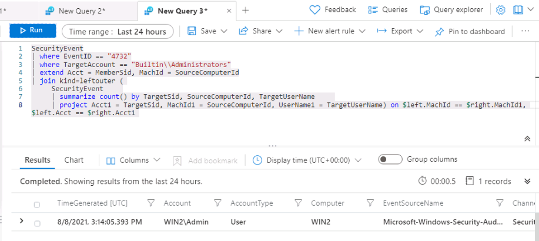

---
lab:
  title: 연습 6 - 검색 만들기
  module: Module 7 - Create detections and perform investigations using Microsoft Sentinel
ms.openlocfilehash: 5512edc50ccfb34c75e4b5658d71f1d3042d7d2c
ms.sourcegitcommit: a90325f86a3497319b3dc15ccf49e0396c4bf749
ms.translationtype: HT
ms.contentlocale: ko-KR
ms.lasthandoff: 04/07/2022
ms.locfileid: "141493946"
---
# <a name="module-7---lab-1---exercise-6---create-detections"></a>모듈 7 - 랩 1 - 연습 6 - 검색 만들기

## <a name="lab-scenario"></a>랩 시나리오


당신은 Microsoft Sentinel을 구현한 회사에서 근무하는 보안 운영 분석가입니다. Log Analytics KQL 쿼리를 사용하여 작업하고, 여기에서 사용자 환경의 위협 및 비정상적인 동작을 검색하는 데 도움이 되는 사용자 지정 분석 규칙을 만듭니다.

분석 규칙은 사용자 환경에서 특정 이벤트 또는 이벤트 세트를 검색하고, 특정 이벤트 임계값 또는 조건에 도달하면 경고를 생성하고, SOC에서 심사 및 조사를 위해 인시던트를 생성하고, 자동화된 추적 및 수정 프로세스를 통해 위협에 대응합니다.


### <a name="task-1-attack-1-detection-with-sysmon"></a>작업 1: Sysmon을 사용하여 공격 1 검색

이 작업에서는 보안 이벤트 커넥터와 Sysmon이 설치된 호스트에서 **공격 1** 검색을 만듭니다.

>**중요:** 다음 단계는 이전에 작업한 컴퓨터와는 다른 컴퓨터에서 수행합니다. 가상 머신 이름 참조를 찾습니다.

1. WIN1 가상 머신에 Admin으로 로그인합니다. 암호로는 **Pa55w.rd** 를 사용하여 로그인합니다.  

1. Edge 브라우저에서 Azure Portal(https://portal.azure.com )로 이동합니다.

1. 랩 호스팅 공급자가 제공한 관리자용 **테넌트 전자 메일** 계정을 복사하여 **로그인** 대화 상자에 붙여넣은 후 **다음** 을 선택합니다.

1. 랩 호스팅 공급자가 제공한 관리자용 **테넌트 암호** 를 복사하여 **암호 입력** 대화 상자에 붙여넣은 후 **로그인** 을 선택합니다.

1. Azure Portal의 검색 창에 *Sentinel* 을 입력하고 **Microsoft Sentinel** 을 선택합니다.

1. 앞에서 만든 Microsoft Sentinel 작업 영역을 선택합니다.

1. 일반 섹션에서 **로그** 를 선택하고 로그 시간 범위:가 **마지막 24시간** 으로 설정되어 있는지 확인합니다.

1. 먼저 데이터가 저장되는 위치를 확인해야 합니다. 다음 KQL 문을 **실행** 합니다.

    ```KQL
    search "temp\\startup.bat"
    ```

1. 결과에는 4개 다른 테이블의 데이터가 표시됩니다.

    - *DeviceProcessEvents*. 원본: 엔드포인트용 Defender 커넥터.
    - *DeviceRegistryEvents*. 원본: 엔드포인트용 Defender 커넥터.
    - *Event*. 원본: Log Analytics 에이전트, Sysmon/Operational Windows 이벤트 로그(에이전트 구성).
    - *SecurityEvent*. 원본: Log Analytics 에이전트, 보안 Windows 이벤트 로그(기본값).

    다양한 원본에서 데이터를 수신하므로 나중에 통합할 수 있는 두 개의 KQL 문을 작성해야 합니다. 초기 조사에서 각 문을 개별적으로 살펴볼 예정입니다.

    >**참고:** 드문 경우지만 초기 데이터 로드 프로세스는 예상보다 오래 걸립니다. 이 경우 몇 시간 동안 결과에 테이블이 표시되지 않습니다. *Event* 테이블만 표시되는 경우 지금 사용할 이벤트 테이블이므로 계속 진행할 수 있습니다.

1. 분석할 첫 번째 데이터 원본은 Windows 호스트의 Sysmon입니다. 다음 KQL 문을 **실행** 하여 이벤트 테이블의 결과만 표시합니다.

    ```KQL
    search in (Event) "temp\\startup.bat"
    ```

1. 첫 번째 행을 확장하여 레코드와 관련된 모든 열을 표시합니다. *EventData*, *ParameterXml* 등의 일부 필드에는 여러 데이터 항목이 구조화된 데이터로 저장되어 있습니다. 그러므로 특정 필드를 쿼리하기가 어렵습니다. 

1. 이를 위해 의미 있는 필드를 찾을 수 있도록 각 행의 데이터를 구문 분석하는 KQL 문을 작성해야 합니다. GitHub의 Microsoft Sentinel 커뮤니티 내 Parsers 폴더에는 다양한 예제가 포함되어 있습니다. Edge 브라우저에서 다른 탭을 열고 **https://github.com/Azure/Azure-Sentinel** 을 입력합니다.

1. **Parsers** 폴더와 **Sysmon** 폴더를 차례로 선택합니다.

1. Sysmon-v12.0.txt 파일을 선택하여 표시합니다.

1. 주석 바로 뒤의 파일 맨 위에 다음 *let* 문이 이벤트 테이블을 쿼리하고 아래와 같이 *EventData* 라는 변수에 저장하는 것을 볼 수 있습니다.

    >**참고:** 다음 코드 조각은 복사하고 실행하지 않고 16단계의 쿼리를 더 잘 이해하기 위한 것입니다.

    ```
    let EventData = Event
    | where Source == "Microsoft-Windows-Sysmon"
    | extend RenderedDescription = tostring(split(RenderedDescription, ":")[0])
    | project TimeGenerated, Source, EventID, Computer, UserName, EventData, RenderedDescription
    | extend EvData = parse_xml(EventData)
    | extend EventDetail = EvData.DataItem.EventData.Data
    | project-away EventData, EvData  ;
    ```

1. 파일 아래쪽에는 아래와 같이 *EventData* 변수를 입력으로 사용하여 *EventID == 13* 을 찾는 또 다른 *let* 문이 있습니다.

    >**참고:** 다음 코드 조각은 복사하고 실행하지 않고 16단계의 쿼리를 더 잘 이해하기 위한 것입니다.

    ```
    let SYSMON_REG_SETVALUE_13=()
    {
        let processEvents = EventData
        | where EventID == 13
        | extend RuleName = EventDetail.[0].["#text"], EventType = EventDetail.[1].["#text"], UtcTime = EventDetail.[2].["#text"], ProcessGuid = EventDetail.[3].["#text"], ProcessId = EventDetail.[4].["#text"], Image = EventDetail.[5].["#text"], TargetObject = EventDetail.[6].["#text"], Details = EventDetail.[7].["#text"]
        | project-away EventDetail  ;
        processEvents;
    };
    ```

1. 이 예제를 참조하여 KQL 문을 작성할 수 있습니다. 위의 두 문을 사용하면 이벤트 테이블 내에서 Sysmon을 사용하여 모든 레지스트리 키 집합 값 행을 표시하는 고유한 KQL 문을 만듭니다. Microsoft Sentinel Edge 브라우저 탭으로 돌아가서 다음 KQL 쿼리를 **실행** 합니다.

    >**중요:** 먼저 메모장에 KQL 쿼리를 붙여넣은 다음, 해당 위치에서 새 쿼리 1 로그 창으로 복사하여 오류를 방지하세요. 

    ```KQL
    Event | where Source == "Microsoft-Windows-Sysmon"
    | where EventID == 13
    | extend RenderedDescription = tostring(split(RenderedDescription, ":")[0])
    | project TimeGenerated, Source, EventID, Computer, UserName, EventData, RenderedDescription
    | extend EvData = parse_xml(EventData)
    | extend EventDetail = EvData.DataItem.EventData.Data
    | project-away EventData, EvData  
    | extend RuleName = EventDetail.[0].["#text"], EventType = EventDetail.[1].["#text"], UtcTime = EventDetail.[2].["#text"], ProcessGuid = EventDetail.[3].["#text"], ProcessId = EventDetail.[4].["#text"], Image = EventDetail.[5].["#text"], TargetObject = EventDetail.[6].["#text"], Details = EventDetail.[7].["#text"]
    | project-away EventDetail 
    ```

   

1. 여기서 검색 규칙을 계속 작성할 수도 있지만, 이 쿼리는 다른 검색 규칙의 KQL 문에 재사용할 수 있을 것으로 보입니다. 로그 창에서 **저장** 을 선택한 다음, **함수로 저장** 을 선택합니다. 함수로 저장 블레이드에서 다음을 입력합니다.

    |설정|값|
    |---|---|
    |함수 이름|**Event_Reg_SetValue**|
    |레거시 범주|**Sysmon**|

1. **저장** 을 선택하고 **+** 기호를 선택하여 새 로그 쿼리 탭을 엽니다. 

1. 다음 KQL 문을 **실행** 하여 새로 만든 함수를 테스트합니다.

    ```KQL
    Event_Reg_SetValue
    ```

1. 현재 데이터 컬렉션에 따라 행이 여러 개 반환될 수도 있습니다. 예상된 동작입니다. 다음 작업에서 이 랩의 시나리오에 맞게 결과를 필터링합니다. 다음 KQL 문을 **실행** 하여 이제 검토할 수 있는 특정 레코드를 반환하여 행을 식별하기 위해 변경할 수 있는 내용을 확인합니다.

    ```KQL
    Event_Reg_SetValue | search "startup.bat"
    ```

1. 결과를 통해 위협 행위자가 reg.exe를 사용하여 레지스트리 키에 키를 추가하고 프로그램이 C:\temp에 있음을 알 수 있습니다. 다음 문을 **실행** 하여 쿼리에서 *search* 연산자를 *where* 연산자로 바꿉니다.

    ```KQL
    Event_Reg_SetValue | where Image contains "reg.exe"
    | where Details startswith "C:\\TEMP"
    ```

1. 이제 식별할 파일이 지정되었습니다. 가능한 한 많은 경고 컨텍스트를 제공하여 보안 작업 분석가를 지원하는 것이 중요합니다. 가령 조사 그래프에 사용할 엔터티 등을 제공할 수 있습니다. 다음 쿼리를 **실행** 합니다.

    ```KQL
    Event_Reg_SetValue | where Image contains "reg.exe"
    | where Details startswith "C:\\TEMP"
    | extend timestamp = TimeGenerated, HostCustomEntity = Computer, AccountCustomEntity = UserName
    ```

1. 이제 적절한 검색 규칙을 작성했으므로 로그 창의 명령 표시줄에서 **+ 새 경고 규칙** 을 선택한 다음 **Azure Sentinel 경고 만들기** 를 선택합니다. 그러면 모듈 7 - 연습 3에서 만든 것과 마찬가지로 새 예약된 규칙이 만들어집니다.

1. 그러면 “분석 규칙 마법사”가 시작됩니다. 일반 탭에서 다음을 입력합니다.

    |설정|값|
    |---|---|
    |Name|**Sysmon Startup RegKey**|
    |설명|**c:\temp의 Sysmon Startup Regkey**|
    |전술|**지속성**|
    |심각도|**높음**|

1. **다음: 규칙 논리 설정 >** 을 선택합니다. 

1. 규칙 논리 설정 탭에서 규칙 쿼리는 경고 보강 - 엔터티 매핑 아래의 엔터티뿐만 아니라 KQL 쿼리로 이미 채워져야 합니다.   **-> 현재 데이터로 테스트** 를 선택하여 현재 구성으로 하루에 수신할 수 있는 경고 수를 검토합니다.

1. 아래로 스크롤하여 쿼리 예약에서 다음을 설정합니다.

    |설정|값|
    |---|---|
    |쿼리 실행 간격|5분|
    |마지막부터 데이터 보기|1일|

    >**참고:** 같은 데이터에 대해 의도적으로 여러 인시던트를 생성합니다. 그러면 랩에서 해당 경고를 사용할 수 있기 때문입니다. 이 구성이 변경되면 수신된 경고 수가 증가합니다.

1.  **-> 현재 데이터로 테스트** 를 다시 선택하여 변경된 구성으로 하루에 수신할 수 있는 경고 수를 검토합니다.

1. 나머지 옵션은 기본값으로 둡니다. **다음: 인시던트 설정>** 단추를 선택합니다.

1. 인시던트 설정 탭에서 기본값을 그대로 두고 **다음: 자동화된 응답 >** 단추를 선택합니다.

1. 자동화된 응답 탭에서 경고 자동화 아래의 **PostMessageTeams-OnAlert** 를 선택한 다음, **다음:  검토 >** 단추를 선택합니다.

1. 검토 탭에서 **만들기** 단추를 선택하여 새 예약된 분석 규칙을 만듭니다.


### <a name="task-2-attack-1-detection-with-defender-for-endpoint"></a>작업 2: 엔드포인트용 Defender를 사용하여 공격 1 검색

이 작업에서는 엔드포인트용 Microsoft Defender가 구성되어 있는 호스트에서 **공격 1** 검색을 만듭니다.

1. 이 페이지에서 벗어나면 Microsoft Sentinel 포털의 일반 섹션에서 **로그** 를 선택합니다.

1. 다음 KQL 문을 다시 **실행** 하여 이 데이터가 있는 테이블을 회수합니다.

    ```KQL
    search "temp\\startup.bat"
    ```

1. 이 검색에서는 엔드포인트용 Defender의 데이터를 중점적으로 찾습니다. 다음 KQL 문을 **실행** 합니다.

    ```KQL
    search in (Device*) "temp\\startup.bat"
    ```

1. 이미 일반화되어 쉽게 쿼리할 수 있는 데이터는 *DeviceRegistryEvents* 테이블에 포함되어 있는 것으로 보입니다. 행을 확장하여 레코드와 관련된 모든 열을 표시합니다.

    >**중요:** 결과에 *DeviceRegistryEvents* 테이블이 표시되지 않는 경우 다음 쿼리의 대안은 *DeviceProcessEvents* 테이블을 대체로 사용하는 것입니다. 즉, 아래 제공된 두 예제 중 하나를 사용합니다.

1. 결과를 통해 위협 행위자가 reg.exe를 사용하여 레지스트리 키에 키를 추가하고 프로그램이 C:\temp에 있음을 알 수 있습니다. 다음 문을 **실행** 하여 쿼리에서 *search* 연산자를 *where* 연산자로 바꿉니다.

    ```KQL
    DeviceRegistryEvents | where ActionType == "RegistryValueSet"
    | where InitiatingProcessFileName == "reg.exe"
    | where RegistryValueData startswith "c:\\temp"
    ```

1. 또는 *DeviceProcessEvents* 테이블을 사용하여 다음 KQL 쿼리를 **실행** 할 수 있습니다.

    ```KQL
    DeviceProcessEvents | where ActionType == "ProcessCreated"
    | where FileName == "reg.exe"
    | where ProcessCommandLine contains "c:\\temp"
    ```

1. 보안 운영 센터 분석자가 위협을 정확하게 분석할 수 있도록 경고 관련 상황 정보를 최대한 많이 제공해야 합니다. 가령 조사 그래프에 사용할 엔터티 등을 제공할 수 있습니다. 다음 쿼리를 **실행** 합니다.

    ```KQL
    DeviceRegistryEvents
    | where ActionType == "RegistryValueSet"
    | where InitiatingProcessFileName == "reg.exe"
    | where RegistryValueData startswith "c:\\temp"
    | extend timestamp = TimeGenerated, HostCustomEntity = DeviceName, AccountCustomEntity = InitiatingProcessAccountName
    ```

   

1. 또는 *DeviceProcessEvents* 테이블을 사용하여 다음 KQL 쿼리를 **실행** 할 수 있습니다.

    ```KQL
    DeviceProcessEvents | where ActionType == "ProcessCreated"
    | where FileName == "reg.exe"
    | where ProcessCommandLine contains "c:\\temp"
    | extend timestamp = TimeGenerated, HostCustomEntity = DeviceName, AccountCustomEntity = InitiatingProcessAccountName
    ```

1. 이제 적절한 검색 규칙을 작성했으므로 로그 창의 명령 표시줄에서 **+ 새 경고 규칙** 을 선택한 다음 **Azure Sentinel 경고 만들기** 를 선택합니다. 이렇게 하면 이전에 만든 것과 마찬가지로 새 예약된 규칙이 만들어집니다.

1. 그러면 “분석 규칙 마법사”가 시작됩니다. 일반 탭에서 다음을 입력합니다.

    |설정|값|
    |---|---|
    |Name|**MDE Startup RegKey**|
    |설명|**c:\temp의 MDE Startup Regkey**|
    |전술|**지속성**|
    |심각도|**높음**|

1. **다음: 규칙 논리 설정 >** 단추를 선택합니다.

1. 규칙 논리 설정 탭에서 규칙 쿼리는 경고 보강 - 엔터티 매핑 아래의 엔터티뿐만 아니라 KQL 쿼리로 이미 채워져야 합니다.  

1. 쿼리 예약에서 다음 항목을 설정합니다.

    |설정|값|
    |---|---|
    |쿼리 실행 간격|5분|
    |마지막부터 데이터 보기|1일|

    >**참고:** 같은 데이터에 대해 의도적으로 여러 인시던트를 생성합니다. 그러면 랩에서 해당 경고를 사용할 수 있기 때문입니다.

1. 나머지 옵션은 기본값으로 둡니다. **다음: 인시던트 설정>** 단추를 선택합니다.

1. 인시던트 설정 탭에서 기본값을 그대로 두고 **다음: 자동화된 응답 >** 단추를 선택합니다.

1. 자동화된 응답 탭에서 경고 자동화 아래의 **PostMessageTeams-OnAlert** 를 선택한 다음, **다음:  검토** 단추를 클릭합니다.

1. 검토 탭에서 **만들기** 단추를 선택하여 새 예약된 분석 규칙을 만듭니다.


### <a name="task-3-attack-2-detection-with-securityevent"></a>작업 3: SecurityEvent를 사용하여 공격 2 검색

이 작업에서는 보안 이벤트 커넥터와 Sysmon이 설치된 호스트에서 **공격 2** 검색을 만듭니다.

1. 이 페이지에서 벗어나면 Microsoft Sentinel 포털의 일반 섹션에서 **로그** 를 선택합니다.

1. 다음 KQL 문을 **실행** 하여 관리자를 참조하는 항목을 식별합니다.

    ```KQL
    search "administrators" | summarize count() by $table
    ```

1. 결과는 다른 테이블의 이벤트를 표시할 수 있지만 이 경우 SecurityEvent 테이블을 조사하려고 합니다. 보고 있는 EventID 및 이벤트는 “4732 - 보안 사용 로컬 그룹에 멤버가 추가되었습니다”입니다. 이를 통해 권한 있는 그룹에 멤버를 추가하는 것을 식별합니다. 다음 KQL 쿼리를 **실행** 하여 다음을 확인합니다.

    ```KQL
    SecurityEvent | where EventID == 4732
    | where TargetAccount == "Builtin\\Administrators"
    ```

1. 행을 확장하여 레코드와 관련된 모든 열을 표시합니다. 관리자로 추가된 계정의 사용자 이름이 표시되지 않습니다. 문제는 사용자 이름이 저장되는 대신 SID(보안 식별자)가 있다는 것입니다. 다음 KQL을 **실행** 하여 SID를 관리자 그룹에 추가된 사용자 이름과 일치시킵니다.

    ```KQL
    SecurityEvent | where EventID == 4732
    | where TargetAccount == "Builtin\\Administrators"
    | extend Acct = MemberSid, MachId = SourceComputerId  
    | join kind=leftouter (
        SecurityEvent 
        | summarize count() by TargetSid, SourceComputerId, TargetUserName 
        | project Acct1 = TargetSid, MachId1 = SourceComputerId, UserName1 = TargetUserName) on $left.MachId == $right.MachId1, $left.Acct == $right.Acct1
    ```

   

    >**참고:** 랩에서는 사용되는 데이터 세트가 작아서 이 KQL이 적절한 결과를 반환하지 않을 수도 있습니다.

1. 행을 확장하여 결과 열을 표시합니다. 마지막 열에는 KQL 쿼리 내에서 프로젝션하는 *UserName1* 열 아래에 추가된 사용자의 이름이 표시됩니다. 보안 작업 분석가가 위협을 정확하게 분석할 수 있도록 경고 관련 상황 정보를 최대한 많이 제공해야 합니다. 가령 조사 그래프에 사용할 엔터티 등을 제공할 수 있습니다. 다음 쿼리를 **실행** 합니다.

    ```KQL
    SecurityEvent | where EventID == 4732
    | where TargetAccount == "Builtin\\Administrators"
    | extend Acct = MemberSid, MachId = SourceComputerId  
    | join kind=leftouter (
        SecurityEvent 
        | summarize count() by TargetSid, SourceComputerId, TargetUserName 
        | project Acct1 = TargetSid, MachId1 = SourceComputerId, UserName1 = TargetUserName) on $left.MachId == $right.MachId1, $left.Acct == $right.Acct1
    | extend timestamp = TimeGenerated, HostCustomEntity = Computer, AccountCustomEntity = UserName1
    ```

1. 이제 적절한 검색 규칙이 작성되었으므로 로그 창의 명령 모음에서 **+ 새 경고 규칙** 을 선택하고 **Azure Sentinel 경고 만들기** 를 선택합니다.

1. 그러면 “분석 규칙 마법사”가 시작됩니다. 일반 탭에서 다음을 입력합니다.

    |설정|값|
    |---|---|
    |Name|**SecurityEvent 로컬 관리자 사용자 추가**|
    |설명|**로컬 관리자 그룹에 추가된 사용자**|
    |전술|**권한 상승**|
    |심각도|**높음**|

1. **다음: 규칙 논리 설정 >** 단추를 선택합니다. 

1. 규칙 논리 설정 탭에서 규칙 쿼리는 경고 보강 - 엔터티 매핑 아래의 엔터티뿐만 아니라 KQL 쿼리로 이미 채워져야 합니다.  

1. 쿼리 예약에서 다음 항목을 설정합니다.

    |설정|값|
    |---|---|
    |쿼리 실행 간격|5분|
    |마지막부터 데이터 보기|1일|

    >**참고:** 같은 데이터에 대해 의도적으로 여러 인시던트를 생성합니다. 그러면 랩에서 해당 경고를 사용할 수 있기 때문입니다.

1. 나머지 옵션은 기본값으로 둡니다. **다음: 인시던트 설정>** 단추를 선택합니다.

1. 인시던트 설정 탭에서 기본값을 그대로 두고 **다음: 자동화된 응답 >** 단추를 선택합니다.

1. 자동화된 응답 탭에서 경고 자동화 아래의 **PostMessageTeams-OnAlert** 를 선택한 다음, **다음:  검토** 단추를 클릭합니다.

1. 검토 탭에서 **만들기** 단추를 선택하여 새 예약된 분석 규칙을 만듭니다.

## <a name="proceed-to-exercise-7"></a>연습 7 계속 진행
