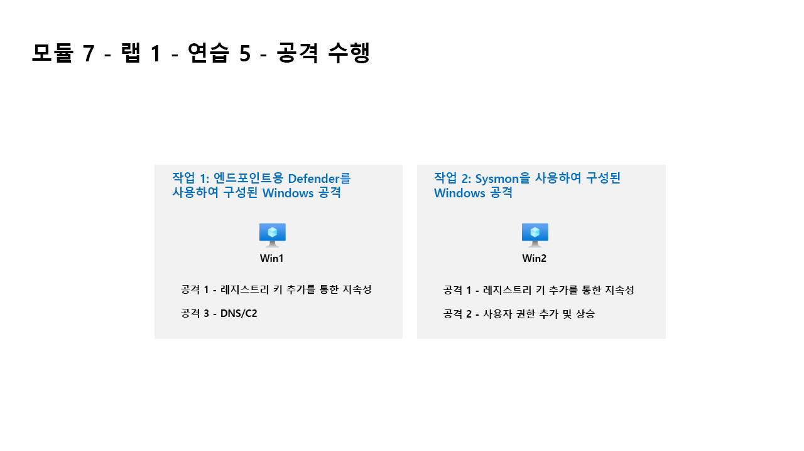

---
lab:
  title: 연습 6 - 공격 수행
  module: Module 7 - Create detections and perform investigations using Microsoft Sentinel
---

# <a name="module-7---lab-1---exercise-6---conduct-attacks"></a>모듈 7 - 랩 1 - 연습 6 - 공격 수행

## <a name="lab-scenario"></a>랩 시나리오



나중에 Microsoft Sentinel에서 검색하고 조사하는 데 사용할 공격을 시뮬레이션하려고 합니다.


### <a name="task-1-attack-windows-configured-with-defender-for-endpoint"></a>작업 1: 엔드포인트용 Defender를 사용하여 구성된 Windows 공격

이 작업에서는 엔드포인트용 Microsoft Defender가 구성되어 있는 호스트에서 공격을 수행합니다.

1. WIN1 가상 머신에 Admin으로 로그인합니다. 암호로는 **Pa55w.rd**를 사용하여 로그인합니다.  

1. 작업 표시줄의 검색 창에 *명령*을 입력합니다. 검색 결과에 명령 프롬프트가 표시됩니다. 명령 프롬프트를 마우스 오른쪽 단추로 클릭하고 **관리자 권한으로 실행**을 선택합니다. 표시되는 사용자 계정 컨트롤 창에서 **예**를 선택하여 앱을 실행할 수 있도록 합니다.

1. 명령 프롬프트에서 루트 디렉터리에 Temp 폴더를 만듭니다. 마지막 행 후에 Enter 키를 눌러야 합니다.

    ```CommandPrompt
    cd \
    mkdir temp
    cd temp
    ```

#### <a name="attack-1---persistence-with-registry-key-add"></a>공격 1 - 레지스트리 키 추가를 통한 지속성

1. 이 명령을 복사하고 실행하여 프로그램 지속성을 시뮬레이션합니다.

    ```CommandPrompt
    REG ADD "HKCU\SOFTWARE\Microsoft\Windows\CurrentVersion\Run" /V "SOC Test" /t REG_SZ /F /D "C:\temp\startup.bat"
    ```

#### <a name="attack-3---dns--c2"></a>공격 3 - DNS/C2 

1. 이 명령을 복사하고 실행하여 C2 서버에 대한 DNS 쿼리를 시뮬레이션하는 스크립트를 만듭니다.

    ```CommandPrompt
    notepad c2.ps1
    ```

1. **예**를 선택하여 새 파일을 만든 후 아래 PowerShell 스크립트를 *c2.ps1*에 복사합니다.

    >**참고:** 가상 머신에 스크립트를 붙여넣을 때는 길이가 제한될 수 있습니다. *c2.ps1* 파일 내에서 스크립트가 여기에 나와 있는 지침과 동일하게 표시되는지 확인합니다.

    ```PowerShell
    param(
        [string]$Domain = "microsoft.com",
        [string]$Subdomain = "subdomain",
        [string]$Sub2domain = "sub2domain",
        [string]$Sub3domain = "sub3domain",
        [string]$QueryType = "TXT",
        [int]$C2Interval = 8,
        [int]$C2Jitter = 20,
        [int]$RunTime = 240
    )
    $RunStart = Get-Date
    $RunEnd = $RunStart.addminutes($RunTime)
    $x2 = 1
    $x3 = 1 
    Do {
        $TimeNow = Get-Date
        Resolve-DnsName -type $QueryType $Subdomain".$(Get-Random -Minimum 1 -Maximum 999999)."$Domain -QuickTimeout
        if ($x2 -eq 3 )
        {
            Resolve-DnsName -type $QueryType $Sub2domain".$(Get-Random -Minimum 1 -Maximum 999999)."$Domain -QuickTimeout
            $x2 = 1
        }
        else
        {
            $x2 = $x2 + 1
        }    
        if ($x3 -eq 7 )
        {
            Resolve-DnsName -type $QueryType $Sub3domain".$(Get-Random -Minimum 1 -Maximum 999999)."$Domain -QuickTimeout
            $x3 = 1
        }
        else
        {
            $x3 = $x3 + 1
        }
        $Jitter = ((Get-Random -Minimum -$C2Jitter -Maximum $C2Jitter) / 100 + 1) +$C2Interval
        Start-Sleep -Seconds $Jitter
    }
    Until ($TimeNow -ge $RunEnd)
    ```

1. 메모장 메뉴에서 **파일**, **저장**을 차례로 선택합니다. 

1. 명령 프롬프트 창으로 돌아가서 다음 명령을 입력하고 Enter 키를 누릅니다. 

    >**참고:** 새 PowerShell 창이 열리고 오류 해결이 표시됩니다. 예상된 동작입니다.

    ```CommandPrompt
    Start PowerShell.exe -file c2.ps1
    ```

>**중요:** 이 창을 닫지 마세요. 이 PowerShell 스크립트를 백그라운드에서 실행하겠습니다. 명령이 몇 시간 동안 로그 항목을 생성해야 합니다. 이 스크립트가 실행되는 동안 다음 작업과 다음 연습을 진행해도 됩니다. 이 작업에서 생성되는 데이터를 나중에 위협 헌팅 랩에서 사용합니다. 이 프로세스에서 대량의 데이터가 작성되거나 처리되지는 않습니다.


### <a name="task-2-attack-windows-configured-with-microsoft-sentinel-connector"></a>작업 2: Microsoft Sentinel 커넥터로 구성된 Windows 공격

이 작업에서는 Microsoft Sentinel의 보안 이벤트 커넥터가 있는 호스트에서 공격을 수행합니다.

>**중요:** 다음 단계는 이전에 작업한 컴퓨터와는 다른 컴퓨터에서 수행합니다. 가상 머신 이름 참조를 찾습니다.

1. WIN2 가상 머신에 Admin으로 로그인합니다. 암호로는 **Pa55w.rd**를 사용하여 로그인합니다.  

>**중요:** 랩 저장 기능으로 인해 Azure Arc에서 Win2가 분리될 수 있습니다.  재부팅하면 문제가 해결됩니다.  

1. Windows에서 **시작**을 선택합니다. 그런 다음, **전원**과 **다시 시작**을 차례로 선택합니다.

1. 지침에 따라 WIN2에 다시 로그인합니다.

1. 작업 표시줄의 검색 창에 *명령*을 입력합니다. 검색 결과에 명령 프롬프트가 표시됩니다. 명령 프롬프트를 마우스 오른쪽 단추로 클릭하고 **관리자 권한으로 실행**을 선택합니다. 표시되는 사용자 계정 컨트롤 창에서 **예**를 선택하여 앱을 실행할 수 있도록 합니다.

1. 명령 프롬프트에서 루트 디렉터리에 Temp 폴더를 만듭니다. 마지막 행 후에 Enter 키를 눌러야 합니다.

    ```CommandPrompt
    cd \
    mkdir temp
    cd \temp
    ```

#### <a name="attack-2---user-add-and-elevate-privilege"></a>공격 2 - 사용자 추가 및 권한 상승

1. 이 명령을 복사하고 실행하여 관리자 계정 만들기를 시뮬레이션합니다. 마지막 행 후에 Enter 키를 눌러야 합니다.

    ```CommandPrompt
    net user theusernametoadd /add
    net user theusernametoadd ThePassword1!
    net localgroup administrators theusernametoadd /add
    ```

## <a name="proceed-to-exercise-7"></a>연습 7 계속 진행
