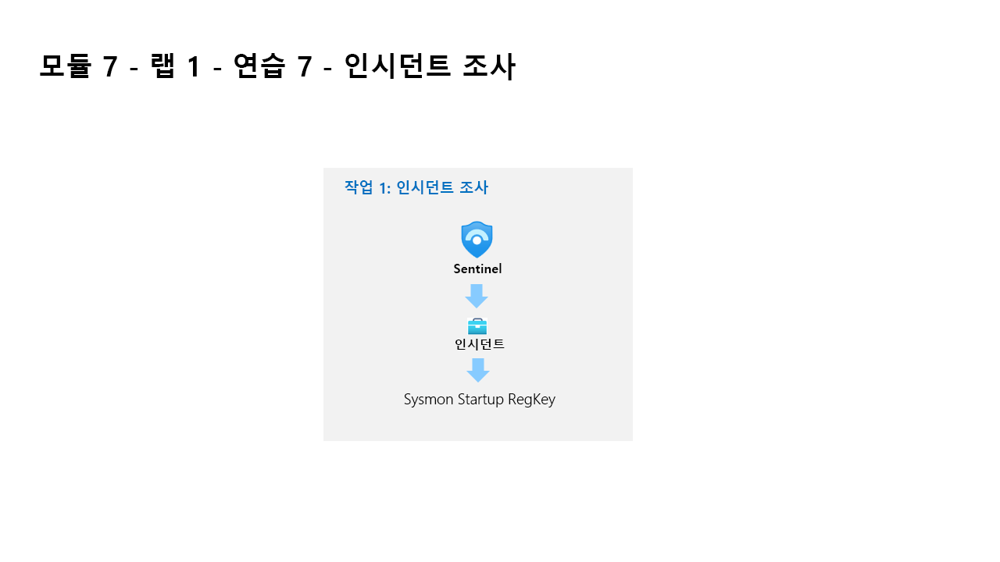

---
lab:
  title: 연습 7 - 검색 만들기
  module: Learning Path 7 - Create detections and perform investigations using Microsoft Sentinel
---

# 학습 경로 7 - 랩 1 - 연습 7 - 검색 만들기

## 랩 시나리오



당신은 Microsoft Sentinel을 구현한 회사에서 근무하는 보안 운영 분석가입니다. Log Analytics KQL 쿼리를 사용하여 작업하고, 여기에서 사용자 환경의 위협 및 비정상적인 동작을 검색하는 데 도움이 되는 사용자 지정 분석 규칙을 만듭니다.

분석 규칙은 사용자 환경에서 특정 이벤트 또는 이벤트 세트를 검색하고, 특정 이벤트 임계값 또는 조건에 도달하면 경고를 생성하고, SOC에서 심사 및 조사를 위해 인시던트를 생성하고, 자동화된 추적 및 수정 프로세스를 통해 위협에 대응합니다.


>                **참고:** **[대화형 랩 시뮬레이션](https://mslabs.cloudguides.com/guides/SC-200%20Lab%20Simulation%20-%20Create%20detections)** 을 사용하여 이 랩을 원하는 속도로 클릭할 수 있습니다. 대화형 시뮬레이션과 호스트된 랩 간에 약간의 차이가 있을 수 있지만 보여주는 핵심 개념과 아이디어는 동일합니다. 


### 작업 1: 지속성 공격 검색

>**중요:** 다음 단계는 이전에 작업한 컴퓨터와는 다른 컴퓨터에서 수행합니다. 가상 머신 이름 참조를 찾습니다.

이 작업에서는 이전 연습의 첫 번째 공격에 대한 검색을 만듭니다.

1. WIN1 가상 머신에 Admin으로 로그인합니다. 암호로는 **Pa55w.rd**를 사용하여 로그인합니다.  

1. Edge 브라우저에서 Azure Portal(https://portal.azure.com )로 이동합니다.

1. 랩 호스팅 공급자가 제공한 **테넌트 전자 메일** 계정을 복사하여 **로그인** 대화 상자에 붙여넣은 후 **다음**을 선택합니다.

1. 랩 호스팅 공급자가 제공한 **테넌트 암호**를 복사하여 **암호 입력** 대화 상자에 붙여넣은 후 **로그인**을 선택합니다.

1. Azure Portal의 검색 창에 *Sentinel*을 입력하고 **Microsoft Sentinel**을 선택합니다.

1. 앞에서 만든 Microsoft Sentinel 작업 영역을 선택합니다.

1. *일반* 섹션에서 **로그**를 선택합니다.

1. 다음 KQL 문을 다시 **실행**하여 이 데이터가 있는 테이블을 회수합니다.

    ```KQL
    search "temp\\startup.bat"
    ```

    >**참고:** 이벤트가 있는 결과가 나타나려면 최대 5분이 걸릴 수 있습니다. 그렇게 될 때까지 기다립니다. 표시되지 않으면 이전 연습에서 지시한 대로 WINServer를 다시 부팅했고 학습 경로 6 랩, 연습 2의 작업 #3을 완료했는지 확인합니다.

1. *SecurityEvent* 테이블은 데이터를 이미 정규화하고 쉽게 쿼리할 수 있도록 합니다. 행을 확장하여 레코드와 관련된 모든 열을 표시합니다.

1. 결과를 통해 위협 행위자가 reg.exe를 사용하여 레지스트리 키에 키를 추가하고 프로그램이 C:\temp에 있음을 알 수 있습니다. 다음 문을 **실행**하여 쿼리에서 *search* 연산자를 *where* 연산자로 바꿉니다.

    ```KQL
    SecurityEvent 
    | where Activity startswith "4688" 
    | where Process == "reg.exe" 
    | where CommandLine startswith "REG" 
    ```

1. 보안 운영 센터 분석자가 위협을 정확하게 분석할 수 있도록 경고 관련 상황 정보를 최대한 많이 제공해야 합니다. 가령 조사 그래프에 사용할 엔터티 등을 제공할 수 있습니다. 다음 쿼리를 **실행**합니다.

    ```KQL
    SecurityEvent 
    | where Activity startswith "4688" 
    | where Process == "reg.exe" 
    | where CommandLine startswith "REG" 
    | extend timestamp = TimeGenerated, HostCustomEntity = Computer, AccountCustomEntity = SubjectUserName
    ```

1. 이제 적절한 검색 규칙을 작성했으므로 로그 창의 명령 표시줄에서 **+ 새 경고 규칙**을 선택한 다음 **Microsoft Sentinel 경고 만들기**를 선택합니다. 이렇게 하면 새 예약된 규칙이 만들어집니다. **힌트:** 명령 모음에서 줄임표(...) 단추를 선택해야 할 수 있습니다.

1. 그러면 “분석 규칙 마법사”가 시작됩니다. 일반 탭에서 다음을 입력합니다.

    |설정|값|
    |---|---|
    |Name|Startup RegKey|
    |Description|c:\temp의 Startup RegKey|
    |전술|지속성|
    |심각도|높음|

1. **다음: 규칙 논리 설정 >** 단추를 선택합니다.

1. 규칙 논리 설정 탭에서 규칙 쿼리는 경고 보강 - 엔터티 매핑 아래의 엔터티뿐만 아니라 KQL 쿼리로 이미 채워져야 합니다.  

    |엔터티|ID|데이터 필드|
    |:----|:----|:----|
    |계정|FullName|AccountCustomEntity|
    |Host|호스트 이름|HostCustomEntity|

1. **호스트 엔**터티에 대해 *호스트* 이름을 선택하지 않은 경우 드롭다운 목록에서 선택합니다.

1. 쿼리 예약에서 다음 항목을 설정합니다.

    |설정|값|
    |---|---|
    |쿼리 실행 간격|5분|
    |마지막 데이터 조회|1일|

    >**참고:** 같은 데이터에 대해 의도적으로 여러 인시던트를 생성합니다. 그러면 랩에서 해당 경고를 사용할 수 있기 때문입니다.

1. 나머지 옵션은 기본값으로 둡니다. **다음: 인시던트 설정>** 단추를 선택합니다.

1. 인시던트 설정 탭에서 기본값을 그대로 두고 **다음: 자동화된 응답 >** 단추를 선택합니다.

1. *자동화 규칙* 아래의 *자동화된 응답* 탭에서 **새로 추가를** 선택합니다.

1. 테이블의 설정을 사용하여 자동화 규칙을 구성합니다.

    |설정|값|
    |:----|:----|
    |자동화 규칙 이름|Startup RegKey|
    |트리거|인시던트가 생성될 때|
    |동작 |플레이북 실행|
    |플레이북 |PostMessageTeams-OnIncident|

    >**참고:** 플레이북에 사용 권한을 이미 할당했으므로 사용할 수 있습니다.

1. **적용**을 선택합니다.

1. 하단에서 **다음: 검토 >** 단추를 선택합니다.
  
1. *검토 및 만들기* 탭에서 **만들기** 단추를 선택하여 새 예약된 분석 규칙을 만듭니다.

### 작업 2: 권한 상승 공격 검색

이 작업에서는 이전 연습의 두 번째 공격에 대한 검색을 만듭니다.

1. 이 페이지에서 벗어나면 Microsoft Sentinel 포털의 일반 섹션에서 **로그**를 선택합니다.

1. 다음 KQL 문을 **실행**하여 관리자를 참조하는 항목을 식별합니다.

    ```KQL
    search "administrators" 
    | summarize count() by $table
    ```

1. 결과는 다른 테이블의 이벤트를 표시할 수 있지만 이 경우 SecurityEvent 테이블을 조사하려고 합니다. 보고 있는 EventID 및 이벤트는 “4732 - 보안 사용 로컬 그룹에 멤버가 추가되었습니다”입니다. 이를 통해 권한 있는 그룹에 멤버를 추가하는 것을 식별합니다. 다음 KQL 쿼리를 **실행**하여 다음을 확인합니다.

    ```KQL
    SecurityEvent 
    | where EventID == 4732
    | where TargetAccount == "Builtin\\Administrators"
    ```

1. 행을 확장하여 레코드와 관련된 모든 열을 표시합니다. 관리자로 추가된 계정의 사용자 이름이 표시되지 않습니다. 문제는 사용자 이름이 저장되는 대신 SID(보안 식별자)가 있다는 것입니다. 다음 KQL을 **실행**하여 SID를 관리자 그룹에 추가된 사용자 이름과 일치시킵니다.

    ```KQL
    SecurityEvent 
    | where EventID == 4732
    | where TargetAccount == "Builtin\\Administrators"
    | extend Acct = MemberSid, MachId = SourceComputerId  
    | join kind=leftouter (
        SecurityEvent 
        | summarize count() by TargetSid, SourceComputerId, TargetUserName 
        | project Acct1 = TargetSid, MachId1 = SourceComputerId, UserName1 = TargetUserName) on $left.MachId == $right.MachId1, $left.Acct == $right.Acct1
    ```

   

1. 행을 확장하여 결과 열을 표시합니다. 마지막 열에는 KQL 쿼리 내에서 프로젝션하는 *UserName1* 열 아래에 추가된 사용자의 이름이 표시됩니다. 보안 작업 분석가가 위협을 정확하게 분석할 수 있도록 경고 관련 상황 정보를 최대한 많이 제공해야 합니다. 가령 조사 그래프에 사용할 엔터티 등을 제공할 수 있습니다. 다음 쿼리를 **실행**합니다.

    ```KQL
    SecurityEvent 
    | where EventID == 4732
    | where TargetAccount == "Builtin\\Administrators"
    | extend Acct = MemberSid, MachId = SourceComputerId  
    | join kind=leftouter (
        SecurityEvent 
        | summarize count() by TargetSid, SourceComputerId, TargetUserName 
        | project Acct1 = TargetSid, MachId1 = SourceComputerId, UserName1 = TargetUserName) on $left.MachId == $right.MachId1, $left.Acct == $right.Acct1
    | extend timestamp = TimeGenerated, HostCustomEntity = Computer, AccountCustomEntity = UserName1
    ```

1. 이제 적절한 검색 규칙을 작성했으므로 로그 창의 명령 표시줄에서 **+ 새 경고 규칙**을 선택한 다음 **Microsoft Sentinel 경고 만들기**를 선택합니다. **힌트:** 명령 모음에서 줄임표(...) 단추를 선택해야 할 수 있습니다.

1. 그러면 “분석 규칙 마법사”가 시작됩니다. 일반 탭에서 다음을 입력합니다.

    |설정|값|
    |---|---|
    |Name|**SecurityEvent 로컬 관리자 사용자 추가**|
    |설명|**로컬 관리자 그룹에 추가된 사용자**|
    |전술|**권한 상승**|
    |심각도|**높음**|

1. **다음: 규칙 논리 설정 >** 단추를 선택합니다. 

1. *규칙 논리 설정* 탭에서 *규칙 쿼리*는 *경고 보강 - 엔터티 매핑* 아래의 엔터티뿐만 아니라 KQL 쿼리로 이미 채워져야 합니다.

1. 쿼리 예약에서 다음 항목을 설정합니다.

    |설정|값|
    |---|---|
    |쿼리 실행 간격|5분|
    |마지막 데이터 조회|1일|

    >**참고:** 같은 데이터에 대해 의도적으로 여러 인시던트를 생성합니다. 그러면 랩에서 해당 경고를 사용할 수 있기 때문입니다.

1. 나머지 옵션은 기본값으로 둡니다. **다음: 인시던트 설정>** 단추를 선택합니다.

1. 인시던트 설정 탭에서 기본값을 그대로 두고 **다음: 자동화된 응답 >** 단추를 선택합니다.

1. *자동화 규칙 아래의 자동화된 응답* 탭에서 **새로 추가를** 선택합니다.**

1. 테이블의 설정을 사용하여 자동화 규칙을 구성합니다.

   |설정|값|
   |:----|:----|
   |자동화 규칙 이름|SecurityEvent 로컬 관리자 사용자 추가|
   |트리거|인시던트가 생성될 때|
   |동작 |플레이북 실행|
   |플레이북 |PostMessageTeams-OnAlert|

   >**참고:** 플레이북에 사용 권한을 이미 할당했으므로 사용할 수 있습니다.

1. **적용**을 선택합니다.

1. **다음: 검토 및 만들기 >** 단추를 선택합니다.
  
1. *검토 및 만들기* 탭에서 **만들기** 단추를 선택하여 새 예약된 분석 규칙을 만듭니다.

## 연습 8 계속 진행
