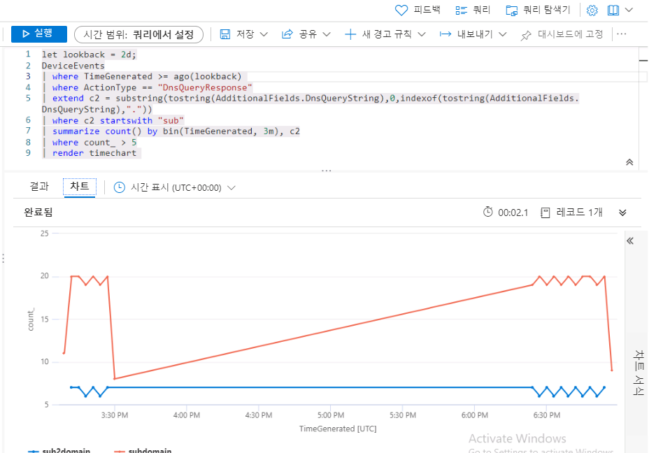
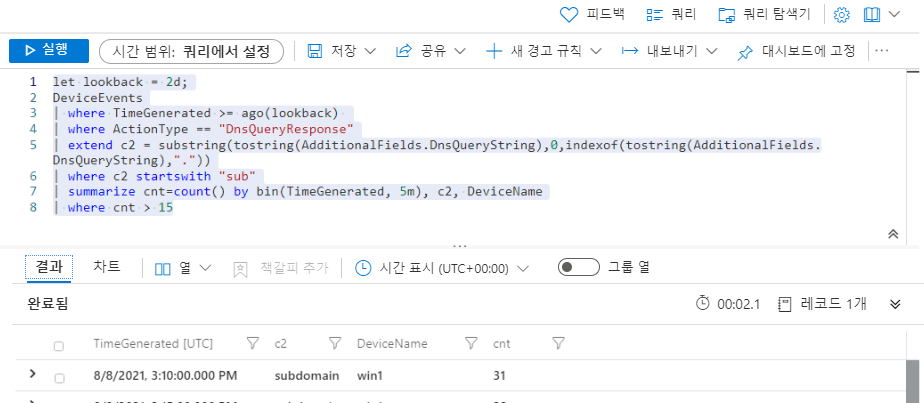

---
lab:
  title: 연습 1 - Microsoft Sentinel에서 위협 헌팅 수행
  module: Module 8 - Perform threat hunting in Microsoft Sentinel
ms.openlocfilehash: 5fe3c20f10e420294fdb2b1048daec19ce359f02
ms.sourcegitcommit: 175df7de88c9a609f8caf39840664bf992c5b6dc
ms.translationtype: HT
ms.contentlocale: ko-KR
ms.lasthandoff: 02/05/2022
ms.locfileid: "138025500"
---
# <a name="module-8---lab-1---exercise-1---perform-threat-hunting-in-microsoft-sentinel"></a>모듈 8 - 랩 1 - 연습 1 - Microsoft Sentinel에서 위협 헌팅 수행

## <a name="lab-scenario"></a>랩 시나리오

당신은 Microsoft Sentinel을 구현한 회사에서 근무하는 보안 운영 분석가입니다. C2 또는 C&C(명령 및 제어) 기술 관련 위협 인텔리전스를 수신했습니다. 헌트를 수행하고 위협을 감시해야 합니다.

>**중요:** 랩에서 사용되는 로그 데이터는 이전 모듈에서 작성된 것입니다. 연습 5의 WIN1 서버에서 **공격 3** 을 참조하세요.

>**참고:** 이전 모듈에서 데이터 살펴보기 프로세스는 이미 진행했으므로, 이 랩에서는 작업 시작을 위한 KQL 문이 제공됩니다. 


### <a name="task-1-create-a-hunting-query"></a>작업 1: 헌팅 쿼리 만들기

이 작업에서는 헌팅 쿼리를 만들고 결과를 책갈피에 저장한 후 라이브 스트림을 만듭니다.

1. WIN1 가상 머신에 Admin으로 로그인합니다. 암호로는 **Pa55w.rd** 를 사용하여 로그인합니다.  

1. Edge 브라우저에서 Azure Portal(https://portal.azure.com )로 이동합니다.

1. 랩 호스팅 공급자가 제공한 **테넌트 전자 메일** 계정을 복사하여 **로그인** 대화 상자에 붙여넣은 후 **다음** 을 선택합니다.

1. 랩 호스팅 공급자가 제공한 **테넌트 암호** 를 복사하여 **암호 입력** 대화 상자에 붙여넣은 후 **로그인** 을 선택합니다.

1. Azure Portal의 검색 창에 *Sentinel* 을 입력하고 **Microsoft Sentinel** 을 선택합니다.

1. Microsoft Sentinel 작업 영역을 선택합니다.

1. **로그** 를 선택합니다. 

1. 새 쿼리 1 공간에 다음 KQL 문을 입력합니다.

   >**중요:** 먼저 메모장에 KQL 쿼리를 붙여넣은 다음, 해당 위치에서 새 쿼리 1 로그 창으로 복사하여 오류를 방지하세요.

   ```KQL
   let lookback = 2d;
   DeviceEvents | where TimeGenerated >= ago(lookback) 
   | where ActionType == "DnsQueryResponse"
   | extend c2 = substring(tostring(AdditionalFields.DnsQueryString),0,indexof(tostring(AdditionalFields.DnsQueryString),"."))
   | where c2 startswith "sub"
   | summarize count() by bin(TimeGenerated, 3m), c2
   | where count_ > 5
   | render timechart 
   ```

   

1. 이전 KQL 쿼리의 목표는 C2 비콘에 대한 시각화를 일관되게 제공하는 것입니다. bin() 내에서 *3m* 설정을 **30s** 로 변경하여 값 그룹화 조정하고 쿼리를 다시 **실행** 합니다.

1. 다시 *3m* 로 변경합니다. 이제 *count_* 임계값을 **10** 으로 변경하고 쿼리를 다시 **실행** 하여 영향을 확인합니다.

1. 지금까지 C2 서버에 알림을 전송하는 DNS 요청을 살펴보았습니다. 다음으로는 알림을 생성하는 디바이스를 확인합니다. 다음 KQL 문을 **실행** 합니다.

   ```KQL
   let lookback = 2d;
   DeviceEvents | where TimeGenerated >= ago(lookback) 
   | where ActionType == "DnsQueryResponse"
   | extend c2 = substring(tostring(AdditionalFields.DnsQueryString),0,indexof(tostring(AdditionalFields.DnsQueryString),".")) 
   | where c2 startswith "sub"
   | summarize cnt=count() by bin(TimeGenerated, 5m), c2, DeviceName
   | where cnt > 15
   ```

   

   >**참고:** 생성된 로그 데이터는 WIN1 디바이스에서만 가져온 것입니다.

1. 창의 오른쪽 위에 있는 **X** 를 선택하여 로그 창을 닫고 **확인** 을 선택하여 변경 내용을 취소합니다. 

1. Microsoft Sentinel 작업 영역을 다시 선택하고 위협 관리 영역에서 **헌팅** 페이지를 선택합니다.

1. 명령 모음에서 **+ 새 쿼리** 를 선택합니다.

1. 사용자 지정 쿼리 만들기 창의 이름에 **C2 Hunt** 를 입력합니다. 

1. *사용자 지정 쿼리* 에 다음 KQL 문을 붙여 넣습니다.

   ```KQL
   let lookback = 2d;
   DeviceEvents | where TimeGenerated >= ago(lookback) 
   | where ActionType == "DnsQueryResponse"
   | extend c2 = substring(tostring(AdditionalFields.DnsQueryString),0,indexof(tostring(AdditionalFields.DnsQueryString),"."))
   | where c2 startswith "sub"
   | summarize cnt=count() by bin(TimeGenerated, 5m), c2, DeviceName
   | where cnt > 15
   ```

1. 아래로 스크롤하고 엔터티 매핑(미리 보기)에서 다음을 선택합니다.

    - 엔터티 유형 드롭다운 목록에서 **호스트** 를 선택합니다.
    - 식별자 드롭다운 목록에서 **호스트 이름** 을 선택합니다.
    - 값 드롭다운 목록에서 **디바이스 이름** 을 선택합니다.

1. 아래로 스크롤하고, 전술 & 기술 아래에서 **명령 및 제어** 를 선택한 다음, **만들기** 를 선택하여 헌팅 쿼리를 만듭니다.

1. “Microsoft Sentinel - 헌팅” 블레이드의 목록에서 방금 만든 쿼리인 *C2 Hunt* 를 검색합니다.

1. 목록에서 **C2 Hunt** 를 선택합니다.

1. 오른쪽 창에서 아래로 스크롤하여 **쿼리 실행** 단추를 선택합니다.

1. 결과 열 아래의 가운데 창에 결과 수가 표시됩니다. 또는 위로 스크롤하여 결과 상자의 개수를 확인합니다.

1. **결과 보기** 단추를 선택합니다. KQL 쿼리가 자동으로 실행됩니다.

1. 결과에서 첫 번째 행의 확인란을 선택합니다. 

1. 가운데 명령 모음에서 **책갈피 추가** 단추를 선택합니다.

1. 기본적으로 채워진 값을 검토하고 책갈피 추가 블레이드에서 **만들기** 를 선택합니다.

1. 창의 오른쪽 위에 있는 **X** 를 선택하여 로그 창을 닫고 **확인** 을 선택하여 변경 내용을 취소합니다. 

1. Microsoft Sentinel 포털의 헌팅 페이지로 돌아가서 가운데 창에서 **책갈피** 탭을 선택합니다.

1. 결과 목록에서 방금 만든 **C2 Hunt** 책갈피를 선택합니다.

1. 오른쪽 창에서 아래로 스크롤하여 **조사** 단추를 선택합니다.

1. 이전 모듈에서와 마찬가지로 조사 그래프를 살펴봅니다.

1. 창의 오른쪽 위에 있는 **X** 를 선택하여 조사 그래프 창을 닫고 **확인** 을 선택하여 변경 내용을 취소합니다. 

1. **쿼리** 탭을 선택합니다.

1. **C2 Hunt** 쿼리를 다시 검색하고 선택합니다.

1. 쿼리를 마우스 오른쪽 단추로 클릭하고 **라이브 스트림에 추가** 를 선택합니다. **힌트:** 또한 오른쪽으로 슬라이딩하고 행 끝에 있는 줄임표 **(...)** 를 선택하여 상황에 맞는 메뉴를 열어도 됩니다.

1. 상태가 현재 실행 중인지 검토합니다.  결과를 찾으면 Azure Portal(종 아이콘)에서 알림을 받게 됩니다.

# <a name="proceed-to-exercise-2"></a>연습 2 계속 진행
