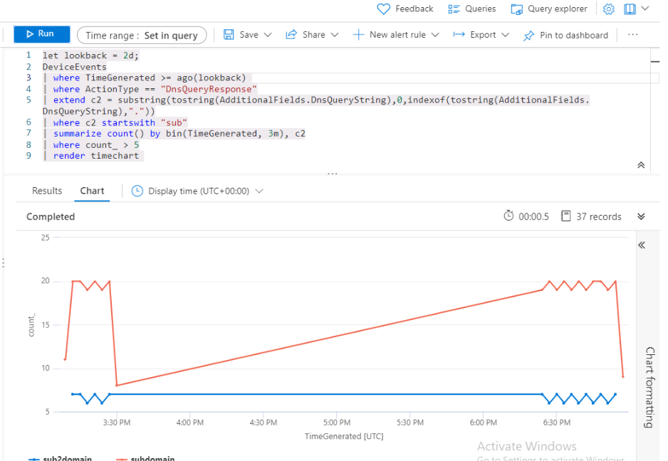

---
lab:
    title: '연습 1 - Microsoft Sentinel에서 위협 헌팅 수행'
    module: '모듈 8 - Microsoft Sentinel에서 위협 헌팅 수행'
---

# 모듈 8 - 랩 1 - 연습 1 - Microsoft Sentinel에서 위협 헌팅 수행

## 랩 시나리오

여러분은 Microsoft Sentinel을 구현한 회사에서 일하는 보안 작업 분석가입니다. C2 또는 C&C(명령 및 제어) 공격 기술 관련 위협 인텔리전스를 수신했습니다.  헌트를 수행하고 위협을 감시해야 합니다.

>**중요:** 랩에서 사용된 로그 데이터는 이전 모듈에서 작성된 것입니다. 연습 5에서 WIN1 서버의 **공격 3**을 참조하세요.

>**참고:**  모듈에서 데이터 살펴보기 프로세스는 이미 진행했으므로, 이 랩에서는 작업 시작을 위한 KQL 문이 제공됩니다.  


### 작업 1: 헌팅 쿼리 만들기

이 작업에서는 헌팅 쿼리를 만들고 결과를 책갈피에 저장한 후 라이브 스트림을 만듭니다.

1. WIN1 가상 머신에 Admin으로 로그인합니다. 암호로는 **Pa55w.rd**를 사용합니다.  

2. Edge 브라우저에서 Azure Portal https://portal.azure.com 으로 이동합니다.

3. 랩 호스팅 공급자가 제공한 **테넌트 전자 메일** 계정을 복사하여 **로그인** 대화 상자에 붙여넣은 후 **다음**을 선택합니다.

4. 랩 호스팅 공급자가 제공한 **테넌트 암호**를 복사하여 **암호 입력** 대화 상자에 붙여넣은 후 **로그인**을 선택합니다.

5. Azure Portal의 검색 창에 *Sentinel*을 입력하고 **Microsoft Sentinel**을 선택합니다.

6. Microsoft Sentinel 작업 영역을 선택합니다.

7. **로그**를 선택합니다. 

8. 새 쿼리 1 공간에 다음 SQL 문을 입력합니다.

   >**중요:** 오류가 발생하지 않도록 먼저 KQL 쿼리를 메모장에 붙여 넣은 후 메모장에서 *새 쿼리 1* 로그 창에 붙여 넣으세요.

```KQL
let lookback = 2d;
DeviceEvents
| where TimeGenerated >= ago(lookback) 
| where ActionType == "DnsQueryResponse"
| extend c2 = substring(tostring(AdditionalFields.DnsQueryString),0,indexof(tostring(AdditionalFields.DnsQueryString),"."))
| where c2 startswith "sub"
| summarize count() by bin(TimeGenerated, 3m), c2
| where count_ > 5
| render timechart 
```

   

9. 이 문은 C2 알림을 일관되게 확인하기 위한 시각화를 제공하는 데 사용됩니다. summarize 연산자에서 3m 설정을 30s로 조정하는 등 문을 조정해 봅니다. count_ > 5 설정의 임계값 횟수를 다른 값으로 변경하여 결과의 변화를 확인합니다.

10. 지금까지 C2 서버에 알림을 전송하는 DNS 요청을 살펴보았습니다.  다음으로는 알림을 생성하는 디바이스를 확인합니다.  다음 KQL 문을 입력합니다.

```KQL
let lookback = 2d;
DeviceEvents
| where TimeGenerated >= ago(lookback) 
| where ActionType == "DnsQueryResponse"
| extend c2 = substring(tostring(AdditionalFields.DnsQueryString),0,indexof(tostring(AdditionalFields.DnsQueryString),"."))
| where c2 startswith "sub"
| summarize cnt=count() by bin(TimeGenerated, 5m), c2, DeviceName
| where cnt > 15
```

   

   >**참고:** 생성된 로그 데이터는 단일 디바이스에서만 가져온 것입니다.

11. 창 오른쪽 위에서 'x'를 선택하여 로그 창을 닫고 **확인**을 선택하여 편집 내용을 취소합니다. Microsoft Sentinel 작업 영역을 다시 선택하고 위협 관리 영역에서 **헌팅** 페이지를 선택합니다.

12. 명령 모음에서 **+ 새 쿼리**를 선택합니다.

13. **사용자 지정 쿼리**에 다음 KQL 문을 붙여 넣습니다.

```KQL
let lookback = 2d;
DeviceEvents
| where TimeGenerated >= ago(lookback) 
| where ActionType == "DnsQueryResponse"
| extend c2 = substring(tostring(AdditionalFields.DnsQueryString),0,indexof(tostring(AdditionalFields.DnsQueryString),"."))
| where c2 startswith "sub"
| summarize cnt=count() by bin(TimeGenerated, 5m), c2, DeviceName
| where cnt > 15
```

14. 이름으로는 *C2 Hunt*를 입력합니다.

15. *엔터티 매핑(미리 보기)* 에서 **+ 새 엔터티 추가**를 선택합니다.

    - *엔터티 형식* 드롭다운 목록에서 **호스트**를 선택합니다.
    - *ID* 드롭다운 목록에서 **호스트 이름**을 선택합니다.
    - *값* 드롭다운 목록에서 **DeviceName**을 선택합니다.

16. *전술 및 전략*에서 **명령 및 제어**를 선택합니다. **만들기**를 선택하여 헌팅 쿼리를 만듭니다.

17. Microsoft Sentinel - 헌팅 블레이드의 목록에서 방금 만든 쿼리인 *C2 Hunt*를 검색합니다.

18. 목록에서 **C2 Hunt**를 선택합니다.

19. 페이지 오른쪽의 **쿼리 실행** 단추를 선택합니다.

20. 플라이아웃 위쪽에 결과 개수가 표시됩니다.

21. **결과 보기** 단추를 선택합니다.

22. 결과의 첫 번째 행을 선택합니다. 

23. **책갈피 추가** 단추를 선택합니다.

24. 책갈피 추가 블레이드에서 **만들기**를 선택합니다.

25. Microsoft Sentinel 포털의 헌팅 페이지로 돌아옵니다(힌트: 왼쪽으로 스크롤).

26. **책갈피** 탭을 선택합니다.

27. 결과 목록에서 방금 만든 책갈피를 선택합니다.

28. **조사** 단추를 선택합니다.

29. 조사 그래프를 살펴봅니다.

30. 오른쪽 위에서 'x'를 선택하여 창을 닫고 Microsoft Sentinel 포털의 헌팅 페이지로 돌아옵니다.

31. **쿼리** 탭을 선택합니다.

32. **C2 Hunt** 쿼리를 다시 검색하여 선택합니다.

33. 오른쪽에 있는 행 끝부분의 **[...]** 를 선택하여 상황에 맞는 메뉴를 엽니다.

34. **라이브 스트림에 추가**를 선택합니다.

# 연습 2 계속 진행
